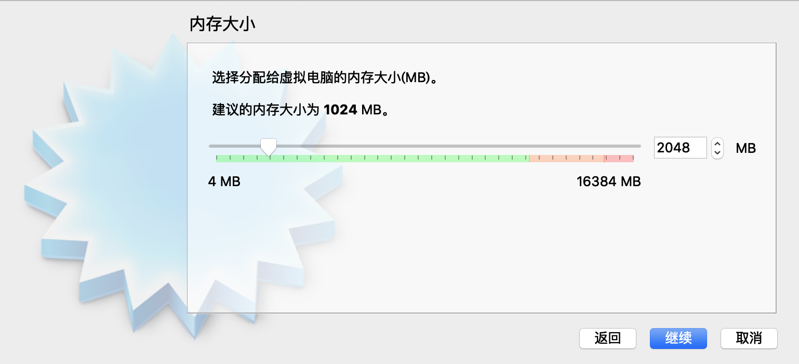
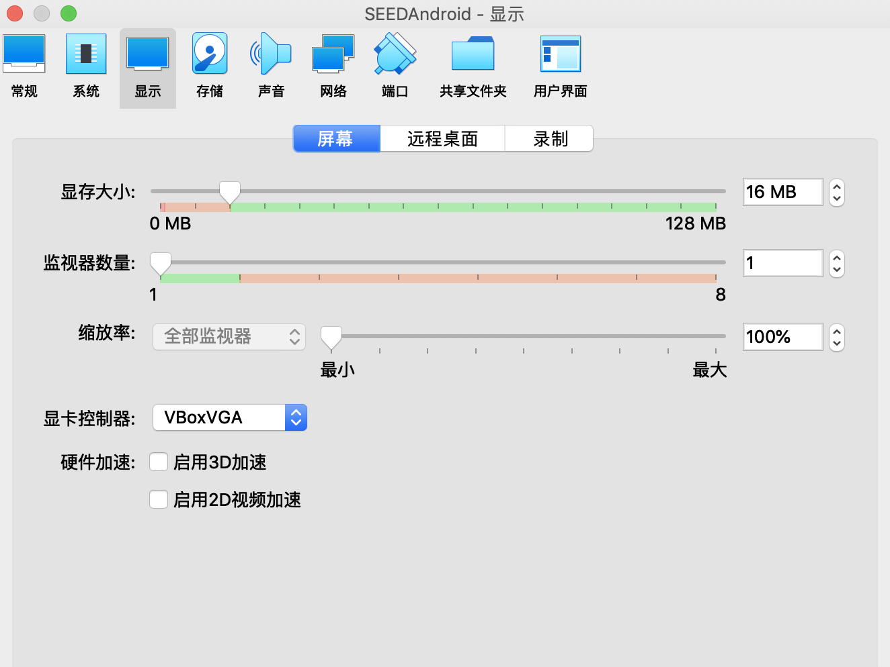
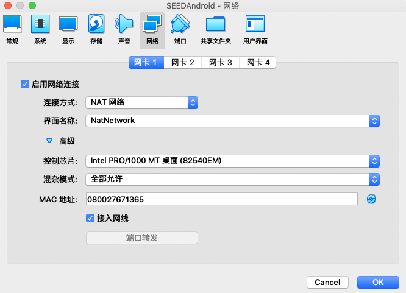

# 在VirtualBox中安装安卓虚拟机

这里建议使用virtualbox，vmware应该也可以，但相关功能怎么调整就需要另外研究了。  
另外我这边实验环境是Mac版virtualbox  

### 下载安卓镜像

下载[安卓镜像](https://drive.google.com/file/d/1ZbqY0L9eyUInvWO8LKdpBlQUWR69Hq8I/view?usp=sharing) 

### 新建虚拟机

**1、新建虚拟机**

**2、内存选择2G**

**3、选择虚拟机文件**

### 配置虚拟机

**1、配置鼠标**

指点设备中如果选USB Tablet选项，则每次启动虚拟机都需要启用鼠标捕获。这里选PS/2鼠标就会自动配置虚拟机鼠标。  

**2、配置PAE/NX**

PAE全称Physical Address Extension，即物理地址扩展，能让64位CPU访问超过4GB的内存  
NX全称No-eXecute，启用这个，可以让特定内存区域不可执行，这个保护机制可以防御缓冲区溢出攻击  
由于用Ubuntu来启动安卓虚拟机，就需要PAE/NX支持，否则启动时会报错  

**3、配置显示**

显卡控制器有三种模式：VMSVGA、VBoxVGA、VBoxSVGA  
默认是VMSVGA，这个是从VMware移植过来的，需要有图形驱动支持，否则会找不到屏幕  
VBoxVGA，这个是virtualbox本身默认支持的  
VBoxSVGA，这个是virtualbox搞的3D显示模式，兼容性不好  
这里选VBoxVGA  

**4、网络配置**

由于移动安全这些实验需要很多虚拟机，这些虚拟机要能访问网络，并且相互之间能访问，故使用一个virtualbox提供的网络适配器，
叫NAT Network。NAT Network即网络地址转换适配器，作用类似于LAN，能让虚拟机既能相互访问又能访问网络，通信都通过一个
适配器  

如果没有建过NAT网络，需要在VitrualBox菜单--系统偏好--网络选项增加

现在在SEEDAndroid虚拟机设置--网络中选择NAT网络（注意必须在关机状态下设置）  

### 启动虚拟机

鼠标退出屏幕是按command  

# VirtualBox安装ubuntu

其他都正常安装，有两点要特别设置  
1、设置--网络--连接方式选NAT网络，界面名称NatNetwork  
2、ubuntu选中情况下菜单栏--view--Scaled mode要选中，不然界面非常小  

## 设置双向拷贝

菜单--machine-settings  

