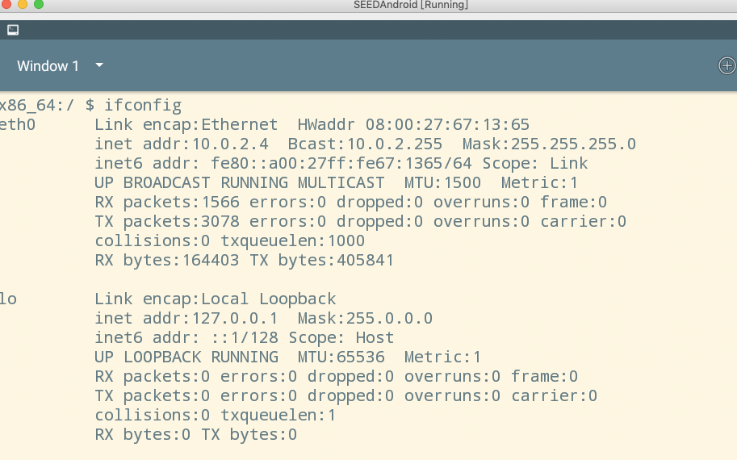
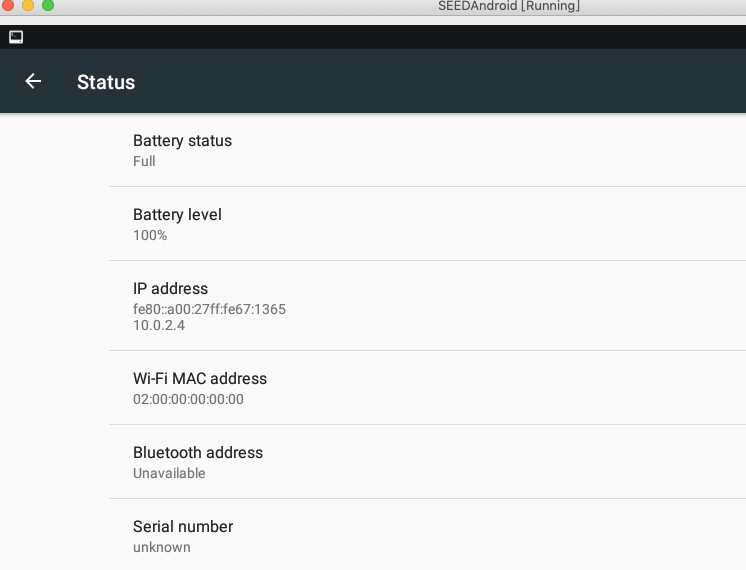
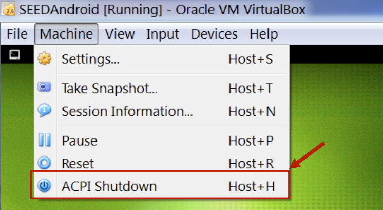
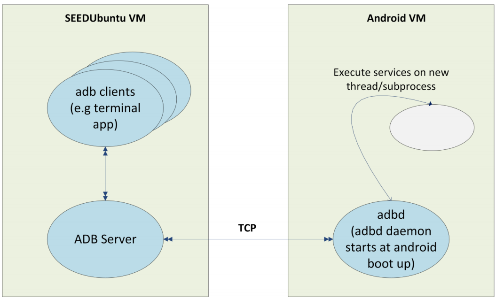
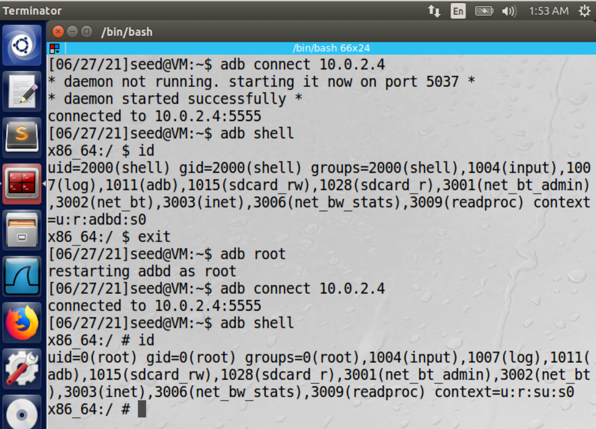
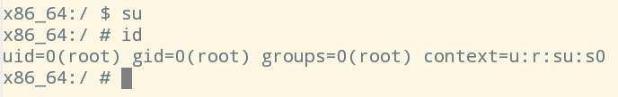
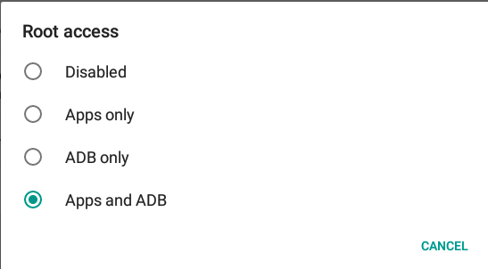
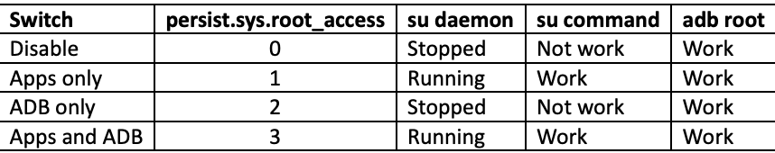
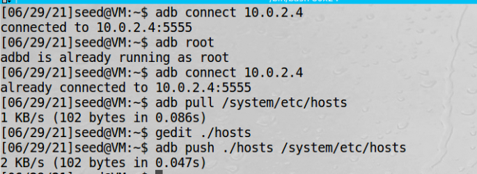

# 安卓使用

## 找安卓的IP地址

1、用Terminal Emulator这个APP  

2、用Settings这个APP  
About Tablet--Status option  

## 防止休眠

在笔记本上跑安卓虚拟机，要给笔记本插上电源，否则安卓会休眠  
下面这个键来关机或者重启    

## 快捷键

| 快捷键 | 作用 |
| ---- | ---- |
| ESC | 返回 |
| ALT + TAB        | 显示最近使用的APP    |
| Command + U      | 关机或重启    |
| unsetenv()       | 删除环境变量    |  

 

## 安卓调试工具

安卓有一个调试工具用来和其他虚拟机调试，叫adb（Android Debug Bridge）。在ubuntu虚拟机上有一个adb服务器，
安卓上有adbd守护进程

  

adb是一个客户端程序，当调用时，adb会先检查adb服务器有没有运行，如果没有，adb会起一个服务进程，这个服务监听TCP的默认
端口是5037  
adb服务器会扫描5555-5585之间的奇数端口，看看是否有安卓物理机或者模拟器，如果有，就会和所有存在的都建立连接。由于我们
的安卓虚拟机现在还没有挂载到这些端口上，还不能被adb服务器发现，需要手动连接。  

以下这些命令在ubuntu虚拟机执行  

| adb命令 | 作用 |
| ---- | ---- |
| adb connect <ip_address> | ubuntu连接安卓虚拟机地址 |
| adb devices        | 列出所有已连接的安卓设备    |
| adb shell      | 得到安卓的远程shell    |
| adb reboot       | 重启安卓    |  
| adb install sample.apk       | 安装应用    |
| adb uninstall sample.apk       | 卸载应用    |
| adb pull <path on Android> <path on Ubuntu>  | 安卓往虚拟机拷贝文件    |
| adb push <path on Ubuntu> <path on Android>  | 虚拟机往安卓拷贝文件    |

 

## 在安卓上获取root权限

1、从外部执行adb root 10.0.2.4  
当守护进程以root身份启动的时候，会读取系统一个安全flag，如果设置了，守护进程会丢弃root权限，使用
AID_SHELL这个user（id为2000），如果守护进程用adb root命令重启，安全flag被清除，继续以root身份运行，客户端就
需要重连  

实验：adb connect连接安卓，身份是2000，用adb root连接安卓，身份是root  

2、在内部用su命令  
这个安卓虚拟机已经安装了su程序，su执行时会向管理app发请求，默认同意给权限

!!! 进入开发模式

    Settings App -- Developer options -- Root Access  
    如果Developer options没有出现，就点7次About Tablet option就会出现

3、开发模式下root权限设置  

  
1、Disable：apps和adb都无法获取root权限  
2、Apps only: 任何安装的app都可以获取root权限，通过su进去  
3、ADB only: 由于我们的虚拟机是用userdebug编译的，无论何种状态下adb root都能进去  
4、Apps and ADB：都能获取  

## 通过ubuntu修改安卓文件

