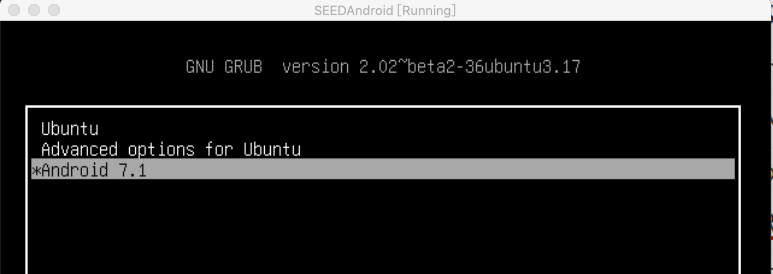
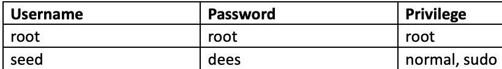

# Recovery模式

!!! Recovery模式

    是一种可以对安卓机内部的数据或系统进行修改的模式。在这个模式下我们可以刷入新的安卓系统，或者对
    已有的系统进行备份或升级，也可以在此恢复出厂设置。
     
## 启动时进入Recovery模式

系统启动时按住左边Shift键可进入Recovery模式  


选择ubuntu可进入恢复模式，系统已经预置了两个账号  


大多数Recovery模式下需要登录root账号

## 最合理的方式关机重启

```bash
shutdown -P now
reboot
```

## 远程登陆用ssh

Recovery模式下启动了ssh，可以在其他虚拟机用ssh登陆安卓，虚拟机中root身份登陆关闭了  

## 远程拷贝

可以用scp, 也可以用sftp  

```bash
sftp seed@10.0.2.4
```

| sftp命令 | 作用 |
| ---- | ---- |
| cd <directory> | 改目录 |
| ls     | 列出文件    |
| put <file> [destination]      | 把一个文件上传到远端    |
| get <file> [destination] | 从远端下载一个文件  |