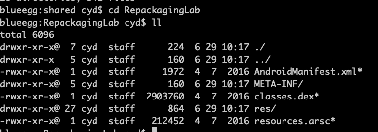
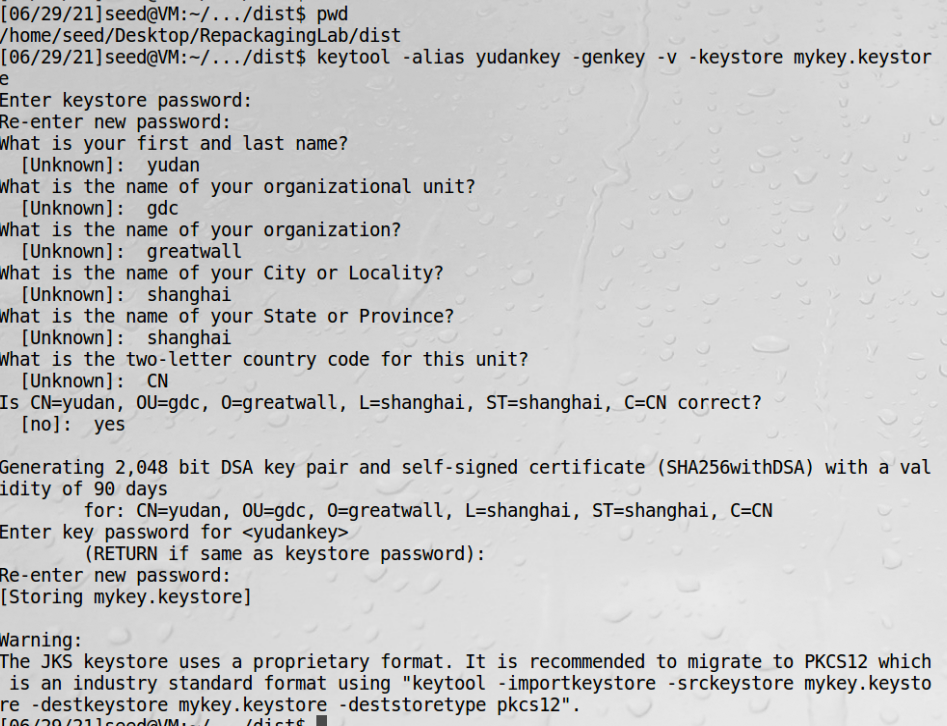
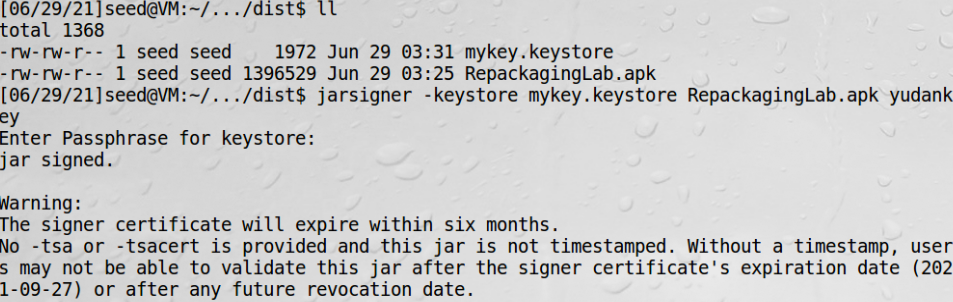
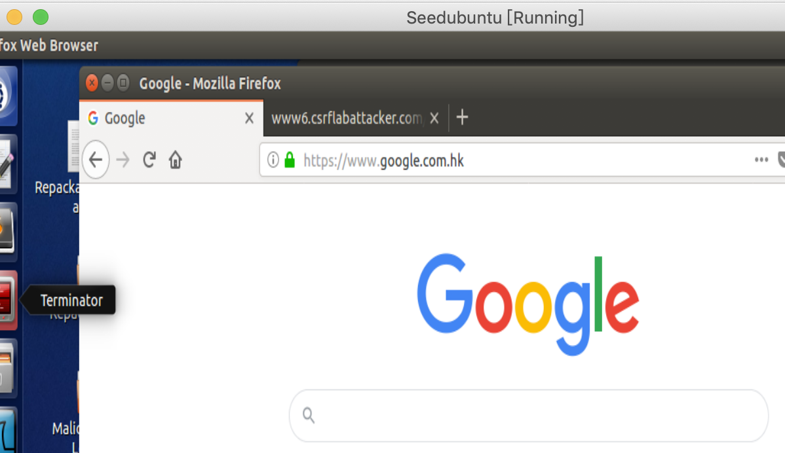

# 重打包攻击前置知识

## APK文件

apk是安卓手机app格式，其实就是一个zip压缩包  
对这个压缩包解压，有以下文件和文件夹  


| 文件和文件夹 | 作用 |
| ---- | ---- |
| AndroidManifest.xml | Android工程的基础配置属性文件 |
| META-INF     | 存放工程属性文件   |
| classes.dex       | java代码编译得到的Dalvik VM能直接执行的文件    |
| res   |  资源目录  |
| resources.arsc | 对res目录下的资源的一个索引文件，保存了工程中strings.xml等文件内容 |  

</br>

## Dalvik字节码

Dalvik是google专门为Android操作系统设计的一个虚拟机，经过深度的优化。虽然Android上的程序是使用java来开发的，
但是Dalvik和标准的java虚拟机JVM还是两回事。Dalvik VM是基于寄存器的，而JVM是基于栈的，Dalvik有专属的文件执行
格式dex（dalvik executable），而JVM则执行的是Java字节码。Dalvik VM比JVM速度更快，占用空间更少。

通过Dalvik的字节码我们不能直接看到原来的逻辑代码，需要借助如Apktool或dex2jar+jd-gui工具来帮助查看。
但是注意最终我们修改APK需要操作的文件是.small文件，而不是导出来的java文件重新编译。

## Smali语言

Smali是用于Dalvik的反汇编程序实现，汇编工具（将Smali代码汇编为dex文件）为smali.jarS，与之对应的baksmali.jar
则是反汇编程序。

Smali支持注解、调试信息、行数信息等基本Java的基本特性，可以说是很接近Java编译在JVM上的中间语言。

## Dalvik字节码转smali

APK文件包含Dalvik字节码，不适合人类阅读，故要把字节码转成smali。可以用APKTool反汇编dex代码（classes.dex）
成smali代码。APKTool是一款编码和重新编译安卓app的工具。

## java代码转smali代码

1、编译java代码为class文件
```bash
javac smaliTest.java
```

2、把class文件转成dex文件  
```bash
java -jar dx.jar --dex --output=smaliTest.dex smaliTest.class
```
其中dx.jar是安卓sdk的一个工具  

3、把dex转化成smali文件  
```bash
java -jar baksmali.jar smaliTest.dex
```
baksmali.jar也是安卓sdk的一个工具

## 对APK文件签名  

安卓要求所有APP有数字签名才能被安装，这要求APK有一个签名和一个公钥。获得一个权威证书要收费，故安卓允许开发者用他们
自己的私钥提供自签名证书，这样开发者可以在证书中使用任何名字不用管是不是拥有这个名字。谷歌应用商店对验证有要求，
但是很多第三方应用市场没有这个要求。

1、生成公钥私钥对  
```bash
keytool -alias yudankey -genkey -v -keystore mykey.keystore
```
mykey.keystore可以存储很多key，yudankey只是其中的一个key  


2、对APK签名  
```bash
jarsigner -keystore mykey.keystore RepackagingLab.apk yudankey
```


## 虚拟机使用宿主机vpn翻墙

1、查看vpn的代理端口是9999  


2、设置http代理端口  


3、成功上网  
