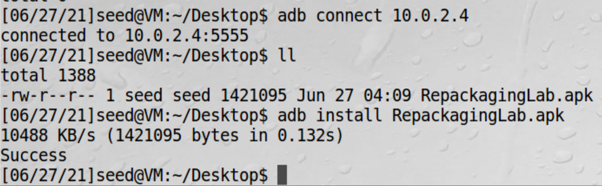

# 安卓重打包攻击

对已存在的安卓应用插入恶意代码，并重新打包

重打包攻击是一种很常见的对安卓设备的攻击形式，攻击者往往从安卓市场下载受欢迎的应用，加入一些恶意参数然后上传到应用市场。
用户很难分辨原始应用和修改后的应用。一旦修改后的应用被安装，恶意代码就可以执行，比如获取root权限等。

重打包攻击之所以容易实现是因为安卓应用的二进制代码很容易修改

## task1: 获得一个安卓APK文件并安装


!!! 环境问题

    由于实验用安卓虚拟机不是物理机，有些应用在虚拟机下可能无法运行，其中原因之一是这些应用用了原生代码。
    原生代码跑在物理机上在ARM处理器用二进制代码，而安卓虚拟机跑在x86处理器上，这需要原代码，而我们没有源代码，
    可能会崩溃，遇到这种情况就换一个app就好。

1、宿主机中[下载app](https://seedsecuritylabs.org/Labs_20.04/Mobile/Android_Repackaging/files/RepackagingLab.apk.zip)  
2、把下载的app拖到ubuntu虚拟机的桌面  
3、连接安卓虚拟机  
```bash
adb connect 10.0.2.4
```
4、安装apk


安装之后就多了一个app


## task2: 对app反汇编