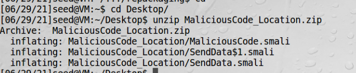

# 追踪用户的位置

这个实验用来获取用户位置信息，特别跟踪用户的移动  

## 1、设置模拟位置  

在安卓设备中，我们是从GPS这个硬件中获取位置信息的。但是虚拟机没有这样的硬件，但是安卓系统允许我们提供一个模拟的位置，
我们所需要做的，是写一个模拟位置的应用，然后让系统从这个应用里面取位置信息，目前已经预置了一个app在里面了。

## 2、配置DNS  

在安卓的重打包app中的恶意代码的功能是，发送用户的坐标到www.repackagingattacklab.com这个地址，这个地址要配置成
ubuntu虚拟机的地址，故在安卓虚拟机中需要配置hosts文件  
  
  

## 3、重打包并安装app
  
### 1、下载[攻击代码](https://seedsecuritylabs.org/Labs_20.04/Mobile/Android_Repackaging/files/MaliciousCode_Location.zip)    

### 2、把压缩包拖到ubuntu虚拟机再解压缩  

如果直接在宿主机解压后拖到虚拟机，会报如下错误，虚拟机不允许这种类型的文件拖进去  
  

之后用unzip解压   


再把三个恶意文件拖到如下目录  
```bash
/home/seed/Desktop/RepackagingLab/smali/com/mobiseed/repackaging
```

### 3、修改AndroidManifest.xml

```xml
<manifest...>
    ...
    <uses-permission android:name="android.permission.ACCESS_COARSE_LOCATION"/>
    <uses-permission android:name="android.permission.ACCESS_FINE_LOCATION"/>
    <uses-permission android:name="android.permission.ACCESS_MOCK_LOCATION" />
    <uses-permission android:name="android.permission.INTERNET"/>
    ....
    <application>
        .....
        .....
        <receiver android:name="com.mobiseed.repackaging.MaliciousCode" >
            <intent-filter>
                <action android:name="android.intent.action.TIME_SET" />
            </intent-filter>
        </receiver>
    </application>
</manifest>
```

 

### 4、重编译 APK

```bash
apktool b RepackagingLab
```

### 5、对APK文件签名

```bash
jarsigner -keystore mykey.keystore RepackagingLab.apk yudankey
```

### 6、卸载老app

### 7、安装新app

### 8、设置允许读取位置

在安卓物理机中，安装完一个app，会询问用户是否允许获取位置，而这里app是通过adb安装的，需要手动允许一下 


### 9、app需要运行一次注册receiver

### 10、改变时间触发攻击

Settings--date and time -- set time

### 11、在ubuntu虚拟机中访问专门设置的网站

虚拟机中预置了一个网站http://www.repackagingattacklab.com/，正常情况下app中的恶意代码会往这个网站发送坐标，
这个网站是一个地图，会显示用户的坐标，但是由于网站用了google map，需要vpn翻墙，虚拟机中使用宿主机共享的vpn需要
设置http代理，设置了代理后，又将无法访问http://www.repackagingattacklab.com/。  

故这个实验在国内做困难重重，除非在虚拟机内部安装vpn。

## 虚拟机使用宿主机vpn翻墙

1、查看vpn的代理端口是9999  


2、设置http代理端口  


3、成功上网  
