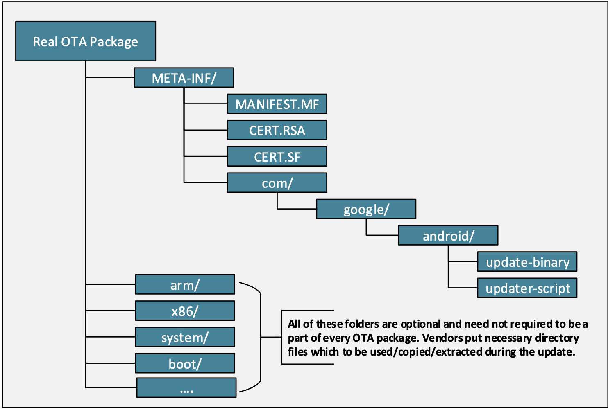

# 前置知识

## OTA背景

!!! Edify语言

    edify是用来解析zip文件，从而进一步安装安卓系统的脚本语言。edify脚本并不一定是用于固件更新，
    它还可以用来替换、增加、删除特定的文件，甚至是格式化分区。通常情况下，edify脚本在recovery模式下
    flash zip包的时候运行。
    
OTA的结构如下：  


下面两个是edify的两个重要文件：  
update-binary，当用户选择刷入zip时执行的二进制解释器，用来执行OTA更新，他来加载updater-script  
updater-script，edify语言描述的安卓系统安装脚本，是文本文件  
这两文件包含了签名和证书  

当对OTA包签名后，recovery系统用update-binary把OTA包解压到/tmp目录  
update-binary命令格式：  
```bash
update-binary 3 stdout /sdcard/ota.zip
```
3是版本号，stdout是和recovery通信管道  
成功执行updater-script后，recovery系统会把执行日志拷贝到/cache/recovery目录，然后重启进入系统，
这就是OTA包更新安卓系统的过程。

## 安卓启动过程


当power按键按下后，设备会从ROM中的固定位置取指令执行，这些指令会在磁盘或flash中预先定义好的位置加载bootloader，bootloader加载
系统，最终控制已加载的系统。

**第一阶段: kernel层**，当bootloader之后就进入安卓系统，安卓的内核实际是linux内核，处理一些基本任务如中断、内存保护、计划任务等  

**第二阶段：Init进程**，内核加载完后，Init是被创建的第一个用户进程，它是所有其他进程的起始进程，运行在root权限下。Init初始化虚拟文件
系统，检测硬件，然后执行init.rc脚本配置系统。init.rc这个脚本作用主要是挂载文件和初始化守护进程。

init.rc引入了以下文件：  
1、init.environ.rc，设置系统环境变量  
2、init.${ro.hardware}.rc，我们这里是init.android_x86.rc，正是在这个文件中，init.sh被调用  
3、init.${ro.zygote}.rc，这个文件启动一个叫Zygote的守护进程，32位系统，文件是init.zygote32.rc  
在我们虚拟机中，所有这些rc文件都存在ramdisk.img这个文件中。在真实设备中，存在boot.img文件中，这个文件包含ramdisk.img和内核  

**第三阶段：zygote进程**，init进程会执行如下命令来启动zygote  
```bash
service zygote /system/bin/app_process ...
```
zygote启动Dalvik或者ART等运行时环境，用来运行java程序。由于在安卓中，系统服务和多数应用都是用java开发的，故zygote是一个很基础的
守护进程，用root权限启动的。这里也提供另一种插入恶意代码的方式，app_process文件不是一个真正的二进制文件，而是一个链接，根据不同架构链接到
app_process32或者app_process64，我们只需改变这个链接，让它指向我们的代码。

## 如何在真实设备上解锁boot loader

多数安卓系统有两个操作系统，一个安卓系统和一个恢复系统。默认进入安卓系统，当启动时按一个特殊的键（Nexus手机是音量小键+power键）会进入
恢复系统。很多手机制造商不希望用户去改动设备，他们会禁用这个功能，这就叫bootloader被锁了。   
有些制造商会永久锁住bootloader，这个系统很难刷新。但更多的制造商会提供解锁指令。  

也可以通过如下命令替代特殊按键  
```bash
adb reboot bootloader
```

三星nexus手机可以通过如下命令解锁bootloader
```bash
fastboot oem unlock
```
解锁时可能个人数据会丢失，如需备份，备份命令如下：  
```bash
adb backup -apk -all -f backup.db
```
备份完之后恢复数据运行如下命令  
```bash
adb restore backup.db
```

## 如何在物理机替换现有的恢复系统

安卓市场上有一些定制化的恢复系统，如TWRP、ClockworkMod  

第一步我们需要解锁系统，之后执行如下命令让系统从定制化的系统启动  
```bash
fastboot boot CustomRecoveryOS.img
```
想永久替换恢复系统，执行  
```bash
fastboot flash recovery CustomRecoveryOS.img
```