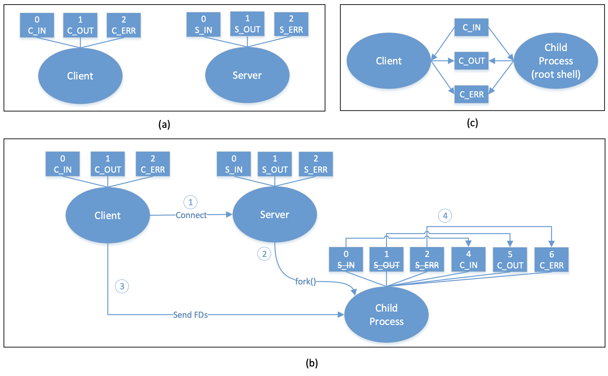

# rooting代码分析

## socket相关

!!! AF_UNIX域socket通信

    本机内进程间通信可以使用socket的AF_UNIX域通信，是一种本地IPC，类似于管道，依赖路径名称标识发送方和接收方。

```c
int socket(int af, int type, int protocol);
```
af为地址族，type为套接字类型，protocol为使用TCP还是UDP，执行正确返回套接字描述符，错误则返回-1

```c
socket_fd = socket(AF_UNIX, SOCK_STREAM, 0);
```
表示创建一个用于本机进程间通信的流式套接字，协议自动选择TCP，最后一个0表示自动推演，是一种简化的写法，比如
```c
int tcp_socket = socket(AF_INET, SOCK_STREAM, 0);  //创建TCP套接字
int udp_socket = socket(AF_INET, SOCK_DGRAM, 0);  //创建UDP套接字
```

```c
fcntl(socket_fd, F_SETFD, FD_CLOEXEC)
```
对socket_fd这个描述符设置有效除非执行exec类型函数  
fcntl是对已打开的文件描述符做控制操作  
F_SETFD设置文件描述符标志  

## c语言用法

```c
#define SERVER_DIR "/data/mydaemon"
#define SERVER_LOC SERVER_DIR "/server"
```
c语言中两个字符串是可以通过空格连接的，故以上语句等价于
```c
#define SERVER_LOC "/data/mydaemon/server"
```

## linux系统函数

```c
int unlink(const char * pathname);
```
删除指定的文件

```c
int previous_umask = umask(0)
```
umask是用来设置用户创建文件的默认权限的，用一个例子来说明  
1、文件最大权限 rwx rwx rwx，对应777  
2、umask值如为2， --- --- -w-  
3、目录权限 rwx rwx r-x，对应775，这就是目录创建的缺省权限  
4、对于文件来说，创建时不能具有执行权限，只要拿掉相应执行权限比特即可，rw- rw- r--，对应664，这就是文件创建缺省权限  
如umask设置为0，目录创建权限777，文件创建权限666  

```c
int dup2(int oldfd, int newfd);
```
复制旧的文件描述符到新的文件描述符，如果新的已经被使用，则会先把它关闭

/dev/urandom是linux提供的随机伪设备，提供不为空的随机字节数据流，urandom不依赖系统中断，也不会造成进程忙等待，数据随机性也不高，
而/dev/random则依赖中断，会造成进程忙，随机性高  

## 项目分析

SimpleSU项目代码结构如下：  


主要是三个文件，一个服务端mydaemonsu.c，一个客户端mysu.c，还有一个socket函数文件socket_util.c    

  
客户端获取另一个进程输入输出设备过程： 开始时，客户端和服务器都运行在各自进程，客户端只有普通权限，服务器有root
权限，图b展示了客户端获取root权限过程：  
1、客户端用socket连接服务器  
2、收到请求后，服务器fork一个子进程root运行，子进程继承了所有服务器的I/O设备  
3、客户端发送文件描述符给子进程，这些描述符分别用4、5、6保存  
4、子进程重定向设备描述符，现在客户端进程和子进程共享设备描述符了 


socket_util.c:
```c
#include "socket_util.h"
#include <stdio.h>
#include <stdlib.h>
#include <sys/types.h>
#include <unistd.h>
#include <sys/socket.h>     //socket() bind() listen() accept()
#include <fcntl.h>          //fcntl()
#include <errno.h>          //errno
#include <limits.h>         //PATH_MAX
#include <string.h>

#define LOGE(fmt,args...) fprintf(stderr, fmt, ##args)
#define PLOGE(fmt,args...) LOGE(fmt " failed with %d: %s", ##args, errno, strerror(errno))

/*
 * Receive a file descriptor from a Unix socket.
 * Contributed by @mkasick
 *
 * Returns the file descriptor on success, or -1 if a file
 * descriptor was not actually included in the message
 *
 * On error the function terminates by calling exit(-1)
 */
int recv_fd(int sockfd) {
    // Need to receive data from the message, otherwise don't care about it.
    char iovbuf;

    struct iovec iov = {
        .iov_base = &iovbuf,
        .iov_len  = 1,
    };

    char cmsgbuf[CMSG_SPACE(sizeof(int))];

    struct msghdr msg = {
        .msg_iov        = &iov,
        .msg_iovlen     = 1,
        .msg_control    = cmsgbuf,
        .msg_controllen = sizeof(cmsgbuf),
    };

    if (recvmsg(sockfd, &msg, MSG_WAITALL) != 1) {
        goto error;
    }

    // Was a control message actually sent?
    switch (msg.msg_controllen) {
    case 0:
        // No, so the file descriptor was closed and won't be used.
        return -1;
    case sizeof(cmsgbuf):
        // Yes, grab the file descriptor from it.
        break;
    default:
        goto error;
    }

    struct cmsghdr *cmsg = CMSG_FIRSTHDR(&msg);

    if (cmsg             == NULL                  ||
        cmsg->cmsg_len   != CMSG_LEN(sizeof(int)) ||
        cmsg->cmsg_level != SOL_SOCKET            ||
        cmsg->cmsg_type  != SCM_RIGHTS) {
error:
        LOGE("unable to read fd");
        exit(-1);
    }

    return *(int *)CMSG_DATA(cmsg);
}

/*
 * Send a file descriptor through a Unix socket.
 * Contributed by @mkasick
 *
 * On error the function terminates by calling exit(-1)
 *
 * fd may be -1, in which case the dummy data is sent,
 * but no control message with the FD is sent.
 */
void send_fd(int sockfd, int fd) {
    // Need to send some data in the message, this will do.
    struct iovec iov = {
        .iov_base = "",
        .iov_len  = 1,
    };

    struct msghdr msg = {
        .msg_iov        = &iov,
        .msg_iovlen     = 1,
    };

    char cmsgbuf[CMSG_SPACE(sizeof(int))];

    if (fd != -1) {
        // Is the file descriptor actually open?
        if (fcntl(fd, F_GETFD) == -1) {
            if (errno != EBADF) {
                goto error;
            }
            // It's closed, don't send a control message or sendmsg will EBADF.
        } else {
            // It's open, send the file descriptor in a control message.
            msg.msg_control    = cmsgbuf;
            msg.msg_controllen = sizeof(cmsgbuf);

            struct cmsghdr *cmsg = CMSG_FIRSTHDR(&msg);

            cmsg->cmsg_len   = CMSG_LEN(sizeof(int));
            cmsg->cmsg_level = SOL_SOCKET;
            cmsg->cmsg_type  = SCM_RIGHTS;

            *(int *)CMSG_DATA(cmsg) = fd;
        }
    }

    if (sendmsg(sockfd, &msg, 0) != 1) {
error:
        PLOGE("unable to send fd");
        exit(-1);
    }
}

int read_int(int fd) {
    int val;
    int len = read(fd, &val, sizeof(int));
    if (len != sizeof(int)) {
        LOGE("unable to read int: %d", len);
        exit(-1);
    }
    return val;
}

void write_int(int fd, int val) {
    int written = write(fd, &val, sizeof(int));
    if (written != sizeof(int)) {
        PLOGE("unable to write int");
        exit(-1);
    }
}

char* read_string(int fd) {
    int len = read_int(fd);
    if (len > PATH_MAX || len < 0) {
        LOGE("invalid string length %d", len);
        exit(-1);
    }
    char* val = malloc(sizeof(char) * (len + 1));
    if (val == NULL) {
        LOGE("unable to malloc string");
        exit(-1);
    }
    val[len] = '\0';
    int amount = read(fd, val, len);
    if (amount != len) {
        LOGE("unable to read string");
        exit(-1);
    }
    return val;
}

void write_string(int fd, char* val) {
    int len = strlen(val);
    write_int(fd, len);
    int written = write(fd, val, len);
    if (written != len) {
        PLOGE("unable to write string");
        exit(-1);
    }
}


/*provided by Zhuo Zhang @ Syracuse University*/
//pass dummy message from client to server and wait for response
void handshake_client(int socket) {
    FILE* rand_fp = fopen("/dev/urandom", "r");
    int ack_num;
    fread(&ack_num, sizeof(int), 1, rand_fp);
    fclose(rand_fp);
    
    write_int(socket, ack_num);
    int back_num = read_int(socket);
    
    if (back_num != ack_num) {
        shutdown(socket, SHUT_RDWR);
        close(socket);
        exit(EXIT_FAILURE);
    }
}

/*provided by Zhuo Zhang @ Syracuse University*/
//receive a dummy message from client and send it back
void handshake_server(int socket) {
    int ack_num = read_int(socket);
    write_int(socket, ack_num);
}
```

mydaemonsu.c：
```c
#include <stdio.h>
#include <stdlib.h>
#include <unistd.h>
#include <sys/types.h>
#include <sys/socket.h>     //socket() bind() listen() accept() AF_UNIX
#include <fcntl.h>          //fcntl()
#include <string.h>         //strerror()
#include <errno.h>          //errno
#include <sys/un.h>         //struct sockaddr_un
#include <sys/stat.h>       //umask() mkdir()
#include <stdbool.h>        //bool true false

#include "../socket_util/socket_util.h"
#include "../server_loc.h"

#define ERRMSG(msg) fprintf(stderr, "%s", msg)

#define DEFAULT_SHELL "/system/bin/sh"

#define SHELL_ENV "SHELL=/system/bin/sh"
#define PATH_ENV "PATH=/system/bin:/system/xbin"

#define APP_PROCESS "/system/bin/app_process_original"

extern char** environ;

//create a UNIX domain socket and return its file descriptor
int creat_socket() {
    int socket_fd;
    struct sockaddr_un sun;
    
    //open socket
    socket_fd = socket(AF_UNIX, SOCK_STREAM, 0);
    if (socket_fd < 0) {
        ERRMSG("failed to open socket\n");
        exit(EXIT_FAILURE);
    }
    
    //set the socket file descriptor
    //with flag FD_CLOEXEC, socket_fd will stay valid through fork()
    //but will be destroyed by all exec family functions (e.g. execve())
    if (fcntl(socket_fd, F_SETFD, FD_CLOEXEC)) {
        ERRMSG("failed to fcntl\n");
        goto err;
    }
    
    //set struct sockaddr_un
    /*    
        struct sockaddr_un {
            sa_family_t sun_family;               //AF_UNIX
            char        sun_path[108];            //pathname
        };
    */
    memset(&sun, 0, sizeof(sun));
    sun.sun_family = AF_UNIX;
    strncpy(sun.sun_path, SERVER_LOC, sizeof(sun.sun_path)); 
    
    //get rid of potential existing file due to previous error
    unlink(sun.sun_path);
    unlink(SERVER_DIR);
    
    //backup current umask
    //and change umask to allow all permissions
    int previous_umask = umask(0);
    
    //make new server path
    mkdir(SERVER_DIR, 0777);
    
    //bind socket
    if (bind(socket_fd, (struct sockaddr*)&sun, sizeof(sun)) < 0) {
        ERRMSG("failed to bind socket\n");
        goto err;
    }
    
    //restore umask
    umask(previous_umask);
    
    //start listening on the socket
    if (listen(socket_fd, 10) < 0) {
        ERRMSG("failed to listen\n");
        goto err;
    }
    
    return socket_fd;
    
err:    
    close(socket_fd);
    exit(EXIT_FAILURE);
}

//the code executed by the child process
//it launches default shell and link file descriptors passed from client side
int child_process(int socket, char** argv){
    //handshake
    handshake_server(socket);
    
    int client_in = recv_fd(socket);
    int client_out = recv_fd(socket);
    int client_err = recv_fd(socket);

    
    dup2(client_in, STDIN_FILENO);      //STDIN_FILENO = 0
    dup2(client_out, STDOUT_FILENO);    //STDOUT_FILENO = 1
    dup2(client_err, STDERR_FILENO);    //STDERR_FILENO = 2
    
    //change current directory
    chdir("/");

    char* env[] = {SHELL_ENV, PATH_ENV, NULL};
    char* shell[] = {DEFAULT_SHELL, NULL};

    execve(shell[0], shell, env);

    //expect no return from execve
    //only if execve fails
    ERRMSG("Failed on launching shell: ");
    ERRMSG(strerror(errno));
    ERRMSG("\n");
    
    close(socket);
    
    exit(EXIT_FAILURE);
}

//start the daemon and keep waiting for connections from client
void run_daemon( char** argv) {
    if (getuid() != 0) {
        ERRMSG("Daemon require root privilege\n");
        exit(EXIT_FAILURE);
    }
    
    //get a UNIX domain socket file descriptor
    int socket = creat_socket();
    
    //wait for connection
    //and handle connections
    int client;
    while ((client = accept(socket, NULL, NULL)) > 0) {
        if (0 == fork()) {
            close(socket);
            ERRMSG("Child process start handling the connection\n");
            exit(child_process(client,argv));
            child_process(client, argv);
        }
        else {
            close(client);
        }
    }
    
    //expect daemon never end execution
    //unless socket failed
    ERRMSG("Daemon quits: ");
    ERRMSG(strerror(errno));
    ERRMSG("\n");
    
    close(socket);
    close(client);
    
    exit(EXIT_FAILURE);
}

//try to connect to the daemon to determine whether it is running
bool detect_daemon() {

    struct sockaddr_un sun;
    
    //create socket fd
    int socket_fd = socket(AF_UNIX, SOCK_STREAM, 0);
    if (socket_fd < 0) {
        ERRMSG("failed to create socket fd\n");
        exit (EXIT_FAILURE);
    }
    
    //set socket fd
    if (fcntl(socket_fd, F_SETFD, FD_CLOEXEC)) {
        ERRMSG("failed on fcntl\n");
        exit (EXIT_FAILURE);
    }
    
    //set sun
    memset(&sun, 0, sizeof(sun));
    sun.sun_family = AF_UNIX;
    strncpy(sun.sun_path, SERVER_LOC, sizeof(sun.sun_path));
    
    //connect to server
    //return false if connection failed (daemon is not running)
    if (0 != connect(socket_fd, (struct sockaddr*)&sun, sizeof(sun))) {
        return false;
    }
    
    //close the socket and return true if connection succeeded (daemon is running)
    close(socket_fd);
    return true;
}

int main(int argc, char** argv) {
    pid_t pid = fork();
    if (pid == 0) {
        // 返回0表示是子进程运行的fork，判断如果守护进程没有运行，则运行守护进程
        //initialize the daemon if not running
        if (!detect_daemon())
            run_daemon(argv);
        }
    else {
        argv[0] = APP_PROCESS;
        execve(argv[0], argv, environ);
    }
}
```

mysu.c：
```c
#include <stdio.h>
#include <stdlib.h>
#include <unistd.h>
#include <sys/types.h>
#include <sys/socket.h>     //socket() bind() listen() accept() AF_UNIX
#include <fcntl.h>          //fcntl()
#include <string.h>         //strerror()
#include <errno.h>          //errno
#include <sys/un.h>         //struct sockaddr_un

#include "../socket_util/socket_util.h"
#include "../server_loc.h"

#define ERRMSG(msg) fprintf(stderr, "%s", msg)

#define DEFAULT_SHELL "/system/bin/sh"

#define SHELL_ENV "SHELL=" DEFAULT_SHELL
#define PATH_ENV "PATH=/system/bin:/system/xbin"


//try to connect to the server and get a socket file descriptor
int config_socket() {
    
    struct sockaddr_un sun;
    
    //create socket fd
    int socket_fd = socket(AF_UNIX, SOCK_STREAM, 0);
    if (socket_fd < 0) {
        ERRMSG("failed to create socket fd\n");
        exit (EXIT_FAILURE);
    }
    
    //set the socket file descriptor
    //with flag FD_CLOEXEC, socket_fd will stay valid through fork()
    //but will be destroyed by all exec family functions (e.g. execve())
    if (fcntl(socket_fd, F_SETFD, FD_CLOEXEC)) {
        ERRMSG("failed on fcntl\n");
        exit (EXIT_FAILURE);
    }
    
    //set struct sockaddr_un
    /*    
        struct sockaddr_un {
            sa_family_t sun_family;               //AF_UNIX
            char        sun_path[108];            //pathname
        };
    */
    memset(&sun, 0, sizeof(sun));
    sun.sun_family = AF_UNIX;
    strncpy(sun.sun_path, SERVER_LOC, sizeof(sun.sun_path));
    
    //connect to server
    if (0 != connect(socket_fd, (struct sockaddr*)&sun, sizeof(sun))) {
        ERRMSG("failed to connect server\n");
        exit (EXIT_FAILURE);
    }
    
    return socket_fd;
}

//try to connect the daemon server
//pass stdin, stdout, stderr to server
//hold the session to operate the root shell created and linked by server
int connect_daemon() {
    
    //get a socket
    int socket = config_socket();
    
    //do handshake
    handshake_client(socket);
    
    ERRMSG("sending file descriptor \n");
    fprintf(stderr,"STDIN %d\n",STDIN_FILENO);
    fprintf(stderr,"STDOUT %d\n",STDOUT_FILENO);
    fprintf(stderr,"STDERR %d\n",STDERR_FILENO);

    send_fd(socket, STDIN_FILENO);      //STDIN_FILENO = 0
    send_fd(socket, STDOUT_FILENO);     //STDOUT_FILENO = 1
    send_fd(socket, STDERR_FILENO);     //STDERR_FILENO = 2
    
    //hold the session until server close the socket or some error occurs
    //in my design, server should not send things back through socket after handshake
    //read() function will block the process, thus we hold the session
    //if the socket is closed, read() will return 0
    //or error occurs, read() will return a negative integer
    char dummy[2];
    ERRMSG("2 \n");
    int flag = 0;
    do {
        flag = read(socket, &dummy, 1);
    } while (flag > 0);
    
    ERRMSG("3 \n");

    close(socket);
    
    //print out error message if has
    if (flag < 0) {
        ERRMSG("Socket failed on client: ");
        ERRMSG(strerror(errno));
        ERRMSG("\n");
        return (EXIT_FAILURE);
    }
    
    return (EXIT_SUCCESS);
}

int main(int argc, char** argv) {
    //if not root
    //connect to root daemon for root shell
    if (getuid() != 0 && getgid() != 0) {
        ERRMSG("start to connect to daemon \n");

        return connect_daemon();
    }
    //if root
    //launch default shell directly
    char* shell[] = {"/system/bin/sh", NULL};
    execve(shell[0], shell, NULL);
    return (EXIT_SUCCESS);
}
```