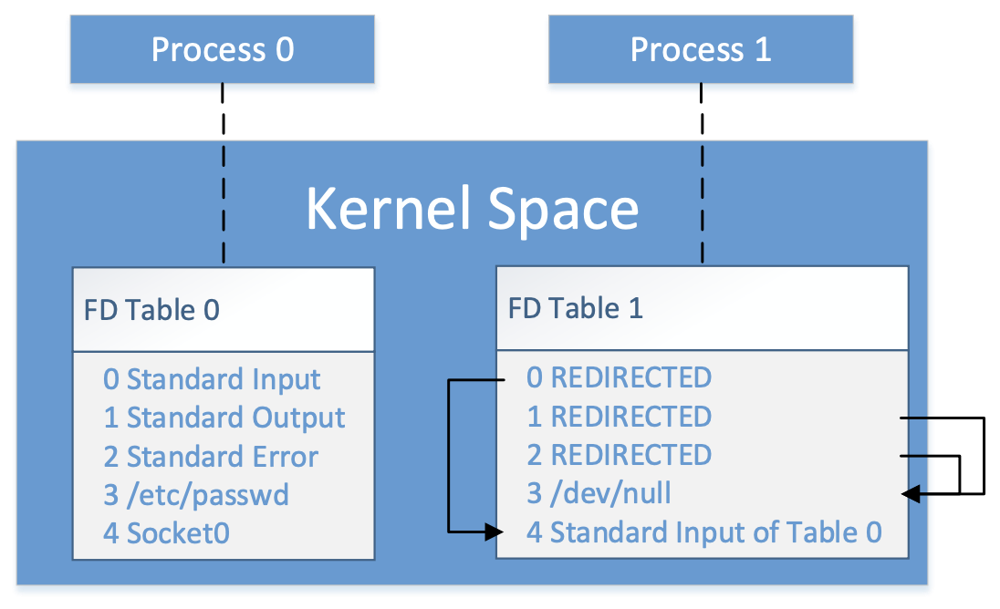
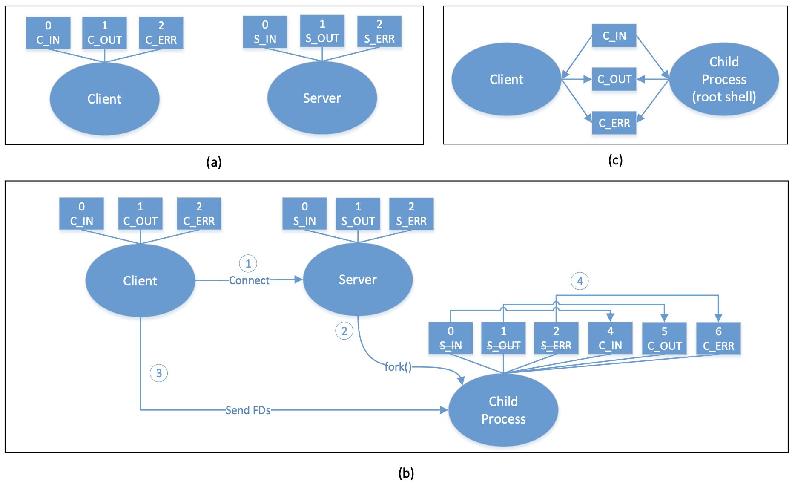
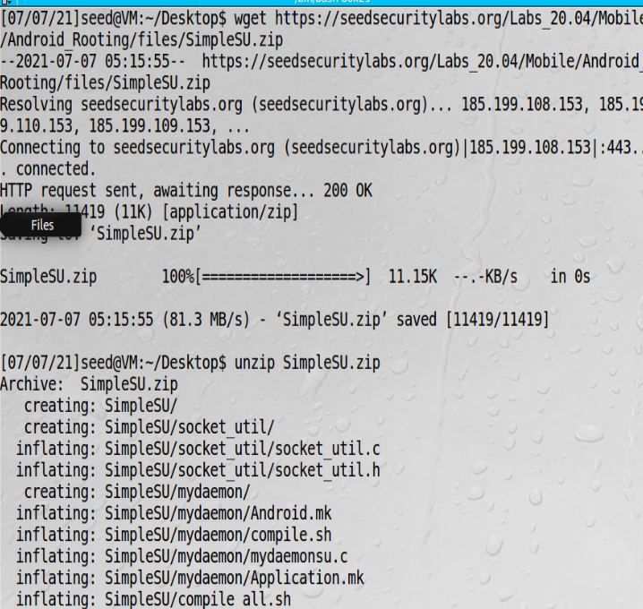
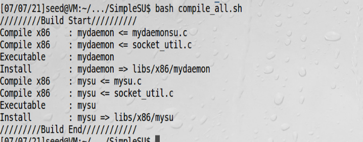
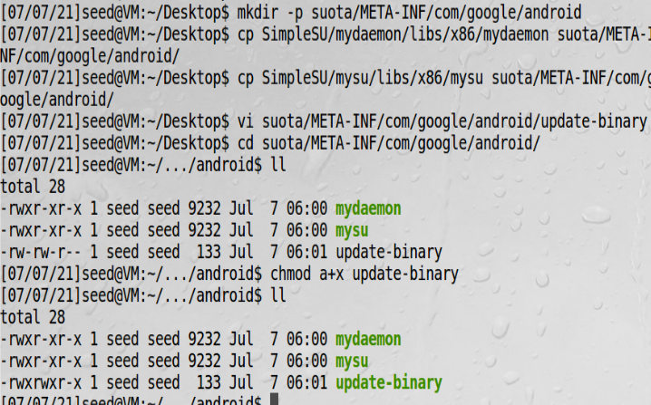
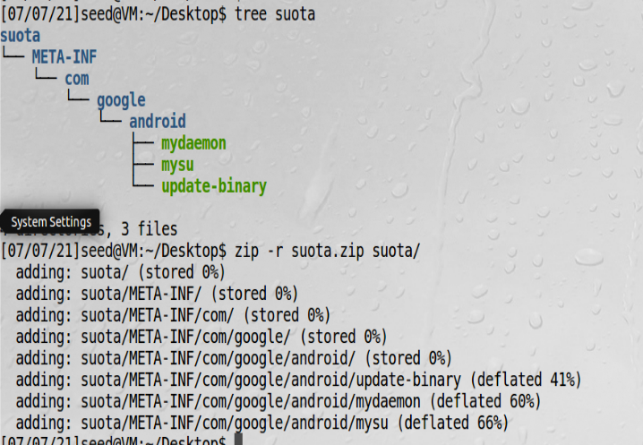

# 实现rooting攻击

## 获取root窗口

在一个典型的Linux系统中，可以通过设置set-uid比特位的方式通过shell程序来获取root权限，但是安卓系统在4.3版本后，
已经去掉了set-uid机制。  
另一个在启动过程中获取root shell的方法是通过OTA包，比如有名的SuperSU。本次实验通过守护进程获取一个root shell，
过程是起一个客户端程序，向有root权限的守护进程发请求，守护进程会起一个shell进程，允许用户控制这个进程  

  
文件描述符用一个例子来说明，以上图实现的功能是，进程1的输入和进程0一样，标准输出和错误输出都丢弃

  
客户端获取另一个进程输入输出设备过程： 开始时，客户端和服务器都运行在各自进程，客户端只有普通权限，服务器有root
权限，图b展示了客户端获取root权限过程：  
1、客户端用socket连接服务器  
2、收到请求后，服务器fork一个子进程root运行，子进程继承了所有服务器的I/O设备  
3、客户端发送文件描述符给子进程，这些描述符分别用4、5、6保存  
4、子进程重定向设备描述符，现在客户端进程和子进程共享设备描述符了 

## 准备实验代码

由于这个seed实验非常复杂，这次提供的是完整的源代码，地址是[rooting源代码](https://seedsecuritylabs.org/Labs_20.04/Mobile/Android_Rooting/files/SimpleSU.zip)  
下载并解压源代码  


编译代码，生成两个可执行文件mysu、mydaemon    



## 准备update-binary

update-binary如下：  
```bash
cp mysu /android/system/xbin
cp mydaemon /android/system/xbin
sed -i "/return 0/i /system/xbin/mydaemon" /android/system/etc/init.sh
```
并给update-binary赋予可执行权限  

## 准备OTA包

准备三个可执行文件和目录  


打成zip包  

