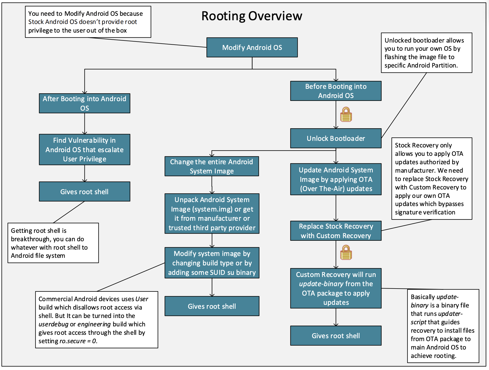
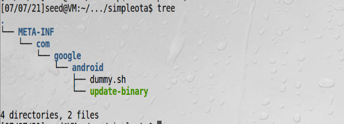
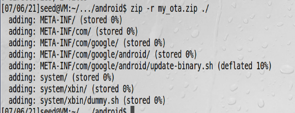

# 安卓rooting

## rooting背景

安卓设备默认用户没有root权限，这对于想深入定制不太方便，安卓设备获取root权限这个过程有个专有名词叫rooting。
为何要获取root权限？比如安卓系统有很多预装软件，用不到又占用资源，需要卸载，往往需要root用户才能卸载。

**从安卓内部获取root**，这种手段会借助一些已经存在的系统漏洞。如果这些漏洞在内核中或者运行在有root权限的
守护进程中，就可以利用这些漏洞获取root权限

rooting概览：


**从安卓外部获取root**，假设我们安装了双系统，只要我们挂载了有安卓系统的分区，就可以修改安卓的系统文件。
安卓设备已经预置了另一个系统在里面，叫recovery模式，为了恢复系统用的，但经常被用来更新操作系统。  
为了防止用户执行任意命令，recovery模式没有提供一个shell提示，取而代之的是用了OTA技术（Over-The-Air）,
就是用一个外部的包，这个包包含了命令和文件用来更新安卓。这个包叫OTA包  

多数OTA包需要有供应商的签名，故需要绕过这个保护机制。

**重新安装recovery系统**，比绕过更简单的方法是重新安装recovery系统。但是有另一个机制阻止我们重装recovery系统，
那就是Bootloader。bootloader用更底层的代码在设备上电后加载系统，当bootloader被锁住时，只能加载已经预装
在设备上的系统。只有把它解锁才能安装定制化的系统。  
制造商往往会出于控制设备上运行软件的目的，把bootloader锁放在安装包的外面，同时也提供让用户可以解锁bootloader
的方法，但是用户这样做会丢失所有数据并无法保修。

## 实验环境

这个实验我们假设bootloader可以被解锁，预置的recovery系统可以被替换。由于替换系统非常复杂，目前我们
用的系统已经是一个定制化的recovery系统。实际上，我们用ubuntu 16.04当作是recovery系统，这个系统可以
执行任意命令。  
我们的这个步骤，除了替换recovery系统外，其他步骤都一样。  
这个安卓虚拟机基于userdebug源码编译的，并且很多后门已经被设置成用来获取root权限，这个实验不是用这些后门
来获取权限，而是用OTA机制来获取。

!!! 安卓编译选项

    安卓有三种编译选项，分别是eng、user、userdebug。eng是用于工程版本，user用于发行版本，userdebug
    是部分调试版本
    
## task1: 编译一个简单的OTA包

准备一个攻击脚本dummy.sh，让recovery系统启动时运行该脚本  
```bash
echo hello > /system/dummy
```

**1、写更新脚本**，update-binary这个文件可以是二进制可执行文件，也可以是脚本文件（由于安装了bash），
dummy.sh这个文件应放在/android目录下，因为安卓分区已经挂载到这个目录下了，安卓是建立在linux系统上的，
启动时，linux是先启动，启动过程用/system/etc/init.sh这个脚本，我们通过在init.sh中插入命令来启动dummy.sh，
由于我们是通过OTA方式修改文件，通过以下命令可实现这个目的：  
update-binary.sh文件内容：  
```bash
sed -i "/return 0/i /system/xbin/dummy.sh" /android/system/etc/init.sh
```
-i表示编译文件  
/return 0/ 表示找到return 0这行代码  
i 表示在找到的代码前插入  
/system/xbin/dummy.sh是插入的内容  
最后是编辑的文件  

**2、编译OTA包**，按如下目录构造OTA包  
  
打包ota  


!!! zip包

    压缩命令：  zip -r my_ota.zip ./  
    解压缩命令： unzip -l my_ota.zip

由于我们用的是ubuntu系统作为恢复系统，它没有恢复功能，所以我们需要自己构造恢复功能，就是说，需要自己对ota包解压，
然后执行update-binary

## task2: 通过app_process注入代码

安卓启动过程：会运行一个叫app_process的程序，这个程序是由一个叫Zygote的守护进程启动的（也是所有app的守护进程），
我们的目标是修改app_process，直接创建一个/system/dummy2文件

app_process.c文件：
```c
#include <stdio.h>
#include <stdlib.h>
#include <unistd.h>
extern char** environ;

int main(int argc, char** argv) {
    //Write the dummy file
    FILE* f = fopen("/system/dummy2", "w");
    if (f == NULL) {
    printf("Permission Denied.\n");
    exit(EXIT_FAILURE);
    }
    fclose(f);
    //Launch the original binary
    char* cmd = "/system/bin/app_process_original";
    execve(cmd, argv, environ);
    //execve() returns only if it fails
    return EXIT_FAILURE;
}
```
我们首先把原始app_process重命名为app_process_original

!!! NDK

    Native Development Kit(NDK)是一个用来编译在安卓系统运行的c/c++工具，这种类型的代码，叫原生代码，
    可以在原生程序中独立存在也能被安卓app中的java代码通过JNI调用（Jave Native Interface）

我们的app_process程序是一个独立的原生程序，必须用NDK来编译，为了使用NDK，必须创建两个文件：Application.mk
和Android.mk  

Application.mk:
```mk
APP_ABI := x86
APP_PLATFORM := android-22
APP_STL := stlport_static
APP_BUILD_SCRIPT := Android.mk
```

Android.mk:  
```mk
LOCAL_PATH := $(call my-dir)
include $(CLEAR_VARS)
LOCAL_MODULE := app_process
LOCAL_SRC_FILES := app_process.c
include $(BUILD_EXECUTABLE)
```

编译脚本complie.sh：  
```bash
export NDK_PROJECT_PATH=.
ndk-build NDK_APPLICATION_MK=./Application.mk
```


可以看到编译完后的代码在/libs/x86目录下

## 获取root窗口

在一个典型的Linux系统中，可以通过设置set-uid比特位的方式通过shell程序来获取root权限，但是安卓系统在4.3版本后，
已经去掉了set-uid机制。  
另一个在启动过程中获取root shell的方法是通过OTA包，比如有名的SuperSU。本次实验通过守护进程获取一个root shell，
过程是起一个客户端程序，向有root权限的守护进程发请求，守护进程会起一个shell进程，允许用户控制这个进程  

  
文件描述符用一个例子来说明，以上图实现的功能是，进程1的输入和进程0一样，标准输出和错误输出都丢弃

  
客户端获取另一个进程输入输出设备过程： 开始时，客户端和服务器都运行在各自进程，客户端只有普通权限，服务器有root
权限，图b展示了客户端获取root权限过程：  
1、客户端用socket连接服务器  
2、收到请求后，服务器fork一个子进程root运行，子进程继承了所有服务器的I/O设备  
3、客户端发送文件描述符给子进程，这些描述符分别用4、5、6保存  
4、子进程重定向设备描述符，现在客户端进程和子进程共享设备描述符了  
