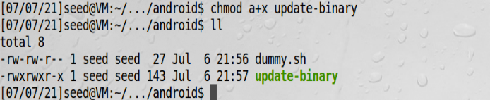
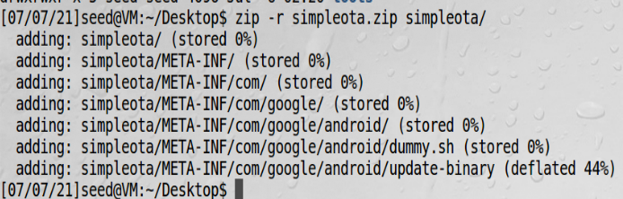
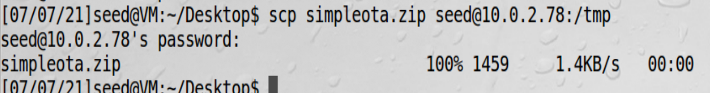
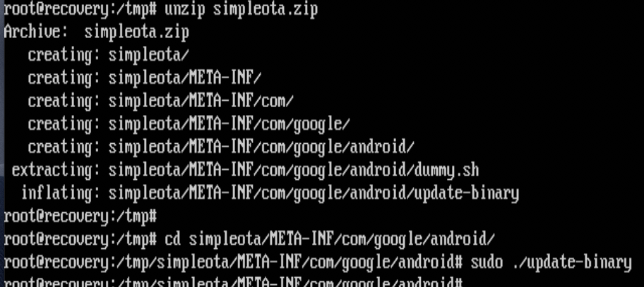
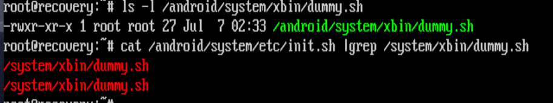
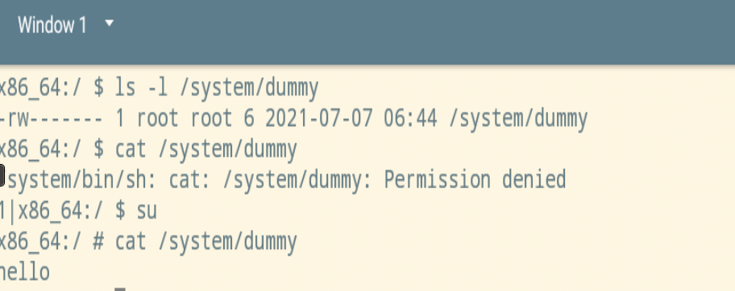

# 写一个OTA并升级

## rooting背景

安卓设备默认用户没有root权限，这对于想深入定制不太方便，安卓设备获取root权限这个过程有个专有名词叫rooting。
为何要获取root权限？比如安卓系统有很多预装软件，用不到又占用资源，需要卸载，往往需要root用户才能卸载。

**从安卓内部获取root**，这种手段会借助一些已经存在的系统漏洞。如果这些漏洞在内核中或者运行在有root权限的
守护进程中，就可以利用这些漏洞获取root权限

rooting概览：


**从安卓外部获取root**，假设我们安装了双系统，只要我们挂载了有安卓系统的分区，就可以修改安卓的系统文件。
安卓设备已经预置了另一个系统在里面，叫recovery模式，为了恢复系统用的，但经常被用来更新操作系统。  
为了防止用户执行任意命令，recovery模式没有提供一个shell提示，取而代之的是用了OTA技术（Over-The-Air）,
就是用一个外部的包，这个包包含了命令和文件用来更新安卓。这个包叫OTA包  

多数OTA包需要有供应商的签名，故需要绕过这个保护机制。

**重新安装recovery系统**，比绕过更简单的方法是重新安装recovery系统。但是有另一个机制阻止我们重装recovery系统，
那就是Bootloader。bootloader用更底层的代码在设备上电后加载系统，当bootloader被锁住时，只能加载已经预装
在设备上的系统。只有把它解锁才能安装定制化的系统。  
制造商往往会出于控制设备上运行软件的目的，把bootloader锁放在安装包的外面，同时也提供让用户可以解锁bootloader
的方法，但是用户这样做会丢失所有数据并无法保修。

## 实验环境

这个实验我们假设bootloader可以被解锁，预置的recovery系统可以被替换。由于替换系统非常复杂，目前我们
用的系统已经是一个定制化的recovery系统。实际上，我们用ubuntu 16.04当作是recovery系统，这个系统可以
执行任意命令。  
我们的这个步骤，除了替换recovery系统外，其他步骤都一样。  
这个安卓虚拟机基于userdebug源码编译的，并且很多后门已经被设置成用来获取root权限，这个实验不是用这些后门
来获取权限，而是用OTA机制来获取。

!!! 安卓编译选项

    安卓有三种编译选项，分别是eng、user、userdebug。eng是用于工程版本，user用于发行版本，userdebug
    是部分调试版本
    
## 写一个简单的OTA包

准备一个攻击脚本dummy.sh，让recovery系统启动时运行该脚本  
```bash
echo hello > /system/dummy
```

**1、写更新脚本**，update-binary这个文件可以是二进制可执行文件，也可以是脚本文件（由于安装了bash），
dummy.sh这个文件应放在/android目录下，因为安卓分区已经挂载到这个目录下了，安卓是建立在linux系统上的，
启动时，linux是先启动，启动过程用/system/etc/init.sh这个脚本，我们通过在init.sh中插入命令来启动dummy.sh，
由于我们是通过OTA方式修改文件，通过以下命令可实现这个目的：  
update-binary文件内容：  
```bash
cp dummy.sh /android/system/xbin
chmod a+x /android/system/xbin/dummy.sh
sed -i "/return 0/i/system/xbin/dummy.sh" /android/system/etc/init.sh
```
-i表示编译文件  
/return 0/ 表示找到return 0这行代码  
i 表示在找到的代码前插入  
/system/xbin/dummy.sh是插入的内容  
最后是编辑的文件  

**2、编译OTA包**，按如下目录构造OTA包  
  
记得要给update-binary可执行权限

打包ota  


!!! zip包

    压缩命令：  zip -r my_ota.zip ./  
    解压缩命令： unzip -l my_ota.zip

由于我们用的是ubuntu系统作为恢复系统，它没有恢复功能，所以我们需要自己构造恢复功能，就是说，需要自己对ota包解压，
然后执行update-binary  
在一个正常的物理机中，可以使用adb来远程安装ota包，但是在我们实验环境不行，必须要拷贝到安卓虚拟机，安卓虚拟机的恢复
模式开启了ssh服务，故先要安卓虚拟机进入恢复模式

!!! warning

    特别要注意的是恢复模式的ip和安卓虚拟机ip不一样

安卓虚拟机恢复模式下，在ubuntu虚拟机中就可以使用scp命令把ota包拷过去  


之后我们在恢复模式下解包，并执行update-binary  


初步验证脚本执行成功了


重启安卓虚拟机正常进入，可以看到我们预置的功能已经被成功执行了


    
## 真实设备ota升级

在真实手机中，利用ota刷机，可以用adb sideload命令，一般是用以下几个命令
```bash
adb connect 10.0.2.4
adb reboot recovery
adb sideload ota.zip
```

[sideload升级OTA](https://9to5google.com/2017/10/24/how-to-manually-sideload-install-ota-update-file-android-basics/)

