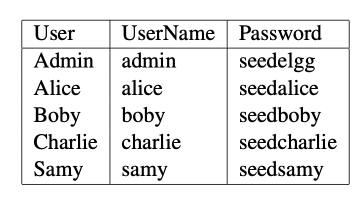

# 针对HTTP GET服务的CSRF攻击

攻击思路：构造好发送到目标网站的url，这个url因为没有cookie信息，直接运行目标服务器会拒绝。只需在恶意网站中加入
这个url的标签，目标用户浏览器上是有目标网站的cookie的，让目标用户访问恶意网页即可。  

实验目标：攻击添加好友服务，将攻击者加为目标用户的好友。

!!! warning

    这个实验一定要看seed lab官网了，书上没有写账户和密码

根据[Seed Lab官网说明](https://seedsecuritylabs.org/Labs_16.04/PDF/Web_CSRF_Elgg.pdf), 账号密码如下  


**攻击步骤**：  
### 1、观察获取所需字段

首先登陆Samy账户，打开Tools-Web Developer-Network，进入到Charlie页面，点add friend按钮，确定添加请求的url：  

可以看到请求url为：  
http://www.csrflabelgg.com/action/friends/add?friend=44&__elgg_ts=1618931955&__elgg_token=vm9r0s3F_s8M_k4SI5H0oQ&__elgg_ts=1618931955&__elgg_token=vm9r0s3F_s8M_k4SI5H0oQ  
从上面可知，Samy的id为44，__elgg_ts和__elgg_token是为了应对CSRF攻击的对策，由于已经关闭不再需要  
最终需要构造的url为：  
http://www.csrflabelgg.com/action/friends/add?friend=44  

Cookie:	Elgg=haq1dp4mom04af6am97n1ggkc4  
这是Charlie的会话cookie，浏览器会自动为http请求设置cookie字段，攻击者不需要设置该值  

### 2、构建恶意网页

```html
<html>
    <body>
        <h1>This page forges an HTTP GET request.</h1>
        
        
    </body>
</html>
```
由于url没有返回图像，为了不让用户起疑，故设置图像大小为1*1像素，这样图像非常小难以发现。  
这个网页由攻击者Samy控制，这个页面放在/var/www/CSRF/Attacker


### 3、吸引用户访问恶意网站

比如用Alice账户登录，点恶意网页www.csrflabattacker.com


可以看到Alice的好友增加了Samy  


!!! warning

    上面这个图显示有点问题，应是Alice is now a friend with Samy，原因是上面那个friend=44开始
    写成了42