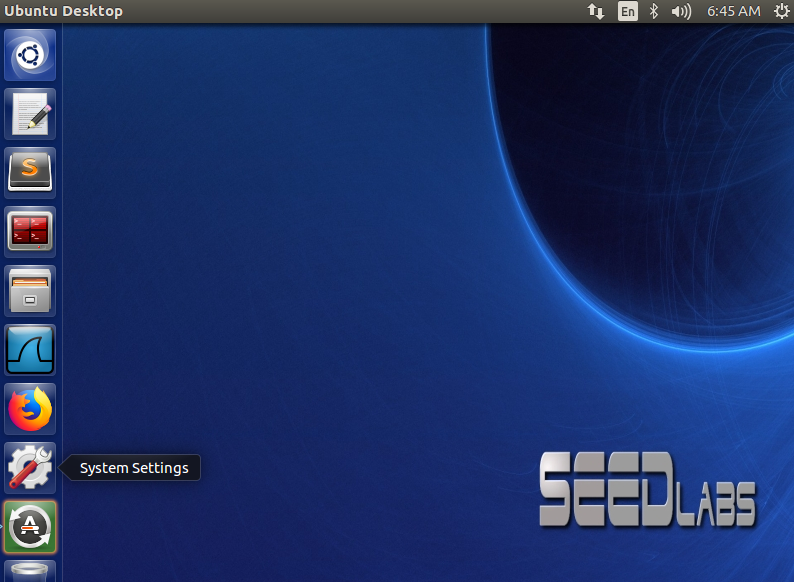
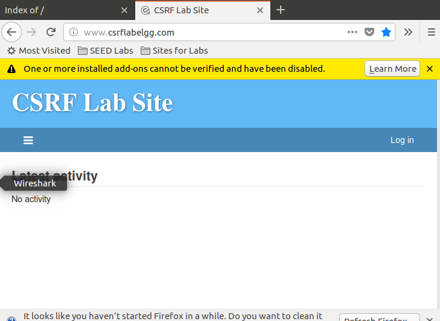
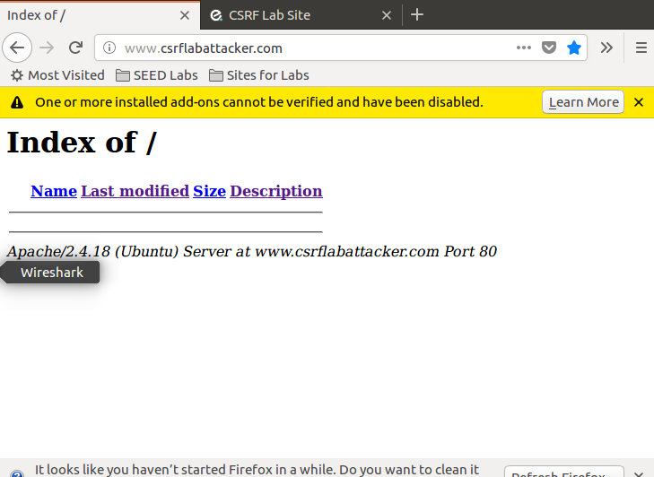

# 跨站请求伪造背景

!!! Note

    跨站请求伪造（CSRF）是一种恶意攻击，当普通用户访问恶意网页时，该网页可以代替用户向目标网站发送伪造的请求。
    
网站通常依靠cookie来判断一个来自客户端的请求是否可信

!!! 漏洞产生

    浏览器会给伪造的请求附加所有目标网站的cookies，当目标网站收到这个请求时，如果它没有任何策略来识别这个伪造的请求，
    那么它将会处理该请求，导致安全漏洞。

## 准备实验环境

这个实验要预置一个应用程序，故要使用Seed lab指定的镜像来做实验，镜像从以下网址下载：  
[Seed Lab镜像](https://drive.google.com/file/d/12l8OO3PXHjUsf9vfjkAf7-I6bsixvMUa/view?usp=sharing)  
解压后用vmware打开，新建虚拟机-创建自定虚拟机-ubuntu-使用现有虚拟磁盘（选共享虚拟机节省磁盘）  

安装成功后显示如下界面：


该虚拟机已经安装Elgg网络应用程序，关闭了防护机制，hosts文件中映射了网站名称    
在Apache配置文件（/etc/apache2/sites-available/000-default.conf）添加：  
```xml
<VirtualHost *:80>
    ServerName www.csrflabattacker.com
    DocumentRoot /var/www/CSRF/Attacker
</VirtualHost>

<VirtualHost *:80>
    ServerName www.csrfLabelgg.com
    DocumentRoot /var/www/CSRF/lgg
</VirtualHost>
```
上面这些在虚拟机中已经配好了。  

准备好的目标网站：  
  

准备好的恶意网站：  


!!! 调整分辨率

    System Settings--Displays--Resolution中改为2560*1600(16:10)

!!! Apache生效命令

    sudo service apache2 restart
    
## 安装vmware tools

为了方便操作，使虚拟机和宿主机之间可以拷贝，需要安装vmware tools  
点击虚拟机--安装VMware Tools，会自动打开一个说明文件  
在桌面建一个文件夹wmware tools，把tar.gz文件解压到vmware tools  
用命令行工具，进入到vmware tools中vmware-tools-distrib目录，sudo ./vmware-install.pl  
一直默认确定，sudo reboot后生效  