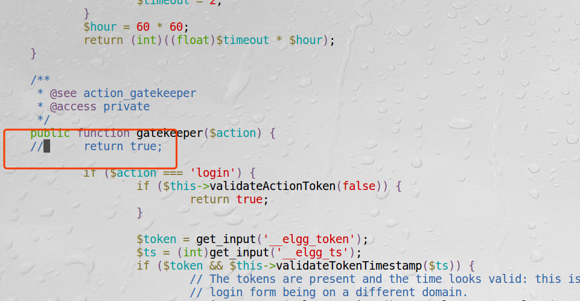
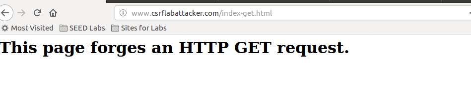
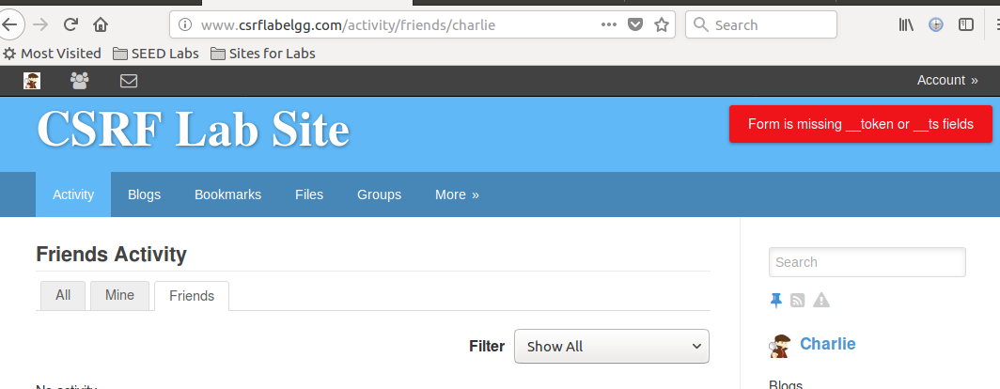

# 防御措施

web服务器不知道一个请求是否是跨站请求，浏览器知道请求是哪个页面产生的，知道是否跨站请求，但是浏览器没有把这个信息
传给服务器，改变这一点，就能抵御CSRF攻击。

## 使用refer头

refer头用来记录请求是从哪个网页发出的。但是它会泄露使用者的浏览历史，产生隐私泄露问题。一些浏览器为了保护隐私会删除
该字段。故使用这个头字段作为防护策略可能会误把很多合法请求当成跨站请求。

## 同站cookie

Chrome、Firefox和Opera使用一个特殊属性SameSite属性，告诉浏览器一个cookie是否可以被跨站请求使用。
值为Strict，则不会跨站请求使用，Lax时，cookie只有在顶级导航的跨站请求时才一起发送。

## 秘密令牌

主要是在同站cookie支持之前使用。秘密令牌只能被自己的页面取得，其他网站页面得不到。实现方法有两种：  
1、每个网页内嵌入一个随机的机密值。  
2、机密值放在cookie中。  
这两个方法都是依赖浏览器同源策略实现的。  

!!! 浏览器的同源策略

    浏览器执行一个脚本的时候会检查这个脚本是属于哪个页面的  
    同源策略是浏览器的行为，是为了保护本地数据不被JavaScript代码获取回来的数据污染，因此拦截的是客户端发出的请求回来的数据接收，
    即请求发送了，服务器响应了，但是无法被浏览器接收。

**Elgg的防护措施**

Elgg使用秘密令牌来抵御CSRF攻击。Elgg在所有页面都内嵌了两个机密值: __elgg_ts和__elgg_token。  

!!! 实现思路

    用一个模块(ActionsService.php)管理两个值，添加到了每个网页中。请求时带上这两个值，
    在后端重新算一遍token，处理每个请求之前都会先验证token。

打开安全防护：
```bash
vi /var/www/CSRF/Elgg/vendor/elgg/elgg/engine/classes/Elgg/ActionsService.php
```


这时再来验证之前添加好友那个攻击，登陆charlie账户，再来访问恶意网站  


目标网站会提示错误，无法将好友Samy加入，防御成功  


