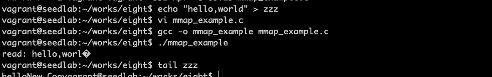
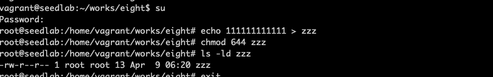
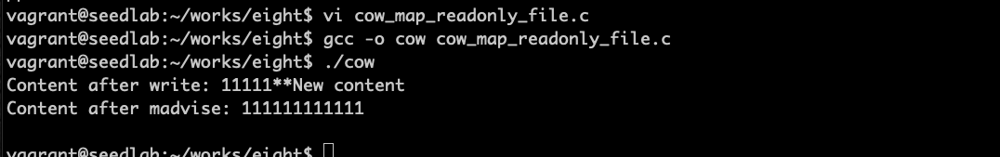

# 脏牛竟态条件攻击背景

## 使用mmap()函数进行内存映射

!!! mmap

    mmap是一个将文件或者设备映射到内存的系统调用。默认映射类型是文件，从内存读取数据，实际读的是文件。

```c
#include <sys/mman.h>
#include <fcntl.h>
#include <sys/stat.h>
#include <string.h>
#include <stdio.h>

int main()
{
    struct stat st;
    char content[20];
    char *new_content = "New Content";
    void *map;
    int f = open("./zzz", O_RDWR);
    fstat(f, &st);
    
    // NULL表示起始地址由内核决定，MAP_SHARED和其他进程共享，0偏移量表示映射整个文件
    map = mmap(NULL, st.st_size, PROT_READ | PROT_WRITE, MAP_SHARED, f, 0);
    memcpy((void*)content, map, 10);
    printf("read: %s\n", content);
    memcpy(map+5, new_content, strlen(new_content));
    
    munmap(map, st.st_size);
    close(f);
    return 0;
}
```

程序解读：读取本地文件zzz到内存，拷贝10个字节到content，从new_content中拷贝偏移5字节，最终得到
helloNew Con。

!!! mmap应用场景

    进程间通信，可以将相同的文件映射到内存，一个进程写另一个进程立即看到。  
    提高效率，访问文件时原本需要用户空间和内核空间复制数据，变成内存操作，但是会浪费内存。  

MAP_SHARED进程共享，即使映射到不同的虚拟地址空间，实际的物理内存是相同的  
MAP_PRIVATE，文件将映射到进程私有内存空间。  

!!! 写时拷贝

    为了创建私有拷贝，需要将原始内存中的内容复制到私有内存。复制需要花时间，复制行为通常要等实际需要时才发生，
    基于这个原因，用MAP_PRIVATE选项映射的虚拟内存最初仍指向共享物理内存。当进程试图写入映射内存时，内核会分配
    一块物理内存，把数据分配到该内存中，然后操作系统更新进程的页表，令映射的虚拟地址指向新的物理地址，之后的任何
    读取和写入操作会在这块私有拷贝中进行。  
    这个行为叫做写时拷贝，就是一种优化方法，也叫COW机制。

## 抛弃复制的内存

在程序得到映射内存的私有拷贝之后，可以使用madvise()的系统调用建议操作系统内核如何处理该内存。  
```c
int madvise(void *addr, size_t length, int advice)
```
当使用MADV_DONTNEED作为第三个参数时，告诉内核不再需要这部分内存地址空间了。

## 映射只读文件

!!! 可以修改只读内存吗

    普通用户只读方式打开的文件，映射到内存时只能用只读选项，否则mmap会失败。  
    但是操作系统是可以修改只读内存的，如果文件以MAP_PRIVATE模式映射，操作系统会特例处理，修改是在副本进行的是安全的。

以下程序演示修改只读内存以修改只读文件：    
```c
#include <stdio.h>
#include <sys/mman.h>
#include <fcntl.h>
#include <unistd.h>
#include <string.h>

int main(int argc, char *argv[])
{
    char *content = "**New content";
    char buffer[30];
    struct stat st;
    void *map;
    
    int f = open("./zzz", O_RDONLY);
    fstat(f, &st);
    
    // zzz映射到只读内存
    map = mmap(NULL, st.st_size, PROT_READ, MAP_PRIVATE, f, 0);
    int fm = open("/proc/self/mem", O_RDWR);
    lseek(fm, (off_t)map + 5, SEEK_SET);
    write(fm, content, strlen(content));
    memcpy(buffer, map, 29);
    printf("Content after write: %s\n", buffer);
    
    madvise(map, st.st_size, MADV_DONTNEED);
    memcpy(buffer, map, 29);
    printf("Content after madvise: %s\n", buffer);
    
    return 0;
}
```
先准备只读文件：


执行程序修改内存：


程序解读：首先zzz被映射到只读内存，由于内存保护机制，不能直接修改该内存，但可以通过proc文件系统来修改内存。
接着移动到第五个字节写入字符串，由于使用MAP_PRIVATE选项，因此写操作会引起写时拷贝，即该写操作会在映射内存
的私有拷贝上进行，而不是直接映射内存上进行。最后丢弃私有拷贝。