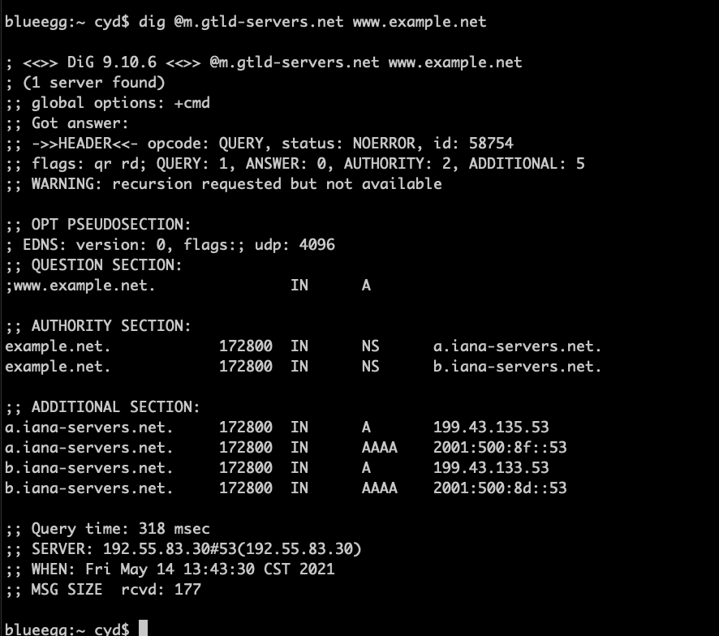
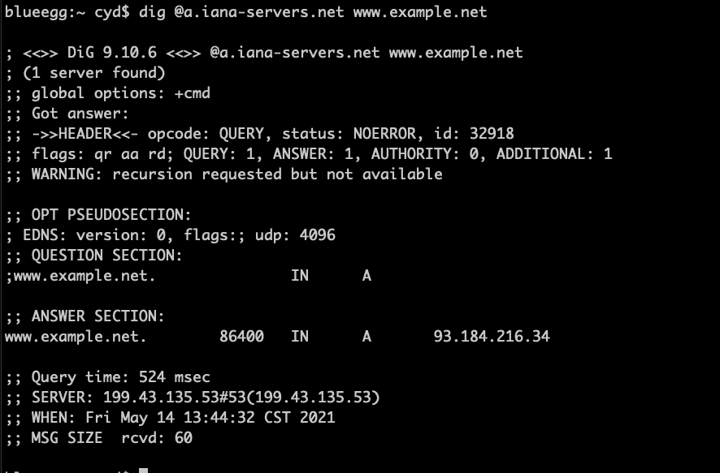

# DNS基本概念

DNS的主要任务是把计算机名转换为IP地址

## DNS域层次结构

域名结构如下图：
  
域的根节点称为根域，用符号.表示，下一层域结构称为顶级域名（TLD）  
顶级域名有国家代码顶级域名（ccTLD），还有其他目的的顶级域名，如bank、coffee、jobs等  
所有顶级域名的官方列表被因特网编号分配机构（IANA）掌管，到2017年已有1547个顶级域名  

每个顶级域名都被IANA委托给一个指定代理，称为注册处。VeriSign是com和net域的指定代理，EDUCASE是edu域的指定代理  
顶级域名的指定代理会通过注册商为公众提供注册服务，用户买了域名后，指定代理会负责把所购域名的相应信息填入注册数据库中  
中国域名注册商有易名中国、万网、商务中国等  

## DNS区域

example.com是一家国际企业，有美国、英国、法国三个分部，分别对应三个子域名。在美国，又有三个分公司。
由于在芝加哥和波士顿的两家公司都比较小，因此放入了同一个区域。而纽约公司比较大，故单独用一个区域。

域名系统是通过区域组织的，一个DNS区域把树状域内临近的域名和子域组织起来，并且将管理权限分配给实体。
每个区域由权威机构管理。一个域名可以由多个机构管理。

### 权威域名服务器

每个DNS区域都至少有一个权威域名服务器来公布关于这个区域的信息。出于冗余目的应至少提供两个权威域名服务器。

### 因特网中区域的组织形式

DNS请求最终目的是从权威域名服务器得到答案，DNS采用分布式方法来找权威域名服务器，以树的形式来组织因特网中所有的
DNS区域，每一个权威域名服务器都可以沿着树的结构找到。

树的根被称为root区域，IANA负责维护这个区域，有13个权威域名服务器（DNS根服务器）管理这个区域，名称从a到m，即
从a.root-servers.net到m.root-servers.net。

## DNS请求过程

用户计算机应用试图与另一台计算机通信时，会先向本机DNS解析器查询，如果失败，再发请求给系统指定的本地DNS服务器，
如果没有，该服务器会逐步从因特网其他DNS服务器查询IP地址。

### 本地DNS文件

在Linux中，DNS解析器依赖两个文件，分别是/etc/hosts和/etc/resolv.conf。  
resolv.conf为DNS解析器提供信息，包含本地DNS服务器的IP地址等

!!! Note

    如果一台计算机用DHCP（动态主机配置协议）得到IP地址，它同时也会从DHCP得到本地DNS服务器的IP地址，
    并且存储到resolv.conf文件中，这种情况下，resolv.conf文件会被自动修改，任何对该文件所做的手动
    更改都会被覆盖。

### 本地DNS服务器和迭代查询过程

!!! 本地DNS服务器

    计算机通常使用局域网内的DNS服务器，这是"本地"的名字来源，现在许多非本地的DNS服务器可以用作本地
    DNS服务器，如谷歌公共DNS等，本地的含义服务器不一定必须位于本地

dns查询过程：本地服务器为了找到www.example.net的ip地址，先是问root区域，root区域会告诉
.net服务器地址，再请求.net服务器，会告诉他example.net服务器的地址，最后才得到正确地址 

dig命令会模拟本地DNS服务器的行为  
先查根服务器：  

根服务器告诉了13个.net域名服务器：  

.net域名服务器返回了2个example.net区域的权威域名服务器：  

DNS应答分为4个部分：问题部分、回复部分、授权部分和附加部分。  
问题部分包含请求的问题  
回复部分包含对请求问题的答案  
授权部分包含指向权威服务器的记录  
附加部分包含和请求有关的记录  

**DNS缓存**，当本地DNS服务器从其他DNS服务器得到信息时，它会缓存这个信息，以便将来需要时不必浪费时间再次询问。  
缓存中的每个信息都有一个存活时间。

比如查询mail.example.net，本地DNS服务器不会从root域开始查询，因为缓存中已经有example.net域名服务器的IP
地址，就直接从这个服务器开始查询。

