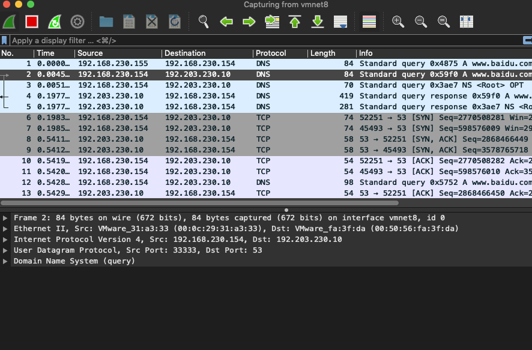
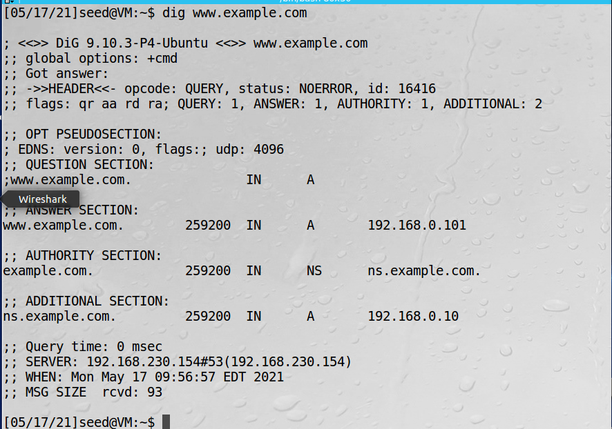
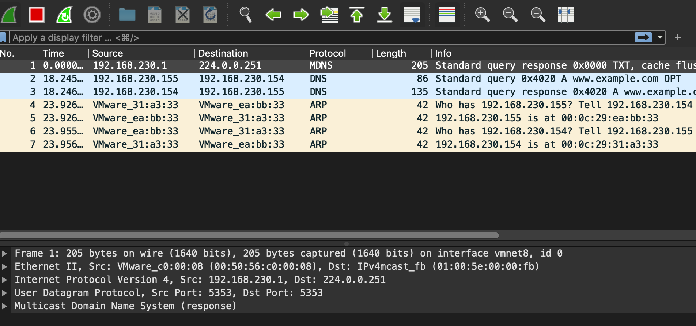
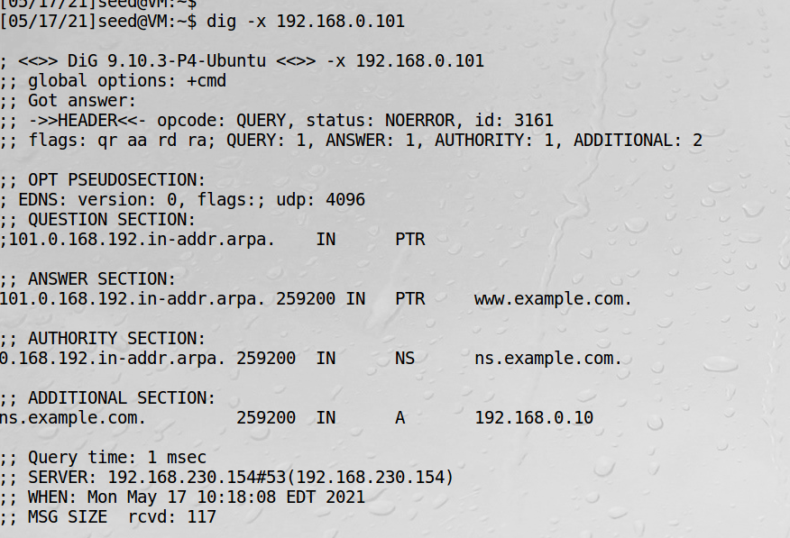

# 配置DNS实验环境

准备用户机（客户端192.168.230.155），DNS服务器（服务端192.168.230.154）和宿主机三台机器  

## 配置用户机

要配置DNS服务器地址，可以改变/etc/resolv.conf文件，但是这个文件会被DHCP提供的信息重写。
一种解决方法是在  
```bash
sudo vi /etc/resolvconf/resolv.conf.d/head
```
加入以下信息
```bash
nameserver 192.168.230.154
```
这个head文件中的内容会在resolv.conf被DHCP修改时自动加到resolv.conf的头部  
运行如下命令使改动生效：
```bash
sudo resolvconf -u
```

测试：  
打开wireshark，并输入dig：  
```bash
dig www.baidu.com
```
查看wireshark：  

可以看到客户端是先向服务端发送DNS请求的，然后由服务端向外发DNS请求报文  

## BIND9入门

!!! bind9配置文件

    named.conf.local 配置本地DNS配置表  
    named.conf.options 连接外网  
    db.local 域名文件模板 

1、配置named.conf.local  
```bash
sudo vi /etc/bind/named.conf.local
```
```text
zone "yudan34.com"{
    type master;
    file "www.yudan34.com";
};
```
type master表示第一步首先去外网DNS服务器查询，如果没有，就用file定义的本地文件，文件名是www.yudan34.com  

2、配置named.conf.options
```text
forwarders {
    8.8.8.8;
};
```
8.8.8.8是外网DNS服务器地址，这个地址是谷歌的

## 配置本地DNS服务器

本地DNS服务器需要运行DNS服务器程序。常用的DNS服务器软件是BIND，最初是1980年美国加州伯克利大学设计出来的。
    
本小节内容虚拟机都已经配置好了  
本虚拟机中已经预装了BIND，如果没有装，可以通过如下命令安装：  
```bash
sudo apt-get install bind9
```
配置BIND9，设置选项文件: /etc/bind/named.conf.options
```bash
options {
    dump-file "/var/cache/bind/dump.db";
}
```
把缓存转储到上面指定的文件中：
```bash
sudo rndc dumpdb -cache
```
清理缓存：
```bash
sudo rndc flush
```
**关闭DNSSEC**，DNSSEC的作用是抵御对DNS服务器的欺骗攻击。为了展示没有这个机制时攻击是如何运作的，需要关闭这个选项。
```bash
options {
   # dnssec-validation auto;
   dnssec-enable no;
}
```
**使用固定源端口号**，出于安全考虑，当发送DNS请求时，BIND 9在它的UDP数据包中使用随机源端口号。为了简化，使用固定
端口号：
```bash
options {
    query-source port 33333;
}
```
**开启/重启DNS服务器**
```bash
sudo service bind9 restart
```

## 在本地DNS服务器内配置区域

实验：有一个域名example.com，用本地DNS服务器作为这个域名的权威域名服务器

1、建立区域  
```bash
sudo vi /etc/bind/named.conf
```
```text
zone "example.com" {
    type master;
    file "/etc/bind/example.com.db";
};
zone "0.168.192.in-addr.arpa" {
    type master;
    file "/etc/bind/192.168.0.db";
};
```
以上第一个区域用来进行正向查找（从主机名到IP地址）  
第二个区域用来进行反向查找（从IP地址到主机名）  

2、配置正向查找区域文件  
```bash
sudo vi /etc/bind/example.com.db
```
```text
$TTL 3D ; default expiration time of all resource records without
        ; their own TTL
@ IN SOA ns.example.com. admin.example.com. (
1 ; Serial
8H ; Refresh
2H ; Retry
4W ; Expire
1D ) ; Minimum
@ IN NS ns.example.com. ;Address of nameserver
@ IN MX 10 mail.example.com. ;Primary Mail Exchanger
www IN A 192.168.0.101 ;Address of www.example.com
mail IN A 192.168.0.102 ;Address of mail.example.com
ns IN A 192.168.0.10 ;Address of ns.example.com
*.example.com. IN A 192.168.0.100 ;Address for other URL in
; the example.com domain
```
这个文件的具体格式在RFC 1035中  
@符号是特殊字符，代表named.conf文件内指定的来源，因此这里代表yudan.com  
这个区域文件有7个资源记录（RR），包括一个SOA（授权开始）记录，一个NS（域名服务器）记录，
一个MX（邮件交换）记录和4个A（IP地址）记录  

3、配置反向查找区域文件
```bash
sudo vi /etc/bind/192.168.0.db
```
```text
$TTL 3D
@ IN SOA ns.example.com. admin.example.com. (
1
8H
2H
4W
1D)
@ IN NS ns.example.com.
101 IN PTR www.example.com.
102 IN PTR mail.example.com.
10 IN PTR ns.example.com.
```

4、重启BIND服务器并测试

```bash
sudo service bind9 restart
```

5、测试  
清空wireshark  
在用户机上dig新加的域名：  


观察wireshark  

看到已经通过DNS服务器找到了IP地址192.168.0.101  

通过Ip地址反向查找域名也可以找到：  
  

