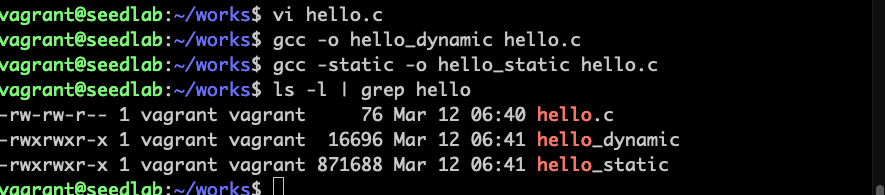
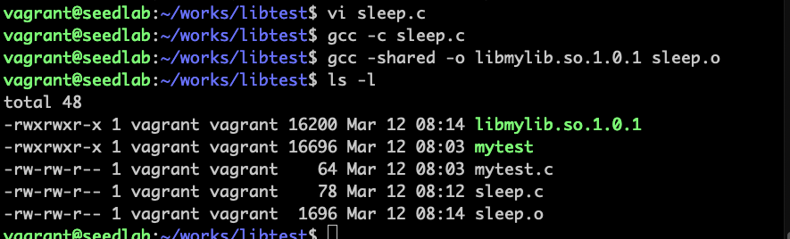
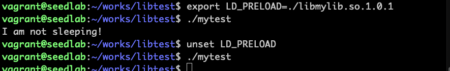
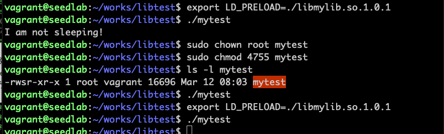
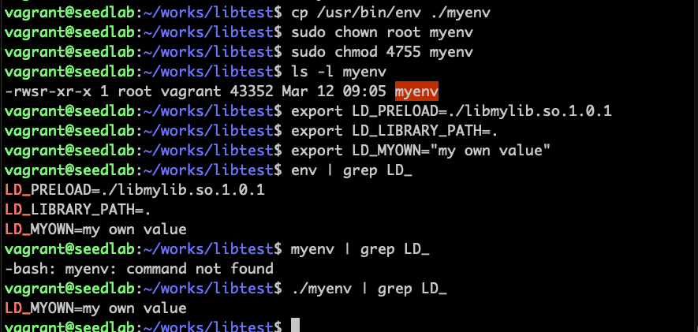

# 攻击动态链接库

## 静态和动态链接

```c
#include <stdio.h>

int main()
{
    printf("hello world");
    return 0;
}
```


使用**-static**进行静态链接，可以看到比动态链接编译的二进制文件大100多倍

!!! 静态链接较少使用的原因

    占用内存空间，程序库中某个函数因为安全漏洞需要打补丁时，所有包含该函数的程序都需要打补丁。

共享库：支持动态链接的程序库，.so为扩展名，微软取名DLL

!!! 动态链接过程

    可执行文件运行前首先被载入内存（装载），装载器把控制权交给动态链接器，动态链接器从共享库中
    找到具体函数实现，并把可执行文件中对该函数的调用链接到实现代码。链接完成把控制权交给main函数。

***可以使用ldd命令查看程序所依赖的共享库***

!!! 动态链接的风险

    使用动态链接时，程序一部分代码在编译过程中是不确定的，在运行时才被确定。此时用户有完全控制权，
    如果用特权程序链接恶意代码，就有安全风险。
    
## 攻击动态链接替换系统函数

动态链接相关的环境变量：  
***LD_PRELOAD***环境变量包含共享库的一个列表，动态链接器首先在这个列表中搜索库函数的实现（即预先加载）  
***LD_LIBRARY_PATH***预先加载中找不到就在这个目录中找  

```c
#include <unistd.h>

int main()
{
    sleep(1);
    return 0;
}
```

正常调用系统函数实现睡眠1秒  

编译自己的共享库libmylib.so.1.0.1，这个库中包含和系统同名函数：
```c
#include <stdio.h>

void sleep(int s)
{
    printf("I am not sleeping!\n");
}
```


把自己的库加入环境变量替换系统库： 

删除环境变量后，程序恢复原样。

!!! gcc编译指令

    -c表示只编译不链接，生成.o的目标文件  
    -o是链接指令，用于链接成可执行文件  
    gcc -shared -o libmylib.so.1.0.1 sleep.o表示把sleep.o打包为动态库文件libmylib.so.1.0.1  

## 系统对动态链接环境变量有保护

### 变成set-uid程序后将忽略环境变量



!!! 系统对动态链接环境变量有保护

    动态链接器（ld.so或ld-linux.so）实现了防御策略，当进程真实用户id和有效用户id不一样（或者组），进程
    将忽略LD_PRELOAD等环境变量

下面这个实验也是一样道理，非特权进程env能显示环境变量包含的内容，特权进程myenv不能
