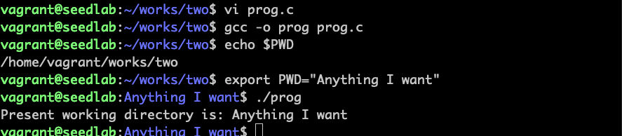

# 攻击程序本身

!!! Note

    写程序过程中使用环境变量，如getenv、setenv、putenv等，可能会导致不受信任的输入

```c
#include <stdio.h>
#include <stdlib.h>

int main(void)
{
    char arr[64];
    char *ptr;
    
    ptr = getenv("PWD");
    if (ptr != NULL)
    {
        sprintf(arr, "Present working directory is: %s", ptr);
        printf("%s\n", arr);
    }
    return 0;
}
```

shell中执行命令会创建一个新子进程，export把环境变量传递到子进程，通过修改PWD这个shell变量
影响程序的执行。上面程序还有另一个问题，没有对ptr的长度校验，可能会有缓冲区溢出漏洞。

!!! 使用安全版本函数

    在set-uid特权程序中使用环境变量，必须要检查环境变量合法性。可以使用安全版本的函数
    secure_getenv()函数
    
## Set-UID机制和服务机制的比较

Set-UID不要求一直运行一个后台进程，性能会更好，但是在Set-UID机制中，环境变量是从普通用户
那里获得的，基于服务的机制中，服务是由特权父进程或操作系统启动，环境变量来自可信实体。故
Set-UID有更大的攻击面。

!!! Note

    Android操作系统完全弃用了Set-UID和Set-GID机制。