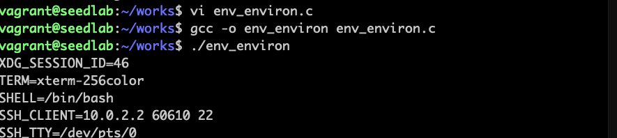

# 环境变量背景

## 程序访问环境变量

### envp打印环境变量

```c
#include <stdio.h>

void main(int argc, char* argv[], char* envp[])
{
    int i=0;
    while (envp[i] != NULL)
    {
        printf("%s\n", envp[i++]);
    }
}
```


### environ打印环境变量

```c
#include <stdio.h>

extern char** environ;
void main(int argc, char* argv[], char* envp[])
{
    int i=0;
    while (environ[i] != NULL)
    {
        printf("%s\n", environ[i++]);
    }
}
```



**其他操作特定环境变量的函数**

| 函数 | 说明 |
| ---- | ---- |
| getenv(var_name) | 获取具体环境变量 |
| putenv()         | 增加环境变量    |
| setenv()         | 修改环境变量    |
| unsetenv()       | 删除环境变量    |  

<br>

## 进程获取环境变量的两种方式

**1、新建进程**：就是fork系统调用生成的进程，子进程继承父进程环境变量。  
**2、通过execue调用**：环境变量会丢失，必须要显示传递。  

### 不传递环境变量，丢失

```c
#include <stdio.h>
#include <unistd.h>

void main(int argc, char* argv[], char* envp[])
{
    char* v[2];
    v[0] = "/usr/bin/env";
    v[1] = NULL;
    execve(v[0], v, NULL);
}
```


### 传递数组，新进程包含数组

```c
#include <stdio.h>
#include <unistd.h>

void main(int argc, char* argv[], char* envp[])
{
    char* v[2];
    char* newenv[3];
    v[0] = "/usr/bin/env";
    v[1] = NULL;
    
    newenv[0] = "AAA=aaa";
    newenv[1] = "BBB=bbb";
    newenv[2] = NULL;
    execve(v[0], v, newenv);
}
```


### 传递所有环境变量

```c
#include <stdio.h>
#include <unistd.h>

extern char ** environ;
void main(int argc, char* argv[], char* envp[])
{
    char* v[2];
    v[0] = "/usr/bin/env";
    v[1] = NULL;
    
    execve(v[0], v, environ);
}
```
