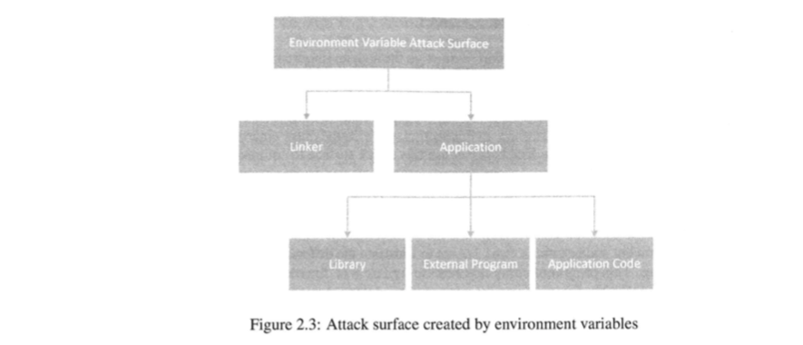

# 环境变量背景

## 程序访问环境变量

### envp打印环境变量

```c
#include <stdio.h>

void main(int argc, char* argv[], char* envp[])
{
    int i=0;
    while (envp[i] != NULL)
    {
        printf("%s\n", envp[i++]);
    }
}
```


### environ打印环境变量

```c
#include <stdio.h>

extern char** environ;
void main(int argc, char* argv[], char* envp[])
{
    int i=0;
    while (environ[i] != NULL)
    {
        printf("%s\n", environ[i++]);
    }
}
```


**其他操作特定环境变量的函数**

| 函数 | 说明 |
| ---- | ---- |
| getenv(var_name) | 获取具体环境变量 |
| putenv()         | 增加环境变量    |
| setenv()         | 修改环境变量    |
| unsetenv()       | 删除环境变量    |  

<br>

## 进程获取环境变量的两种方式

**1、新建进程**：就是fork系统调用生成的进程，子进程继承父进程环境变量。  
**2、通过execue调用**：环境变量会丢失，必须要显示传递。  

### 不传递环境变量，丢失

```c
#include <stdio.h>
#include <unistd.h>

void main(int argc, char* argv[], char* envp[])
{
    char* v[2];
    v[0] = "/usr/bin/env";
    v[1] = NULL;
    execve(v[0], v, NULL);
}
```


### 传递数组，新进程包含数组

```c
#include <stdio.h>
#include <unistd.h>

void main(int argc, char* argv[], char* envp[])
{
    char* v[2];
    char* newenv[3];
    v[0] = "/usr/bin/env";
    v[1] = NULL;
    
    newenv[0] = "AAA=aaa";
    newenv[1] = "BBB=bbb";
    newenv[2] = NULL;
    execve(v[0], v, newenv);
}
```


### 传递所有环境变量

```c
#include <stdio.h>
#include <unistd.h>

extern char ** environ;
void main(int argc, char* argv[], char* envp[])
{
    char* v[2];
    v[0] = "/usr/bin/env";
    v[1] = NULL;
    
    execve(v[0], v, environ);
}
```


## 环境变量在内存中的位置


如图，区域1存储的是环境变量字符串和参数字符串，区域2存储环境变量指针数组，其内容存在1中，
区域3存储参数指针数组，其内存也在1中，区域4存储main函数的栈帧

!!! 用全局环境变量environ优于envp的原因

    根据环境变量在内存中的位置，当环境变量变化时，区域1和2可能会出现空间不够的情况，
    不够时整个环境变量会转移到堆内存中，全局变量environ也会转移到新位置，但是main函数
    第三个参数envp不会。

## shell变量和环境变量

shell变量是shell程序维护的内部变量，程序启动时，会创建一份和环境变量同名值也相同的变量。对shell变量
的修改不会影响环境变量。

!!! shell中启动程序过程

    shell中输入名称执行程序时，先用fork()函数，再用execve()函数来完成。shell通过execve为
    新程序传递环境变量。

!!! proc文件系统

    这个文件系统为每个运行时进程保留一个目录，目录以进程id命名。$$是一个特殊的bash变量表示当前进程id。
    可以用echo $$。可以用/proc/$$打印当前进程信息。而当前进程信息目录下有个叫environ虚拟文件，保存的
    是进程的环境变量信息，信息是文本格式的，故可以用strings /proc/$$/environ打印当前进程环境变量。
       
!!! 打印当前进程的环境变量

    strings /proc/$$/environ  
    而/usr/bin/env会启动一个子进程，打印的是子进程的环境变量


以上HOME=yudan修改的是shell变量，不影响环境变量


### shell变量会影响子进程的环境变量

只有两种类型的shell变量会传递给新程序：  
1、从环境变量复制的shell变量。  
2、用户自定义且标明为export的变量。  


这个实验说明，环境变量和export导出变量被传递到子进程了。unset去掉了shell变量，该变量也不会传递到子进程了。

## 环境变量攻击面


攻击面主要包括链接器和应用程序。应用程序又分为程序库、外部程序和程序本身。  
链接器负责查找程序中使用的外部库函数。这些方面都会使用环境变量，如果没有对环境变量合法性进行校验，就有安全缺陷。  