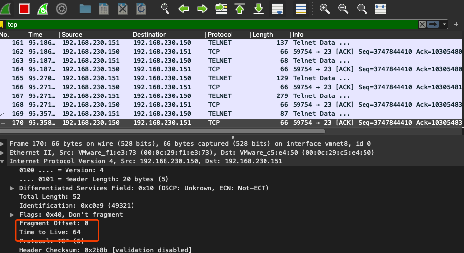
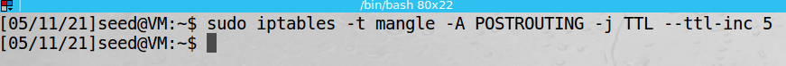
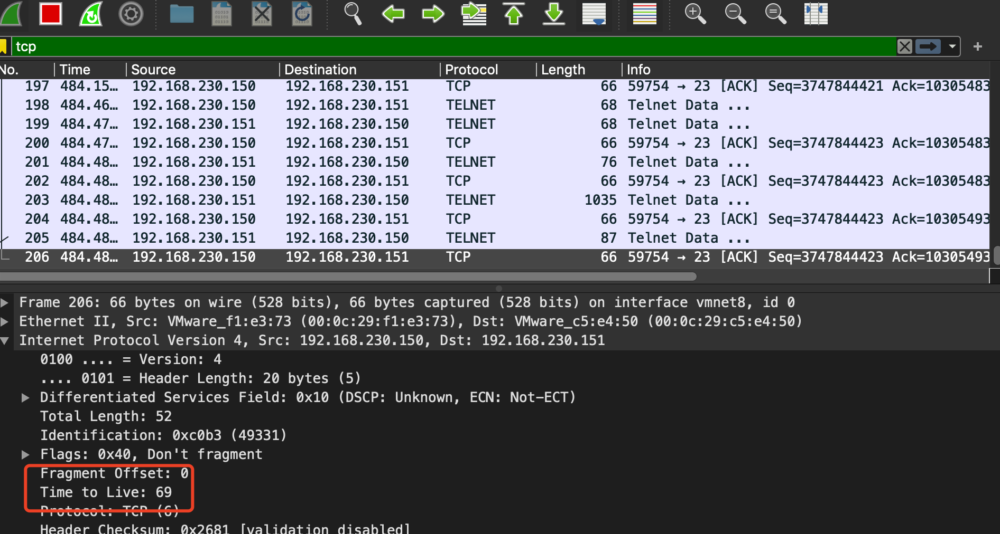
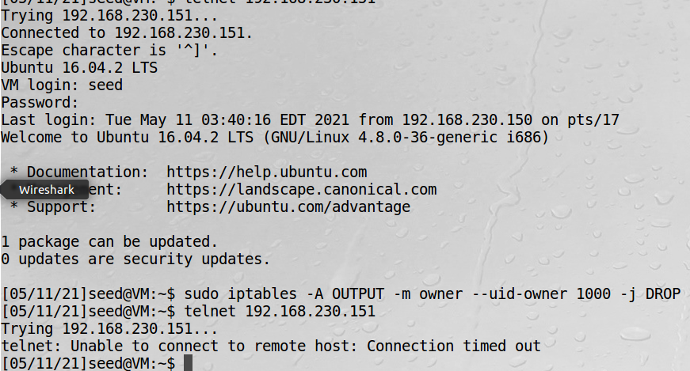

# 用iptables实现一个防火墙

Linux自带的iptables防火墙也是基于Netfilter的。该防火墙在内核中的部分叫做xtables，而iptables是用户空间用来
设置防火墙的程序。  
然而，iptables经常作为内核部分和用户空间部分两者的统称。

## iptables防火墙的结构

iptables防火墙不仅可以用来过滤数据包，还可以修改数据包。为了方便管理，iptables使用表和链来管理不同用途的防火墙规则。  
iptables主要有5个表：filter、nat、mangle、raw和security。  

!!! 表的用途

    过滤数据包规则放在filter  
    修改数据包规则放在nat或mangle  
    只修改源和目的地址的规则放在nat表中，其他放在mangle  

每个表中有若干个链，每个链对应一个Netfilter的钩子

## iptables修改防火墙规则

实验目标是使所有数据包的生存时间TTL增大5  
修改前TCP包TTL是64  

修改TTL

修改后ttl时间变成69

-t mangle，修改数据包，用mangle表  
-A POSTROUTING，附加到POSTROUTING链上  

### iptables的扩展组件

iptables可以通过增加模块来扩展功能。很多模块并没有预先安装在标准的linux内核中，这些iptables模块也叫做
扩展组件。  

!!! 有用模块

    conntrack模块可用于搭建状态防火墙，设置基于连接的防火墙规则，而不仅仅基于单个数据包。  
    ower模块用于设置基于用户的规则。这个功能只限于OUTPUT链。而有些数据包（如ICMP应答包）是由内核
    产生的，而不是由任何用户进程产生，因此不存在所有者。

实验：id为1000的用户产生的数据包全部被防火墙丢弃  

实验显示，之前是可以telnet连接的，开启后无法连接   

    -m owner，使用owner模块

清空filter表中的所有的链后，就可以连接上了

## 搭建一个简单的防火墙

!!! Note

    iptables命令中如果没有用-t选项选择一个具体的表，则默认选择的是filter表 

