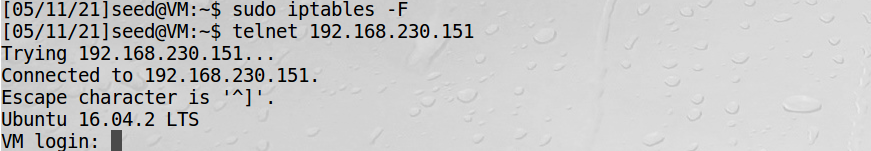

# 用iptables实现一个防火墙

Linux自带的iptables防火墙也是基于Netfilter的。该防火墙在内核中的部分叫做xtables，而iptables是用户空间用来
设置防火墙的程序。  
然而，iptables经常作为内核部分和用户空间部分两者的统称。

## iptables防火墙的结构

iptables防火墙不仅可以用来过滤数据包，还可以修改数据包。为了方便管理，iptables使用表和链来管理不同用途的防火墙规则。  
iptables主要有5个表：filter、nat、mangle、raw和security。  

!!! 表的用途

    过滤数据包规则放在filter  
    修改数据包规则放在nat或mangle  
    只修改源和目的地址的规则放在nat表中，其他放在mangle  

每个表中有若干个链，每个链对应一个Netfilter的钩子

## iptables修改防火墙规则

实验目标是使所有数据包的生存时间TTL增大5  
修改前TCP包TTL是64  


修改TTL


修改后ttl时间变成69


-t mangle，修改数据包，用mangle表  
-A POSTROUTING，附加到POSTROUTING链上  

### iptables的扩展组件

iptables可以通过增加模块来扩展功能。很多模块并没有预先安装在标准的linux内核中，这些iptables模块也叫做
扩展组件。  

!!! 有用模块

    conntrack模块可用于搭建状态防火墙，设置基于连接的防火墙规则，而不仅仅基于单个数据包。  
    ower模块用于设置基于用户的规则。这个功能只限于OUTPUT链。而有些数据包（如ICMP应答包）是由内核
    产生的，而不是由任何用户进程产生，因此不存在所有者。

实验：id为1000的用户产生的数据包全部被防火墙丢弃  

实验显示，之前是可以telnet连接的，开启后无法连接   

    -m owner，使用owner模块

清空filter表中的所有的链后，就可以连接上了


## 搭建一个简单的防火墙

实验目的是丢弃除80端口和22端口之外的所有数据包

!!! Note

    iptables命令中如果没有用-t选项选择一个具体的表，则默认选择的是filter表 

默认规则是接受所有数据包，配置如下：
```bash
sudo iptables -P INPUT ACCEPT
sudo iptables -P OUTPUT ACCEPT
sudo iptables -P FORWARD ACCEPT
```

设置规则前必须要清空所有的链
```bash
sudo iptables -F
```

例如，从INPUT链开始，打开端口号22和80以提供SSH和Web服务，命令如下：
```bash
sudo iptables -A INPUT -p tcp --dport 22 -j ACCEPT
sudo iptables -A INPUT -p tcp --dport 80 -j ACCEPT
```
-A INPUT，把规则加到INPUT链上  
-p tcp，该规则只用于TCP数据包  
--dport nn，目标端口号  

为了让SSH和HTTP服务能发送响应消息给客户端，需要允许对外发送TCP数据包，命令如下：
```bash
sudo iptables -A OUTPUT -p tcp -j ACCEPT
```
-j ACCEPT，接受满足此规则的包

同一个系统中的不同程序间往往也使用数据包来通信，它们利用一个称为loopback的虚拟接口，这个接口把信息导回自己，
应开启这个防火墙规则：
```bash
sudo iptables -I INPUT 1 -i lo -j ACCEPT
```
-I INPUT 1，把规则加到INPUT链的第一个位置上  
-i lo， 选择发往loopback接口的数据包  

需要允许DNS的查询和回复，DNS使用的是UDP端口53，如果DNS服务不在本机，只需执行：
```bash
sudo iptables -A OUTPUT -p udp --dport 53 -j ACCEPT
sudo iptables -A INPUT -p udp --sport 53 -j ACCEPT
```
由于seed lab虚拟机DNS服务器在本机，故还需执行下面两条命令，否则本地DNS服务器将无法收到DNS查询：
```bash
sudo iptables -A OUTPUT -p udp --sport 53 -j ACCEPT
sudo iptables -A INPUT -p udp --dport 53 -j ACCEPT
```

上述配置执行，并用iptables -L列出设置


设置完成后，应当把默认策略改为DROP，这样只有满足规则的数据包才能够进入这台计算机，其他的都会被丢弃
```bash
sudo iptables -P INPUT DROP
sudo iptables -P OUTPUT DROP
sudo iptables -P FORWARD DROP
```

完整脚本（iptablesfw.sh）：
```bash
#!/bin/bash

# Allow SSH and HTTP
iptables -A INPUT -p tcp --dport 22 -j ACCEPT
iptables -A INPUT -p tcp --dport 80 -j ACCEPT
iptables -A OUTPUT -p tcp  -j ACCEPT             

# Allow loopback
iptables -I INPUT 1 -i lo -j ACCEPT

# Allow DNS
iptables -A OUTPUT -p udp  --dport 53 -j ACCEPT
iptables -A OUTPUT -p udp  --sport 53 -j ACCEPT
iptables -A INPUT  -p udp  --sport 53 -j ACCEPT
iptables -A INPUT  -p udp  --dport 53 -j ACCEPT

# Set default filter policy to DROP.
iptables -P INPUT DROP
iptables -P OUTPUT DROP
iptables -P FORWARD DROP
```
该脚本用sudo执行

**测试**：  

实验表明，telnet连23端口不成功，80端口是成功的，实验成功。

实验后要清除防火墙规则，否则后续实验会受影响，清除脚本（cleanup.sh）：
```bash
#!/bin/sh

# Set up all the default policies to ACCEPT packets.
iptables -P INPUT ACCEPT
iptables -P OUTPUT ACCEPT
iptables -P FORWARD ACCEPT

#Flush all existing configrations.
iptables -F
```