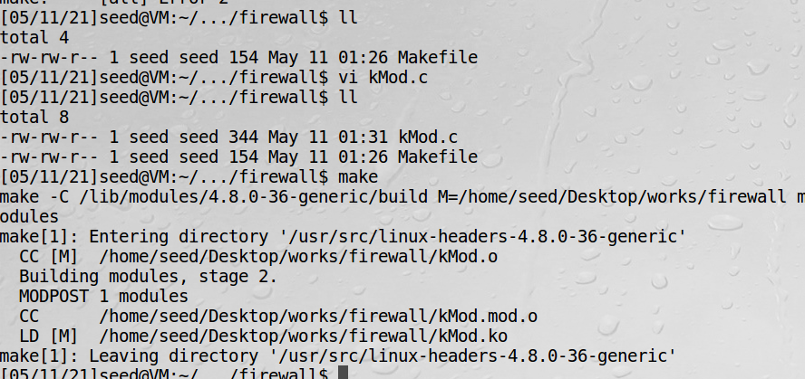
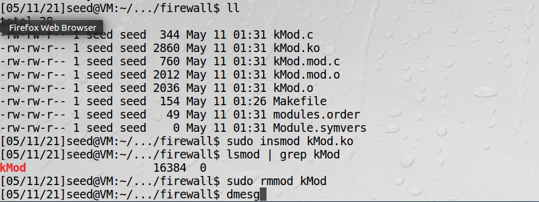
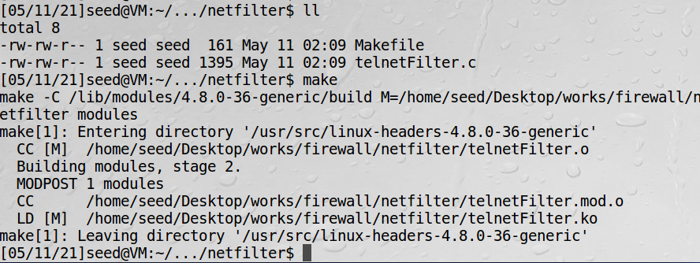
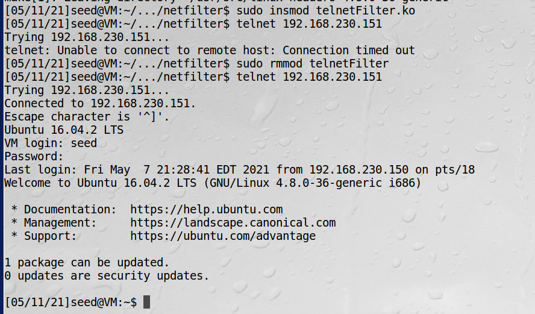

# 基于Netfilter实现一个防火墙

数据包过滤器只能在内核中实现，因此代码需要运行在内核中，也就意味着需要修改内核。  
Linux提供了两项重要技术，使得无须重新编译整个内核就能实现数据包过滤器。分别是Netfilter和可加装内核模块（loadable kernel modules）

!!! Netfilter实现原理

    Netfilter在数据包经过的路径上放置了一些钩子，它们位于内核中，自行编写的函数可以通过内核放进内核，并挂在那些钩子上。
    当数据包到达某个钩子时，挂在钩子上面的函数就会被调用，可以在函数中对数据包进行审查和过滤，并告诉Netfilter如何处理。

## 编写可加载内核模块

```c
// kMod.c
#include <linux/module.h>
#include <linux/kernel.h>
#include <linux/init.h>

static int kmodule_init(void)
{
    printk(KERN_INFO "Initializing this module\n");
    return 0;
}

static void kmodule_exit(void)
{
    printk(KERN_INFO "Module cleanup\n");
}

module_init(kmodule_init);
module_exit(kmodule_exit);

MODULE_LICENSE("GPL");
```

程序解读：  
module_init 指定的函数在模块载入时被调用，用来进行初始化。  
module_exit 指定的函数在模块卸载时被调用，用来进行清理工作。  
内核中打印日志要用printk，打印内容至内核日志缓存。  

编译一个内核模块最简便、有效的方式是使用makefile，样例如下：
```makefile
obj-m += kMod.o
all:
	make -C /lib/modules/$(shell uname -r)/build M=$(PWD) modules

clean:
	make -C /lib/modules/$(shell uname -r)/build M=$(PWD) clean
```

!!! makefile

    参数M表明一个外部模块将要被编译，以及模块生成后应该放在什么位置  
    选项-C用于指定内核库文件的目录  
    当执行makefile中的make命令时，make进程会切换到指定的目录并在完成时切换回来  

编译：


安装内核模块：  



!!! warning

    注意Makefile里面不能有空格，所有代码中只有这个拷贝过去是不能直接用，要把空格改成tab，否则代码显示红色表示有问题  

!!! 内核管理命令

    insmod把内核模块载入内核  
    lsmod 查看kMod模块是否已载入内核  
    rmmod 把内核模块从内核中卸载  

## 使用Netfilter搭建一个简单的防火墙

实验的目的是过滤telnet数据包，启用后将无法telnet到其他计算机  
```c
// telnetFilter.c

#include <linux/kernel.h>
#include <linux/module.h>
#include <linux/netfilter.h>
#include <linux/netfilter_ipv4.h>
#include <linux/ip.h>
#include <linux/tcp.h>

static struct nf_hook_ops telnetFilterHook;


unsigned int telnetFilter(void *priv, struct sk_buff *skb,
                 const struct nf_hook_state *state)
{
  struct iphdr *iph;
  struct tcphdr *tcph;

  iph = ip_hdr(skb);
  tcph = (void *)iph+iph->ihl*4;

  if (iph->protocol == IPPROTO_TCP && tcph->dest == htons(23)) {
    printk(KERN_INFO "Dropping telnet packet to %d.%d.%d.%d\n",
        ((unsigned char *)&iph->daddr)[0],
        ((unsigned char *)&iph->daddr)[1],
        ((unsigned char *)&iph->daddr)[2],
        ((unsigned char *)&iph->daddr)[3]);
    return NF_DROP;
  } else {
    return NF_ACCEPT;
  }
}


int setUpFilter(void) {
        printk(KERN_INFO "Registering a Telnet filter.\n");
        telnetFilterHook.hook = telnetFilter; 
        telnetFilterHook.hooknum = NF_INET_POST_ROUTING;
        telnetFilterHook.pf = PF_INET;
        telnetFilterHook.priority = NF_IP_PRI_FIRST;

        // Register the hook.
        nf_register_hook(&telnetFilterHook);
        return 0;
}

void removeFilter(void) {
        printk(KERN_INFO "Telnet filter is being removed.\n");
        nf_unregister_hook(&telnetFilterHook);
}

module_init(setUpFilter);
module_exit(removeFilter);

MODULE_LICENSE("GPL");
```

利用Netfilter框架写数据包过滤器主要有两步：  
1、写一个回调函数telnetFilter  
2、把回调函数挂到Netfilter的钩子上  

!!! Note

    telnetFilter中skb是传入的整个数据包  
    ip_hdr是得到ip数据包的源节点地址  
    NF_INET_POST_ROUTING是Netfilter为IPv4定义的钩子函数，在数据包流出路径上  
    PF_INET使用IP，处理器架构是POSIX时用的，其他用AF_INET  
    NF_IP_PRI_FIRST加载优先级，用的是先进先出  

```makefile
obj-m += telnetFilter.o
all:
	make -C /lib/modules/$(shell uname -r)/build M=$(PWD) modules

clean:
	make -C /lib/modules/$(shell uname -r)/build M=$(PWD) clean
```

编译数据包过滤器：


测试过滤器：

可以看到加载过滤器后，就无法使用telnet功能，卸载后又可以使用了，实验成功。