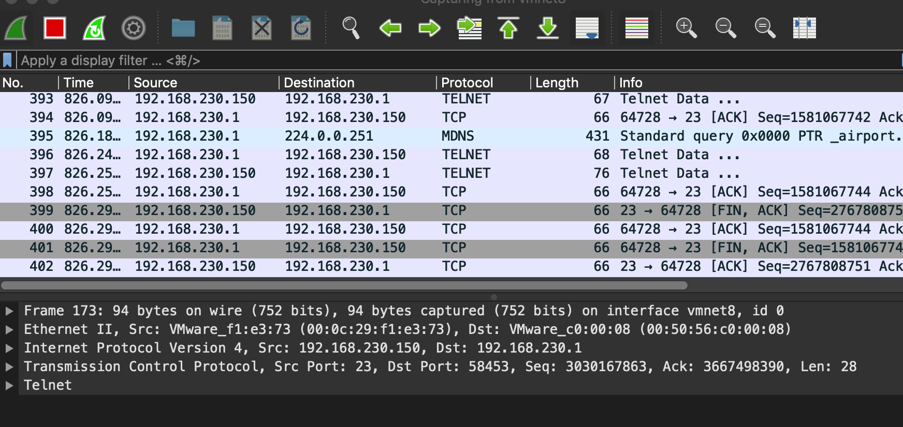
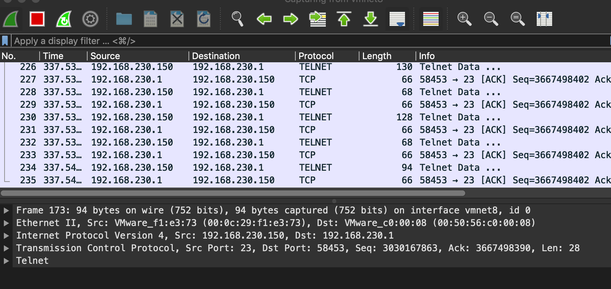

# 状态防火墙和应用防火墙

之前的都是无状态防火墙，这种防火墙独立地检查每个数据包。而数据包通常是上下文关联的。比如，如果只想让
那些属于已有连接的TCP数据包进入网络，就必须用状态防火墙。

## 状态防火墙

状态防火墙能监视连接的数据包，这个连接是广义的。  
比如TCP是面向连接的，使用三次握手来建立连接。  
UDP不是面向连接，但当一个UDP客户端和服务端开始交换数据时，状态防火墙认为连接已经建立，一段时间没有数据交换，就
认为连接终止。  
ICMP也不是面向连接的。因ICMP消息仅有一轮请求与应答，当防火墙看到应答时，会认为连接被建立并同时终止。
复杂协议的连接，一些防火墙在传输层和网络层之上跟踪连接，如HTTP，FTP和IRC连接就是应用层协议，由于广泛使用，
防火墙也对这些连接跟踪。  

## Linux的连接跟踪框架

Linux内核提供了一个连接跟踪框架nf_conntrack，该框架也是建立在Netfilter上。这个框架保存连接状态信息。
每个进入nf_conntrack的数据包都会被标上一个连接状态，以便之后的钩子处理数据包。

nf_conntrack的状态有：  
1、NEW， 用于建立连接  
2、ESTABLISHED，连接已建立  
3、RELATED， 这个状态专门用来建立不同连接之间的联系。如FTP中，控制流（端口21的数据流）被标记为ESTABLISHED，
而数据传输流被标记为RELATED连接。  
4、INVALID， 标记不符合连接行为的数据包  

## 搭建一个状态防火墙

上一课中iptables实现的一个防火墙有一个问题，它有一条规则是这么写的：
```bash
iptables -A OUTPUT -p tcp  -j ACCEPT
```
这样有一个问题，就是它允许所有服务发出TCP数据包，而没有限制只允许这两个服务（SSH和HTTP）发出TCP数据包  
为此改进这条规则，改为基于连接状态的规则：
```bash
sudo iptables -A OUTPUT -p tcp -m conntrack --ctstate ESTABLISHED,RELATED -j ACCEPT
```
-m conntrack，使用conntrack模块中的规则  
--ctstate ESTABLISHED, RELATED, 具备ESTABLISHED或RELATED状态的包  

测试：  
策略使用前抓包


策略使用后抓包


这个实验目的是应用之后，看不到服务端（150）发出的TCP包，但最终还是看到了，没有做成功

## 应用防火墙

数据包过滤器只检查传输层及其下层，应用防火墙检查所有层数据。  
典型的应用防火墙是代理，因此也被称为应用代理防火墙  
应用防火墙的一个普遍应用是Web代理，它用于控制浏览器可以访问的内容，Web代理主要用于过滤发送出去的数据包，
但也可以用于过滤进来的数据包。  

在网络中搭建一个Web代理，最关键之处在于确保所有的网络流量经过代理服务器。
实现方式有以下几种：  
1、修改系统配置来引导所有网络流量通过代理  
2、修改浏览器的网络设置使所有的HTTP请求都通过指定的代理  
3、使用iptables直接修改HTTP的IP数据包，将其目的IP地址和端口号改成代理的IP地址和端口号  
最好的方式是不修改任何主机配置  

代理技术也可被用于绕过防火墙。如果一个防火墙基于数据包的目的地址进行过滤，则可以用Web代理浏览因特网，
从而绕过防火墙。只需将目的地址修改为代理服务器的地址，让代理服务器获得网页并把结果传给即可。

!!! SOCKS代理

    SOCKS（socket secure）代理服务器，利用应用层和传输层之间的一个协议搭建防火墙，它就是
    垫层（shim layer）或者OSI模型中的会话层（session layer）。利用这一层，代理服务器
    可以独立于应用监视所有经过它的会话请求。
    客户机软件需要实现SOCKS协议才能使用SOCKS代理。