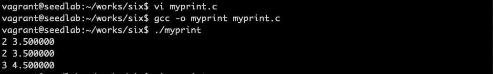
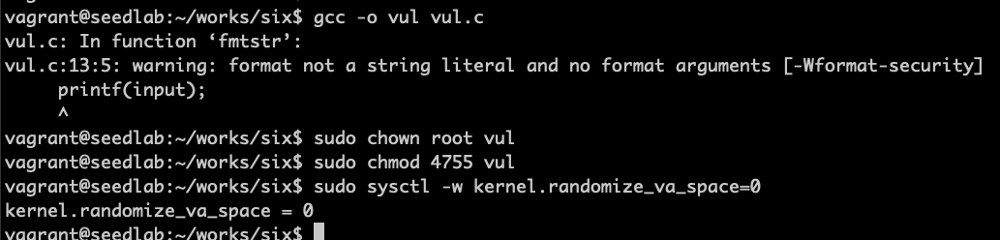

# 格式化字符串漏洞

格式化字符串没有经过安全检查，攻击者就可以利用来运行恶意代码，这样的问题叫格式化字符串漏洞

## 可变参数的实现

```c
#include <stdio.h>
#include <stdarg.h>

int myprint(int Narg, ... )
{
    int i;
    va_list ap;
    
    va_start(ap, Narg);
    for (i=0; i<Narg; i++)
    {
        printf("%d ", va_arg(ap, int));
        printf("%f\n", va_arg(ap, double));
    }
    va_end(ap);
}

int main()
{
    myprint(1, 2, 3.5);
    myprint(2, 2, 3.5, 3, 4.5);
    return 1;
}
```
第一个参数是长度，是几组的意思

stdarg是定义的一个宏文件，va_start计算va_list的起始位置，va_end做必要清理。 

而printf的实现和myprint不同，是通过格式规定符的数目来决定可变参数个数。

## 可变参数不够造成安全风险

比如下面程序，需要三个参数却提供了两个参数
```c
#include <stdio.h>

int main()
{
    int id=100, age=25; char *name="Bob Smith";
    printf("ID: %d, Name: %s, Age: %d\n", id, name);
}
```
编译器无法检测这种错误

以下三个例子都有格式化字符串漏洞：  
```c
printf(user_input);   // user_input可能有格式化字符串

sprintf(format, "%s %s", user_input, ": %d");  // user_input可能有格式化字符串
printf(format, program_data);  

sprintf(format, "%s %s", getenv("PWD"), ": %d");  // 可能在环境变量中植入格式化字符串
printf(format, program_data);  
```

## 实验准备

```c
#include <stdio.h>

void fmtstr()
{
    char input[100];
    int var = 0x11223344;
    
    printf("Target address: %x\n", (unsigned) &var);
    printf("Data at target address: 0x%x\n", var);
    
    printf("Please enter a string: ");
    fgets(input, sizeof(input)-1, stdin);
    printf(input);
    printf("Data at target address: 0x%x\n", var);
}

void main()
{
    fmtstr();
}
```


