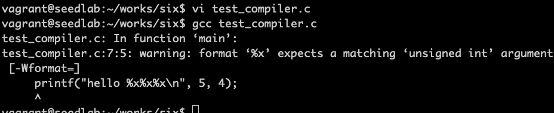
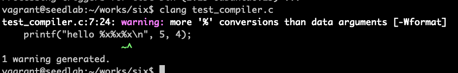
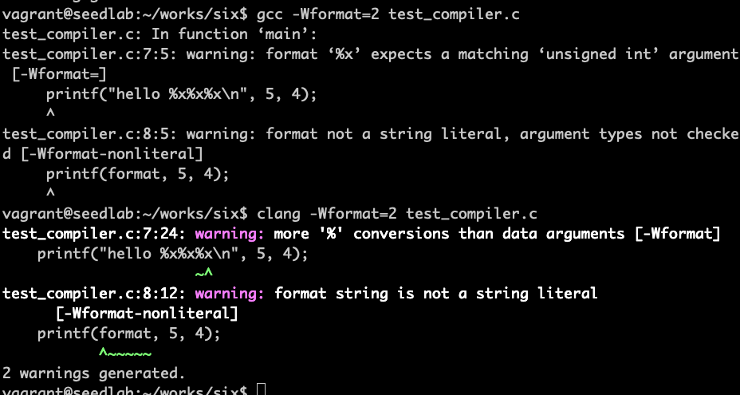

# 防御措施

## 开发者角度

***不要把用户输入包含在格式化字符串中***

```c
// 有漏洞的版本（用户输入变成了格式化字符串的一部分）
sprintf(format, "%s %s", user_input, ": %d");
printf(format, program_data);

// 安全的版本
strcpy(format, "%s: %d");
printf(format, user_input, program_data);
```

## 编译器角度

```c
#include <stdio.h>

int main()
{
    char *format = "Hello %x%x%x\n";
    
    printf("hello %x%x%x\n", 5, 4);  // 1
    printf(format, 5, 4);            // 2
    
    return 0;
}
```
使用gcc编译器默认编译没有对行2告警


安装clang编译器
```bash
sudo apt install clang -y
```

使用clang编译器默认也没有对行2告警


!!! 深度编译选项

    加上-Wformat=2选项会增加额外的安全检查，成本较高



## 系统角度

攻击者想获取或修改程序的状态，需要知道目标程序的内存地址。在linux系统中打开地址随机化能令攻击者难以猜测地址。