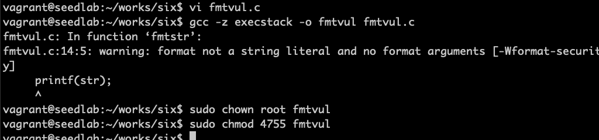

# 注入恶意代码

前面实现了向任意一个地址写入任意值，可以使用相同的技术修改函数的返回地址，令地址指向注入的恶意代码。

```c
#include <stdio.h>

void fmtstr(char *str)
{
    unsigned int *framep;
    unsigned int *ret;
    
    asm("movl %%ebp, %0" : "=r" (framep));  // copy ebp into framep
    ret = framep + 1;
    
    printf("The address of the input array: 0x%.8x\n", (unsigned)str);
    printf("The value of the frame pointer: 0x%.8x\n", (unsigned)framep);
    printf("The value of the return address: 0x%.8x\n", *ret);
    printf(str);
    printf("\nThe value of the return address: 0x%.8x\n", *ret);
}

int main(int argc, char **argv)
{
    FILE *badfile;
    char str[200];
    
    badfile = fopen("badfile", "rb");
    fread(str, sizeof(char), 200, badfile);
    fmtstr(str);
    
    return 1;
}
```
