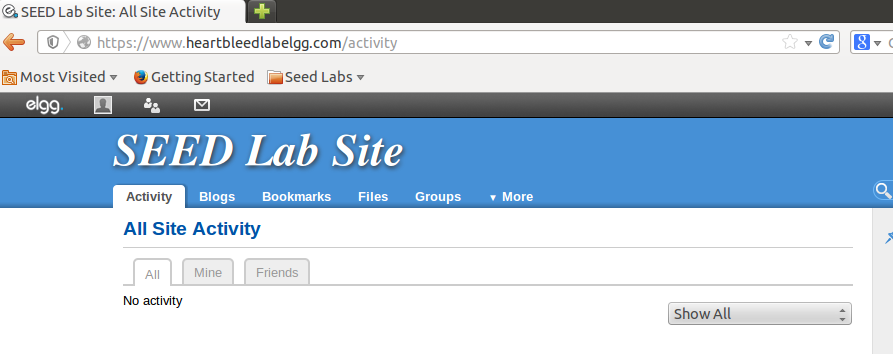
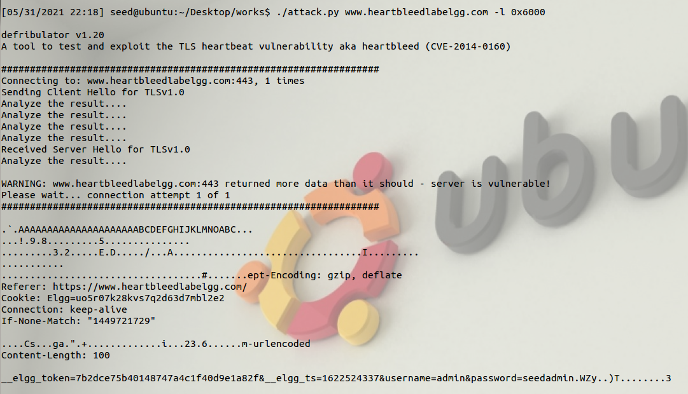

# 心脏滴血漏洞

!!! 概述

    心脏滴血（CVE-2014-0160）是OpenSSL库的一个严重漏洞。它使攻击者能够从远程服务器中窃取数据。  
    漏洞存在的原因是当数据从内存复制到回复数据包时，在应该复制多少数据上犯了错误，导致服务器内存中
    的数据被泄露。  
    受影响的OpenSSL版本从1.01到1.01f。

## 心跳协议

安全传输层协议（TLS/SSL）为相互通信的应用程序提供了安全信道，在该信道内传输的数据是受保护的，创建
一个安全的信道涉及一定的计算量，如公钥加解密、密钥交换等，因此一旦建立，不希望被终结，但是当客户端
和服务器一段时间内互相不发送消息时，这个信道可能会被操作系统或者防火墙终结，为了解决这个问题，TLS引入
了一个叫做心跳的扩展协议。  
过程是发送方发出的心跳请求包内装有载荷，载荷的内容不重要，接收方会构建一个心跳回复包，回复包应携带和
请求包相同的载荷内容。回复包的构建是导致心脏滴血攻击的原因。

### 心脏滴血漏洞原理

回复包的内容是由请求包中的载荷复制而来的，复制的多少不是由载荷实际大小决定，而是由发送方声称的大小决定。

声称的大小如果很大，除了会复制请求包中的数据，还会复制更多数据到回复包，memcpy()函数会超越载荷区域的边界
继续从内存中复制数据，可能会有敏感数据（如信用卡账户等）

## 搭建攻击环境

这个实验需要预置一个网络应用服务，目前只能使用12.04的镜像，镜像地址在[Seed Ubuntu 12.04](https://seed.nyc3.cdn.digitaloceanspaces.com/SEEDUbuntu12.04.zip)

这个网络应用使用https协议，这个协议使用了OpenSSL库，虚拟机里面的库的版本是还没有修复漏洞的旧版本  
开发心脏滴血漏洞攻击程序不简单，但是斯坦福的Jared开发好了，python脚本在[攻击脚本](https://seedsecuritylabs.org/Labs_16.04/Networking/Heartbleed/attack.py)

请求长度和实际长度相符，正常返回数据：


请求长度明显多于实际长度，返回内存数据，由于没有登录过，内存中没什么有价值数据：


登录一下web，admin/seedlab：


再次请求发现已经有密码信息在里面了：


!!! Note

    由于每次内存数据不一样，要多试几次，长度改为0x6000
    
## 修复心脏滴血漏洞

只需更新openssl库：
```bash
sudo apt-get update
sudo apt-get upgrade
```
第一个是更新可获得的安装包以及它们的版本，但不下载安装包。第二个命令对包进行下载和安装。  
更新后的openssl库增加了对回复包长度的判断。

这个漏洞2014年发行，至今仍然存在于很多服务器中，这些服务器要么没有打补丁，要么没法打补丁，因此这个漏洞
至今仍是一个很大的威胁。