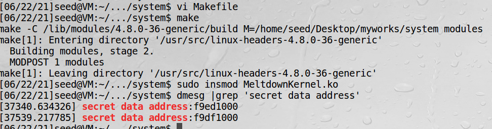
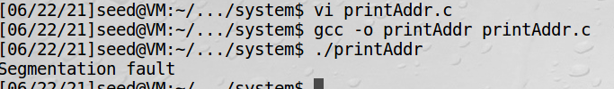
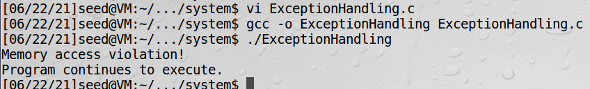

# 内核空间写值

这一节更确切的名字是：编写可加载的内核模块预置秘密值，和c语言处理异常的方法    
内存隔离是系统安全的基础，用户程序是不允许访问内核空间内存的，这个隔离是由处理器的一个比特位控制的，CPU进入内核空间设置该
比特位，进入用户空间时清空该比特。但这种隔离会被Meltdown攻击所打破，这个攻击会允许用户程序访问内核空间。

## task3: 在内核空间放入秘密值

!!! linux的proc文件系统

    linux内核提供了一种通过/proc文件系统，在运行时访问内核内部数据结构，改变内核设置的机制。proc文件系统是一个伪
    文件系统，它只存在内存当中，而不占用外存空间。它以文件系统的方式为访问系统内核数据的操作提供接口。

MeltdownKernel.c如下：
```c
#include <linux/module.h>
#include <linux/kernel.h>
#include <linux/init.h>
#include <linux/vmalloc.h>
#include <linux/version.h>
#include <linux/proc_fs.h>
#include <linux/seq_file.h>
#include <linux/uaccess.h>

static char secret[8] = {'S','E','E','D','L','a','b','s'};
static struct proc_dir_entry *secret_entry;
static char* secret_buffer;

static int test_proc_open(struct inode *inode, struct file *file)
{
#if LINUX_VERSION_CODE <= KERNEL_VERSION(4,0,0)
   return single_open(file, NULL, PDE(inode)->data);
#else
   return single_open(file, NULL, PDE_DATA(inode));
#endif
}

static ssize_t read_proc(struct file *filp, char *buffer, 
                         size_t length, loff_t *offset)
{
   memcpy(secret_buffer, &secret, 8);              
   return 8;
}

static const struct file_operations test_proc_fops =
{
   .owner = THIS_MODULE,
   .open = test_proc_open,
   .read = read_proc,
   .llseek = seq_lseek,
   .release = single_release,
};

static __init int test_proc_init(void)
{
   // write message in kernel message buffer
   printk("secret data address:%p\n", &secret);      

   secret_buffer = (char*)vmalloc(8);

   // create data entry in /proc
   secret_entry = proc_create_data("secret_data", 
                  0444, NULL, &test_proc_fops, NULL);
   if (secret_entry) return 0;

   return -ENOMEM;
}

static __exit void test_proc_cleanup(void)
{
   remove_proc_entry("secret_data", NULL);
}

module_init(test_proc_init);
module_exit(test_proc_cleanup);
```

程序解读：  
该程序作用是往/proc/secret_data里面写入SEEDlabs  
需要注意的是，read_proc调用后，秘密值被CPU缓存，但是这里并没有泄露这个秘密值，需要后续Meltdown攻击来得到这个值  
另外这里秘密值的地址直接是知道的，在真实攻击中，地址需要自己去获取  

Makefile如下：
```makefile
KVERS = $(shell uname -r)

# Kernel modules
obj-m += MeltdownKernel.o

build: kernel_modules

kernel_modules:
	make -C /lib/modules/$(KVERS)/build M=$(CURDIR) modules

clean:
	make -C /lib/modules/$(KVERS)/build M=$(CURDIR) clean
```


insmod把内核模块载入内核，编写可加载内核模块可以参考基于Netfilter实现一个防火墙一节  

## task4: 从用户空间访问内核内存

上面我们得到了秘密值的地址，看能否编程把秘密值通过地址打印出来

printAddr.c如下：
```c
#include <stdio.h>

int main()
{
    char *kernel_data_addr = (char*)0xf9df1000;
    char kernel_data = *kernel_data_addr;
    printf("I have reached here.\n");
    return 0;
}
```
结果发现是无法打印的：


## task5: c语言处理打印地址异常

访问非法内存会抛出一个叫SIGSEGV的signal，如果程序没有处理这个异常，那操作系统会处理并结束程序，这也是上面程序崩溃的原因。

!!! c语言的异常捕获

    c语言中是没有try/catch语句的，而是用sigsetjmp()和siglongjmp()代替，这两是专为信号设置的跳转函数，
    sigsetjmp是设置跳转点，siglongjmp是起跳

ExceptionHandling.c如下：
```c
#include <stdio.h>
#include <setjmp.h>
#include <signal.h>

static sigjmp_buf jbuf;

static void catch_segv()
{
  // Roll back to the checkpoint set by sigsetjmp().
  siglongjmp(jbuf, 1);                         
}

int main()
{ 
  // The address of our secret data
  unsigned long kernel_data_addr = 0xf9df1000;

  // Register a signal handler
  signal(SIGSEGV, catch_segv);                     

  if (sigsetjmp(jbuf, 1) == 0) {                
     // A SIGSEGV signal will be raised. 
     char kernel_data = *(char*)kernel_data_addr; 

     // The following statement will not be executed.
     printf("Kernel data at address %lu is: %c\n", 
                    kernel_data_addr, kernel_data);
  }
  else {
     printf("Memory access violation!\n");
  }

  printf("Program continues to execute.\n");
  return 0;
}
```
程序解读：  
1、sigsetjmp(jbuf, 1)会把栈的上下文环境变量保存到jbuf中，检查点成功设置会返回0 
（sigsetjmp的第二个参数为非0，表示搁置的信号集合也会一起保存）   
2、程序运行到下面这行会抛出异常，catch_segv被调用
```c
char kernel_data = *(char*)kernel_data_addr
```
3、siglongjmp(jbuf, 1)会跳转到sigsetjmp(jbuf, 1)这一行，并且siglongjmp的第二个参数将会是sigsetjmp函数
的返回值，故最后打印内存访问冲突  



