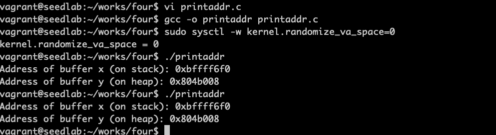
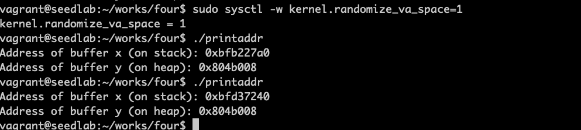
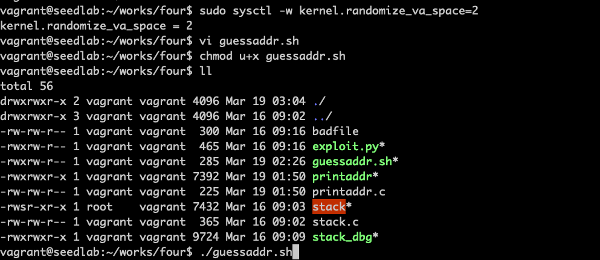
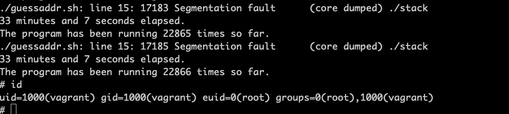

# 防御措施

## 防御措施概述

### 更安全的函数

    有些内存复制函数靠数据中的某些特殊字符来判断是否复制完成，这样复制的长度取决于数据，更安全的
    是由程序来指定长度

| 不安全 | 安全 |
| ---- | ---- |
| strcpy | strncpy |
| sprintf | snprintf    |
| strcat  | strncat    |
| gets    | fgets    |  

<br>

### 更安全的动态链接库

开发一个安全的动态链接库替换不安全的库。如libsafe函数库，基于ebp进行边界检测，不允许复制超出帧指针
的边界。libmib函数库，为strcpy等函数提供安全版本。

### 程序静态分析

在开发时，编辑器中提醒可能存在缓冲区溢出。如ITS4，可以识别c/c++的代码。

### 编程语言

语言本身可以检测缓冲区溢出。如python和java，提供自动边界检查。

### 编译器

编译器将源代码转化为二进制代码。可以控制在二进制程序中插入验证栈完整性指令。
Stackshield和StackGuard就是基于编译器的防御措施，会在函数返回前检查返回地址是否被修改。

### 操作系统

在程序运行之前，操作系统需要把程序加载进来并设置好运行环境，加载程序负责这个工作。通用防御措施
是地址空间布局随机化。让难以猜测shellcode的地址。

### 硬件体系结构

现代cpu支持一个称为NX bit的特性，No-Execute 不可执行，是一种把代码和数据分离的技术。可以把栈设置为
不可执行。这个防御可以被一个称为return-to-libc的方法攻破。

## 地址随机化

!!! ASLR

    ASLR（Address space layout randomization）地址空间配置随机化。为了成功实施缓冲区溢出攻击，
    攻击者需要使漏洞程序返回到他们注入的代码，就首先需要猜测注入代码的地址。操作系统以前总是把栈放在
    固定位置，而ASLR就是为了解决这个问题。  
    静态ASLR是指除了程序映像以外的内存区域都被随机化  
    
```c
#include <stdio.h>
#include <stdlib.h>

void main()
{
    char x[12];
    char *y = malloc(sizeof(char)*12);
    
    printf("Address of buffer x (on stack): %p\n", x);
    printf("Address of buffer y (on heap): %p\n", y);
}
```

***关闭地址随机化，每次栈和堆内存地址都一样***


***只关闭栈随机化，栈变化堆不变***


***打开地址随机化，栈和堆地址都改变***


!!! ASLR缺点

    所有进程都放在随机内存中后，可能导致兼容性问题。另一个局限性是可供随机化的地址范围可能不够大

衡量地址空间随机程序的一种方式是熵，如果一个内存空间有n比特熵，表明此系统上该区域的基地址有2的n次方种可能的结果。  
比如32位系统中，栈只有19位的熵，意味着基地址只有2的19次方 = 524288种可能性，可以采用下面的脚本暴力破解。

```bash
#!/bin/bash

SECONDS=0
value=0

while [ 1 ]
    do
    value=$(( $value + 1 ))
    duration=$SECONDS
    min=$(($duration / 60))
    sec=$(($duration % 60))
    echo "$min minutes and $sec seconds elapsed."
    echo "The program has been running $value times so far."
    ./stack
done
```

执行了33分钟后，猜中地址 &#x1F44D;&#x1F44D;&#x1F44D;



!!! stagefright攻击

    这个攻击在安卓系统中非常流行，2015年被发现，原因是安卓媒体库存在缓冲区溢出漏洞。虽然采用ASLR，但
    32位系统的熵只有8位，只有256种可能性，暴力攻击非常容易，
    
## StackGuard

!!! 防御思路

    基于栈的缓冲区溢出攻击需要修改返回地址，如果能够在函数返回前检测到返回地址是否被修改，就能
    抵御攻击。一种方法是将返回地址备份到其他地方。而StackGuard是在返回地址和缓冲区之间设置一个
    哨兵，这个哨兵来检测返回地址是否被修改。

!!! 原理

    缓冲区溢出攻击修改返回地址时，所有处于缓冲区和返回地址之间的内存值也会被修改。不想改变某个
    特定位置的值，唯一方法是用相同的值覆盖这个位置

如果不是用gcc编译器，可以使用在函数中添加代码的方式来检查
```c
int secret;
void foo (char *str)
{
    int guard;
    guard = secret;  // 设置哨兵值
    
    char buffer[12];
    strcpy(buffer, str);
    
    if (guard == secret) // 检查哨兵值是否改变
        return;
    else
        exit(1);
}
```

gcc编译器实现了StackGuard保护机制，通过生成的汇编代码得知，gcc在汇编中插入了额外的guard代码，
保存的秘密值是保存在GS寄存器中的。

!!! GS寄存器

    在linux中，GS寄存器指向的内存段是一个特殊的区域，不同于栈、堆、BSS段、数据段和代码段。
    GS段与栈物理隔离，堆栈的缓冲区溢出不会影响GS段中的任何数据