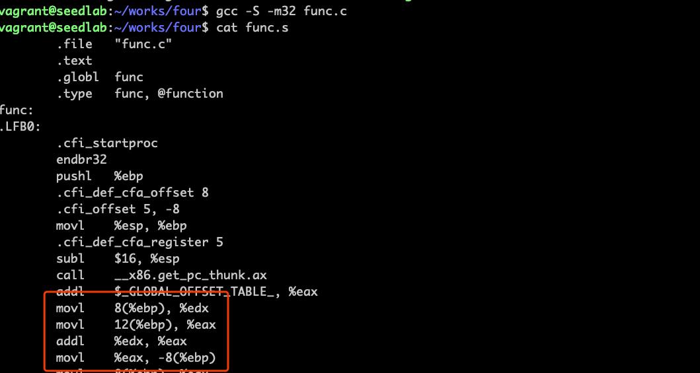

# 程序运行原理

## 程序的内存布局


代码段：存程序可执行代码  
数据段：存初始化的静态/全局变量  
BSS段：存未初始化的静态/全局变量  
堆： 存动态分配的内存  
栈： 存函数内的局部变量，或者和函数调用有关的数据，如返回地址和参数等  
  
```c
// 初始化全局变量存数据段
int x = 100;

int main()
{
    // 函数内的局部变量存在栈中
    int a=2;
    float b=2.5;
    
    // 未初始化静态变量，存BSS段
    static int y;
    
    // 分配的内存存在堆中
    int *ptr = (int *)malloc(2*sizeof(int));
    
    // 5和6的值存在堆中
    ptr[0]=5;
    ptr[1]=6;
    
    // 堆中释放内存
    free(ptr);
    return 1;
}
```

## 栈的内存布局

```c
void func(int a, int b)
{
    int x, y;
    
    x = a + b;
    y = a - b;
}
```

!!! 栈帧

    当func()函数被调用时，操作系统将在栈顶为其分配一块内存空间，这块内存空间被称为栈帧（stack frame）
  


函数调用入栈过程：参数先入栈（注意顺序是相反的），之后是返回地址入栈，接着前帧指针入栈，最后局部变量入栈（顺序
取决于编译器）

!!! 前帧指针

    previous frame pointer，下一个被程序压入栈帧中的数据是上一个栈帧的指针

## 64位系统编译32位程序

```bash
sudo apt-get install build-essential module-assistant
sudo apt-get install gcc-multilib g++-multilib
gcc -m32 hello.c
```

## 帧指针

!!! 帧指针

    在func函数中，需要访问参数和局部变量。访问参数和局部变量的唯一方法是通过它们的内存地址。然而，
    这些地址在编译时并不能确定，因为编译器无法预测栈的运行时状态，也就无法得知栈帧的位置。为了解决
    这个问题，cpu引入了一个专门的寄存器，叫做帧指针（frame pointer）。这个寄存器指向栈帧中的
    一个固定地址，因此参数和局部变量的地址可以通过这个寄存器加上一个偏移值计算得到。偏移值在编译时
    确定，而帧指针的值取决于运行时栈帧被分配至栈的哪个位置。



以上实验可以找到所有变量的地址：  
b的地址是 %ebp + 8  
a的地址是 %ebp + 12  
x的地址是 %ebp - 8  

!!! 参数入栈时顺序相反的原因

    栈是从高地址向低地址增长，顺序相反压入，最后生成的汇编代码顺序是正的  
    
!!! 前帧指针必要性

    通常会在一个函数调另一个函数，进入调用函数前，程序会在栈顶为被调用函数分配一个栈帧，程序从被调用函数
    返回时，该栈帧占据的内存空间将被释放，为了始终记录函数的栈帧在什么位置，需要在本函数中记录调用函数的
    栈帧指针，这个指针叫做前帧指针

!!! ebp和rbp

    32位系统用ebp，64位系统用rbp