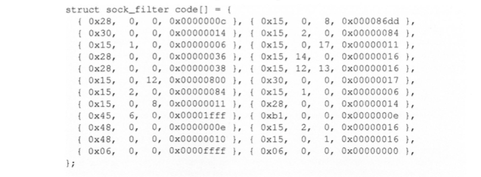

# 数据包嗅探和伪造背景

## 网络接口卡

设备通过网络接口卡（network interface card, NIC，简称网卡）接入网络。每个网卡都有一个硬件地址，叫MAC地址。  

!!! 广播型介质

    网络中的设备均连接到一个共享的介质上。常用的本地通信网络、以太网和WIFI都是广播型介质。

!!! 内核处理普通数据包原理

    当数据包在传播介质中流动时，网络中的每个网卡都能听到所有广播的数据帧（frame），这些数据帧会被复制到
    网卡的内存中，网卡会检查数据帧头部的目的地址。如果目的地址和该网卡的MAC地址相匹配，那么该数据帧就会
    通过直接存储器访问（direct memory access, DMA）的方式被复制到操作系统内核的缓存中，接着网卡会
    以中断的方式告诉CPU它接收到了新的数据，然后CPU会将它们全部从缓存中复制到一个队列中，以便为新数据包
    的到来腾出空间。根据协议规定，内核在处理队列中的数据包时会调用不同的回调函数。

!!! 混杂模式

    promiscuous mode，嗅探程序要处理目标地址和自身MAC地址不匹配的数据帧，要把网卡设置成混杂模式。
    一般是网络管理员诊断网络问题或者是黑客监听使用。有线网络使用。

!!! 监听模式

    monitor mode，无线网卡是通过监听模式进行嗅探的。由于无线网络存在相邻设备干扰的问题，会严重影响网络的
    性能，为了解决这个问题，wifi设备通过不同的信道传递数据，接入点将相邻设备用不同的信道连接起来，从而减少了
    冲突带来的影响。wifi网卡的设计也做了相应的调整，可以在整个可用带宽和信道的分片上进行通信，由于这样的设计，
    当网卡处于监听模式时，它只能捕捉所监听信道中的802.11数据帧。  
    这意味着，与以太网能监听所有数据帧不同，由于存在不同的信道，可能会错过一个网络中其他信道传输的信息。大多数
    无线网卡都不支持监听模式，即使支持，默认也是禁用。

## BSD数据包过滤器

当进行网络嗅探时，嗅探器经常只会对某些特定类型的数据包感兴趣，如TCP数据包或者DNS数据包。  
系统可以将所有捕获到的数据包交给嗅探程序，嗅探程序会丢弃它不需要的数据包，但是这种处理方式效率低下，因为
把这些没用的数据包从内核传到嗅探程序是需要花费CPU时间的。  

UNIX操作系统定义了BSD数据包过滤器(BSD packet filter, BPF)，用于在底层实现数据包的过滤。BPF允许用户
空间的程序将一个过滤器和一个套接字进行绑定，其本质上是为了告知内核尽早丢弃不需要的数据包。  
过滤器一般是首先使用布尔操作符编写的可读性较强的代码，随后该代码被编译成伪代码传递给BPF驱动。

经过编译的bsd代码如下：

这段BPF代码只过滤了22号端口，但可读性很差，再绑定socket：
```c
struct sock_fprog bpf = {
    .len = ARRAY_SIZE(code);
    .filter = code,
};

setsockopt(sock, SOL_SOCKET, SO_ATTACH_FILTER, &bpf, sizeof(bpf));
```
与bpf一旦与socket绑定，当数据包到达内核时，回调函数就会被调用，用于判断该数据包是否应该过滤。通过过滤的数据
包被压入协议栈。

## 字节顺序

字节顺序和处理器架构有关，和几位操作系统无关  
x86系列计算机都是小端序  

小端字节顺序的计算机先写最低字节，大端是先写最高字节。

!!! 名字来由

    来自《格列佛游记》，吃鸡蛋先敲大头还是小头。大端字节意味着先从大的字节开始保存。
    
**网络字节序**： 为了解决字节顺序不匹配的问题，IANA(Internet Assigned Numbers Authority，互联网
数字分配机构)定义了一种名为网络字节顺序的字节顺序，这就要求计算机在将多个字节数据写入数据包时使用这种字节
顺序，而不是操作系统的字节顺序。这种字节顺序和大端字节顺序是相同的。

**字节序宏函数**：为了方便网络字节序和本机字节序之间转换，提供了如下宏函数，从而使得代码有可移植性。
| 宏函数 | 描述 |
| ---- | ---- |
| htons() | 把无符号短整数从本机字节序转网络字节序 |
| htonl()         |  把无符号整数从本机字节序转网络字节序   |
| ntohs()        | 把无符号短整数从网络字节序转本机字节序    |
| ntohl()       | 把无符号整数从网络字节序转本机字节序    |  

## 校验和

每一个数据包中都有校验和字段。

!!! 文档出处

    RFC 1071给出了IP、ICMP、TCP和UDP数据包头中校验和的算法。  

!!! IP数据包不需提供校验和

    IP数据包不需提供校验和，系统会计算IP数据包头中的校验和字段，其他数据包头需要开发者计算。

```c
// checksum.c
unsigned short in_cksum(unsigned short *buf, int length)
{
    unsigned short *w = buf;
    int nleft = length;
    int sum = 0;
    unsigned short temp = 0;
    
    while (nleft > 1)
    {
        sum += *w++;
        nleft -= 2;
    }
    
    if (nleft == 1)
    {
        *(u_char *)(&temp) = *(u_char *)w;
        sum += temp;
    }
    
    // 对每个16比特进行二进制反码求和
    sum = (sum >> 16) + (sum & 0xffff);
    sum += (sum >> 16);
    return (unsigned short)(~sum);
}
```

根据RFC 768文档和RFC 793文档，TCP和UDP的校验和是伪头部中每16比特的反码和，该伪头部中包含了IP头部、
TCP/UDP头部以及数据的信息。  
如果需要的话，该校验和的末尾会填充8位0，使之成为两个字节的整数倍。  
为了计算校验和，需要先创建一个伪头部，然后使用上述in_chksum()函数计算校验和。

```c
// 伪TCP头部
struct pseudo_tcp
{
    unsigned saddr, daddr;
    unsigned char mbz;
    unsigned char ptcl;
    unsigned short tcpl;
    struct tcpheader tcp;
    char payload[PACKET_LEN];
};

unsigned short calculate_tcp_checksum(struct ipheader *ip)
{
    struct tcpheader *tcp = (struct tcpheader *)((u_char *)ip + sizeof(struct ipheader));
    int tcp_len = ntohs(ip->iph_len)->sizeof(struct ipheader);
    
    // 伪造TCP头部计算校验和
    struct pesudo_tcp p_tcp;
    memset(&p_tcp, 0x0, sizeof(struct pseudo_tcp));
    
    p_tcp.saddr = ip->iph_sourceip.s_addr;
    p_tcp.daddr = ip->iph_destip.s_addr;
    p_tcp.mbz = 0;
    p_tcp.ptcl = IPPROTO_TCP;
    p_tcp.tcpl = htons(tcp_len);
    memcpy(&p_tcp.tcp, tcp, tcp_len);
    
    return (unsigned short) in_cksum((unsigned short *)&p_tcp, tcp_len + 12);
}
```