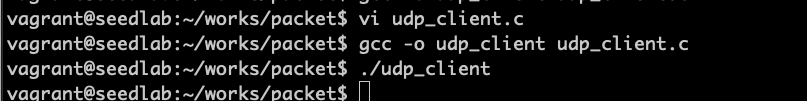
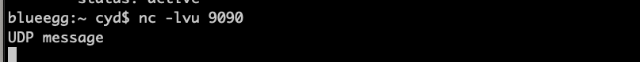

# 数据包伪造

伪造攻击例子：  
TCP泛洪攻击，攻击包的源IP地址是随机生成的  
TCP会话劫持攻击，攻击者不仅需要在TCP数据包头中使用其他人的IP地址，同时也需要在数据包头中设置正确的序号和端口号  
DNS缓存中毒攻击，攻击者向受害者发送虚假的DNS应答，但是攻击者需要确保DNS应答数据包的源IP地址是合法DNS服务器
的IP地址，且头中的DNS信息与有效载荷信息都是正确的  

!!! 数据包伪造工具

    Netwox、Scapy等，Scapy是一种强大的交互式数据包处理程序，能够对多种协议的数据包进行伪造或解码、发送、
    捕获、匹配请求和应答等

## socket发送数据包

查看宿主机ip地址为192.168.31.171

```c
// udp_client.c
#include <unistd.h>
#include <stdio.h>
#include <string.h>
#include <sys/socket.h>
#include <netinet/ip.h>
#include <arpa/inet.h>

void main()
{
    struct sockaddr_in dest_info;
    char *data = "UDP message\n";
    
    int sock = socket(AF_INET, SOCK_DGRAM, IPPROTO_UDP);
    memset((char *)&dest_info, 0, sizeof(dest_info));
    dest_info.sin_family = AF_INET;
    dest_info.sin_addr.s_addr = inet_addr("192.168.31.171");
    dest_info.sin_port = htons(9090);
    
    sendto(sock, data, strlen(data), 0, (struct sockaddr *)&dest_info, sizeof(dest_info));
    close(sock);
}
```
在虚拟机上编译并运行该程序:  


在宿主机开端口，虚拟机运行后可以接收到数据：  


## 原始套接字发送伪造数据包

用基本套接字只能填写几个字段如目的IP地址、目的端口号等，其他由操作系统设置。  
原始套接字，需要在缓冲区中创建整个数据包，包括ip头和其后续所有的头字段，然后将它交给socket发送。这种socket
操作系统不会填头信息。  

数据包伪造的两个步骤：  
1、在缓冲区中构造数据包  
2、发送数据包  

下面是第二步发送数据包程序：
```c
void send_raw_ip_packet(struct ipheader* ip)
{
    struct sockaddr_in dest_info;
    int enable = 1;
    
    int sock = socket(AF_INET, SOCK_RAW, IPPROTO_RAW);
    setsockopt(sock, IPPROTO_IP, IP_HDRINCL, &enable, sizeof(enable));
    
    dest_info.sin_family = AF_INET;
    dest_info.sin_addr = ip->iph_destip;
    
    sendto(sock, ip, ntohs(ip->iph_len), 0, (struct sockaddr *)&dest_info, sizeof(dest_info));
    close(sock);
}
```
AF_INET表示用于IPv4的socket，SOCK_RAW表示创建原始套接字，IPPROTO_RAW表示会提供IP头，这样操作系统不会再创建IP头  

!!! Note

    安全性考虑，只有root进程和具有CAP_NET_RAW能力的进程才能创建raw socket

## 构造ICMP数据包

完整程序，构造ICMP应答数据包示例：
```c
#include <stdio.h>
#include <string.h>
#include <sys/socket.h>
#include <netinet/ip.h>

struct ipheader {
    unsigned char iph_ihl:4,  // ip头长度
                  iph_ver:4;  // ip版本
    unsigned char iph_tos;    // 服务版本
    unsigned short int iph_len;  // ip包长度
    unsigned short int iph_ident;
    unsigned short int iph_flag:3,
                       iph_offset:13;
    unsigned char  iph_ttl;
    unsigned char  iph_protocol;
    unsigned short int iph_chksum;
    struct in_addr iph_sourceip;
    struct in_addr iph_destip;
};

struct icmpheader {
    unsigned char icmp_type;
    unsigned char icmp_code;
    unsigned short int icmp_chksum;
    unsigned short int icmp_id;
    unsigned short int icmp_seq;
};

unsigned short in_cksum(unsigned short *buf, int length)
{
    unsigned short *w = buf;
    int nleft = length;
    int sum = 0;
    unsigned short temp = 0;
    
    while (nleft > 1)
    {
        sum += *w++;
        nleft -= 2;
    }
    
    if (nleft == 1)
    {
        *(u_char *)(&temp) = *(u_char *)w;
        sum += temp;
    }
    
    sum = (sum >> 16) + (sum & 0xffff);
    sum += (sum >> 16);
    return (unsigned short)(~sum);
}
 
void send_raw_ip_packet(struct ipheader* ip)
{
    struct sockaddr_in dest_info;
    int enable = 1;
    
    int sock = socket(AF_INET, SOCK_RAW, IPPROTO_RAW);
    setsockopt(sock, IPPROTO_IP, IP_HDRINCL, &enable, sizeof(enable));
    
    dest_info.sin_family = AF_INET;
    dest_info.sin_addr = ip->iph_destip;
    
    sendto(sock, ip, ntohs(ip->iph_len), 0, (struct sockaddr *)&dest_info, sizeof(dest_info));
    close(sock);
};

int main()
{
    char buffer[1500];
    
    memset(buffer, 0, 1500);
    // 填充ICMP头
    struct icmpheader *icmp = (struct icmpheader *)(buffer + sizeof(struct ipheader));
    icmp->icmp_type = 8;
    icmp->icmp_chksum = 0;
    icmp->icmp_chksum = in_cksum((unsigned short *)icmp, sizeof(struct icmpheader));
    
    // 设置IP头
    struct ipheader *ip = (struct ipheader *)buffer;
    ip->iph_ver = 4;
    ip->iph_ihl = 5;
    ip->iph_ttl = 20;
    ip->iph_sourceip.s_addr = inet_addr("192.168.230.150");
    ip->iph_destip.s_addr = inet_addr("192.168.230.1");
    ip->iph_protocol = IPPROTO_ICMP;
    ip->iph_len = htons(sizeof(struct ipheader) + sizeof(struct icmpheader));
    
    send_raw_ip_packet(ip);
    return 0;
}
```

在ICMP应答请求中，有效载荷数据可有可无，这里不需要携带任何载荷数据。  
设置IP头时，不需要设置IP头的校验和字段，因为在数据包发送过程中，操作系统会设置该字段。  

!!! warning

    可能会碰到两个问题，一是程序中ipheader没有定义导致报错，二是in_cksum函数找不到，这是一个自定义函数。
    说白了，这个程序不完整。如何测试也未知

## 构造UDP数据包

构造UDP数据包和ICMP包不同的是，这里需要增加有效载荷数据。  

```c
#include <unistd.h>
#include <stdio.h>
#include <string.h>
#include <sys/socket.h>
#include <netinet/ip.h>
#include <arpa/inet.h>

struct udpheader
{
    u_int16_t udp_sport;
    u_int16_t udp_dport;
    u_int16_t udp_ulen;
    u_int16_t udp_sum;
};

struct ipheader {
    unsigned char iph_ihl:4,  // ip头长度
                  iph_ver:4;  // ip版本
    unsigned char iph_tos;    // 服务版本
    unsigned short int iph_len;  // ip包长度
    unsigned short int iph_ident;
    unsigned short int iph_flag:3,
                       iph_offset:13;
    unsigned char  iph_ttl;
    unsigned char  iph_protocol;
    unsigned short int iph_chksum;
    struct in_addr iph_sourceip;
    struct in_addr iph_destip;
};

void send_raw_ip_packet(struct ipheader* ip)
{
    struct sockaddr_in dest_info;
    int enable = 1;
    
    int sock = socket(AF_INET, SOCK_RAW, IPPROTO_RAW);
    setsockopt(sock, IPPROTO_IP, IP_HDRINCL, &enable, sizeof(enable));
    
    dest_info.sin_family = AF_INET;
    dest_info.sin_addr = ip->iph_destip;
    
    sendto(sock, ip, ntohs(ip->iph_len), 0, (struct sockaddr *)&dest_info, sizeof(dest_info));
    close(sock);
}

int main()
{
    char buffer[1500];
    memset(buffer, 0, 1500);
    struct ipheader *ip = (struct ipheader *)buffer;
    struct udpheader *udp = (struct udpheader *)(buffer + sizeof(struct ipheader));
    
    char *data = buffer + sizeof(struct ipheader) + sizeof(struct udpheader);
    const char *msg = "Hello Server!\n";
    int data_len = strlen(msg);
    strncpy(data, msg, data_len);
    
    udp->udp_sport = htons(12345);
    udp->udp_dport = htons(9090);
    udp->udp_ulen = htons(sizeof(struct udpheader) + data_len);
    udp->udp_sum = 0; // 操作系统会忽略，置0即可
    
    ip->iph_ver = 4;
    ip->iph_ihl = 5;
    ip->iph_ttl = 20;
    ip->iph_sourceip.s_addr = inet_addr("192.168.0.11");
    ip->iph_destip.s_addr = inet_addr("192.168.31.171");
    ip->iph_protocol = IPPROTO_UDP;
    ip->iph_len = htons(sizeof(struct ipheader) + sizeof(struct udpheader) + data_len);
    
    send_raw_ip_packet(ip);
    return 0;
}
    
```

无法发送到宿主机，实验失败