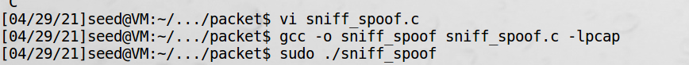

# 嗅探与伪造

在许多攻击中，需要先进行数据包嗅探，然后根据捕获的数据包内容来伪造响应数据包，这就是嗅探与伪造  
本节这个实验是前面的实验综合，书上程序只有片段，怎么补充完整，考验理解和编程能力。  

```c
// sniff_spoof.c
#include <pcap.h>
#include <stdio.h>
#include <arpa/inet.h>
#include <unistd.h>
#include <string.h>

struct ipheader {
    unsigned char iph_ihl:4,  // ip头长度
                  iph_ver:4;  // ip版本
    unsigned char iph_tos;    // 服务版本
    unsigned short int iph_len;  // ip包长度
    unsigned short int iph_ident;
    unsigned short int iph_flag:3,
                       iph_offset:13;
    unsigned char  iph_ttl;
    unsigned char  iph_protocol;
    unsigned short int iph_chksum;
    struct in_addr iph_sourceip;
    struct in_addr iph_destip;
};

struct udpheader
{
    u_int16_t udp_sport;
    u_int16_t udp_dport;
    u_int16_t udp_ulen;
    u_int16_t udp_sum;
};

struct ethheader
{
    u_char ether_dhost[6];
    u_char ether_shost[6];
    u_short ether_type;
};

void send_raw_ip_packet(struct ipheader* ip)
{
    struct sockaddr_in dest_info;
    int enable = 1;
    
    int sock = socket(AF_INET, SOCK_RAW, IPPROTO_RAW);
    setsockopt(sock, IPPROTO_IP, IP_HDRINCL, &enable, sizeof(enable));
    printf("setsockopt ok\n");
    
    dest_info.sin_family = AF_INET;
    dest_info.sin_addr = ip->iph_destip;
    
    printf("dest ip: %s\n", inet_ntoa(ip->iph_destip));
    if (sendto(sock, ip, ntohs(ip->iph_len), 0, (struct sockaddr *)&dest_info, sizeof(dest_info)) < 0){
        printf("sendto func error\n");
    }
    close(sock);
};

void spoof_reply(struct ipheader* ip)
{
  const char buffer[1500];
  int ip_header_len = ip->iph_ihl * 4;
  struct udpheader* udp = (struct udpheader *)((u_char *)ip + ip_header_len);
  
  if (ntohs(udp->udp_dport) != 9999){
    printf("spoof_reply return\n");
    return;
  }
  // 复制捕获的数据包
  memset((char*)buffer, 0, 1500);
  memcpy((char*)buffer, ip, ntohs(ip->iph_len));
  struct ipheader *newip = (struct ipheader *)buffer;
  struct udpheader *newudp = (struct udpheader *)(buffer + ip_header_len);
  char *data = (char *)newudp + sizeof(struct udpheader);
  
  // 构造UDP payload
  const char *msg = "This is a spoofed reply!\n";
  int data_len = strlen(msg);
  strncpy(data, msg, data_len);
  
  // 构造UDP头
  newudp->udp_sport = udp->udp_dport;
  newudp->udp_dport = udp->udp_sport;
  newudp->udp_ulen = htons(sizeof(struct udpheader) + data_len);
  newudp->udp_sum = 0;
  
  // 构造IP头
  newip->iph_sourceip = ip->iph_destip;
  newip->iph_destip = ip->iph_sourceip;
  newip->iph_ttl = 50;
  newip->iph_len = htons(sizeof(struct ipheader) + sizeof(struct udpheader) + data_len);
  
  printf("start send raw ip packet\n");
  // 发送伪造的包
  send_raw_ip_packet(newip);
}


void got_packet(u_char *args, const struct pcap_pkthdr *header, const u_char *packet)
{
    struct ethheader *eth = (struct ethheader *)packet;
    if (ntohs(eth->ether_type) == 0x0800){
        struct ipheader *ip = (struct ipheader *)(packet + sizeof(struct ethheader));
        printf("    From: %s\n", inet_ntoa(ip->iph_sourceip));
        printf("      To: %s\n", inet_ntoa(ip->iph_destip));
        
        switch(ip->iph_protocol){
            case IPPROTO_TCP:
                printf("    Protocol: TCP\n");
                return;
            case IPPROTO_UDP:
                printf("    Protocol: UDP\n");
                spoof_reply(ip);
                return;
            case IPPROTO_ICMP:
                printf("    Protocol: ICMP\n");
                return;
            default:
                printf("    Protocol: others\n");
                return;
        }
    }
}

int main()
{
    pcap_t *handle;
    char errbuf[PCAP_ERRBUF_SIZE];
    struct bpf_program fp;
    char filter_exp[] = "port 9999";
    bpf_u_int32 net;
    
    handle = pcap_open_live("ens33", BUFSIZ, 1, 1000, errbuf); 
    if (handle == NULL) {
        fprintf(stderr, "Couldn't open device ens33: %s\n", errbuf);
        return(2);
    }
    if (pcap_compile(handle, &fp, filter_exp, 0, net) == -1) {
        fprintf(stderr, "Couldn't parse filter %s: %s\n", filter_exp, pcap_geterr(handle));
        return(2);
    }
    if (pcap_setfilter(handle, &fp) == -1) {
        fprintf(stderr, "Couldn't install filter %s: %s\n", filter_exp, pcap_geterr(handle));
        return(2);
    }
    
    pcap_loop(handle, -1, got_packet, NULL); 
    pcap_close(handle);
    return 0;
}
```
程序解读，这个程序捕获了所有的UDP数据包，在捕获的数据包中，如果数据包的目标端口是9999的话，就发送一条伪造的
回复数据包。


!!! Note

    找不到pcap.h  
    sudo apt-get install libpcap-dev


测试：
1、在虚拟机1中启动本程序：


2、虚拟机2中开启接收ip数据包程序：
```python
#!/usr/bin/python3
from scapy.all import *

def print_pkt(pkt):
    pkt.show()

pkt = sniff(filter='ip', prn=print_pkt)
```
启动：
```bash
sudo ./sniffer.py
```

3、在虚拟机2中向虚拟机1的9999端口发数据包：


4、虚拟机1中接收数据包并返回：


5、虚拟机2中接收到伪造的ip数据包：


!!! Note

    调试时加一些打印非常关键，比如上面：  
    printf("dest ip: %s\n", inet_ntoa(ip->iph_destip));