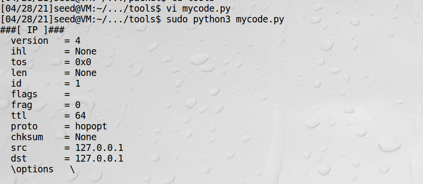
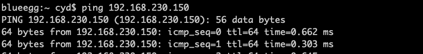
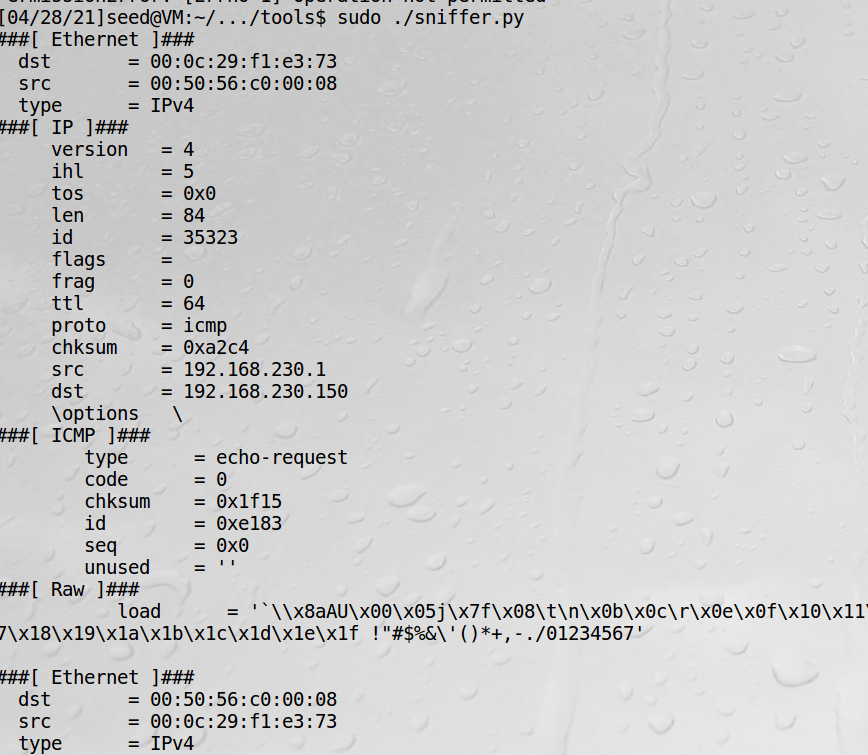
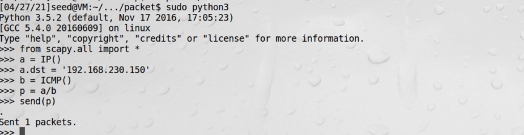
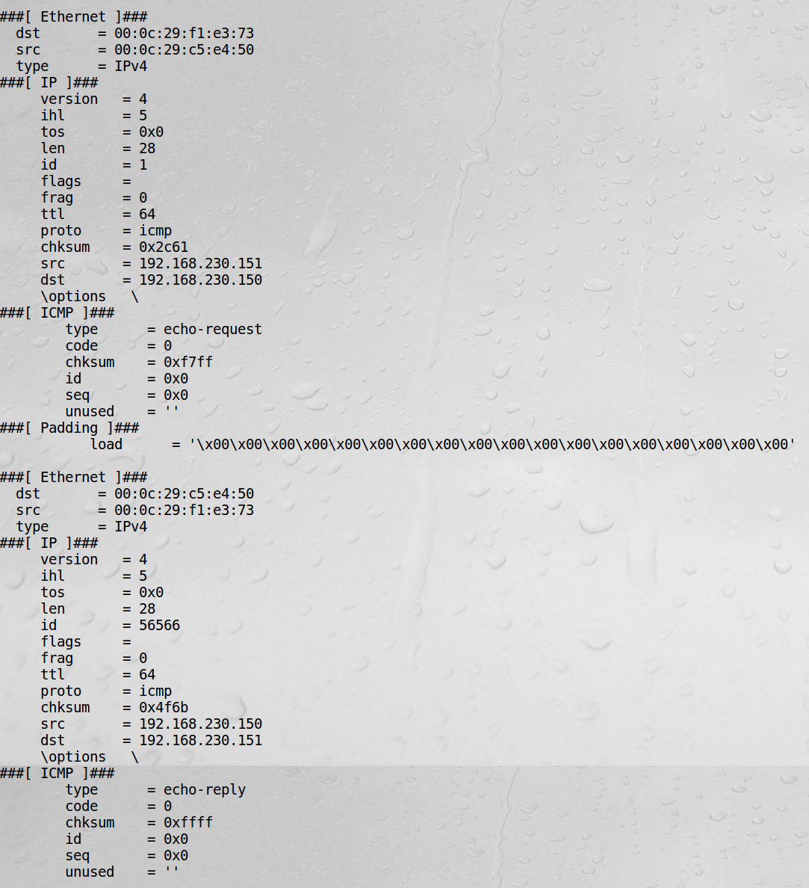
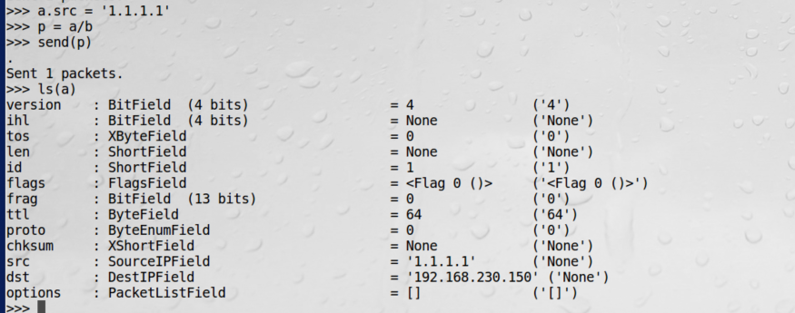
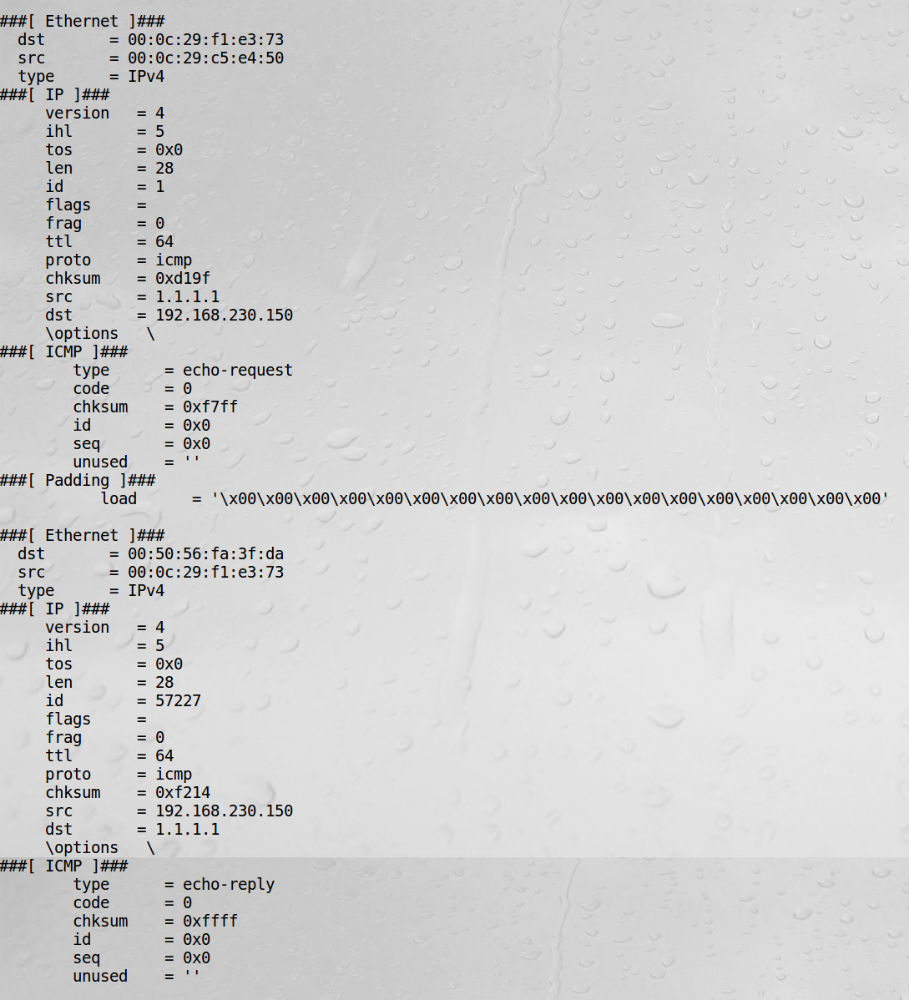

# 嗅探和伪造工具

安装scapy
```bash
sudo pip3 install scapy
```

```python
#!/usr/bin/python3

from scapy.all import *

a = IP()
a.show()
```



## 嗅探数据包

wireshark是最强大的嗅探工具，但是不好跟其他集成做成新工具，而scapy则容易集成。

```python
#!/usr/bin/python3
from scapy.all import *

def print_pkt(pkt):
    pkt.show()

pkt = sniff(filter='icmp', prn=print_pkt)
```
虚拟机起服务：


宿主机ping：


虚拟机收到ping：


!!! Note

    ping会产生一个ICMP的请求

scapy的过滤器用BPF语法，可以查询[BPF手册](https://www.kernel.org/doc/html/latest/bpf/index.html)

!!! 过滤器实例

    dst host 10.0.2.5 只捕获目的ip地址为10.0.2.5的数据包  
    src host 10.0.2.6 只捕获源ip地址为10.0.2.6的数据包  
    host 10.0.2.6 and src host port 9090 只捕获源或目的ip地址为10.0.2.6，并且源端口号为9090的数据包  
    proto tcp 只捕获TCP数据包  

## 伪造ICMP数据包

虚拟机1起服务：


虚拟机2发包：


虚拟机1收到包：


说明，IP类重载过/，故/的意思不是除，而是把b作为a的载荷，所以我们得到了一个ICMP包。ICMP包默认类型是echo。  
现在我们伪造源IP地址：


虚拟机1收到伪造包：

可以看到源IP地址改成了伪造的

!!! warning

    宿主机上用scapy会有警告，暂时没去查啥原因  
    WARNING: Failed to execute ifconfig: (ifconfig: interface vboxnet does not exist)  
    WARNING: No IPv4 address found on p2p0 !  
    WARNING: No IPv4 address found on awdl0 !  
    WARNING: more No IPv4 address found on en1 !  

## 路由跟踪traceroute

traceroute是用来检测发出数据包的主机到目标主机之间所经过的网关数量的工具。
traceroute的原理是试图以最小的TTL（存活时间）发出探测包来跟踪数据包到达目标主机所经过的网关，
然后监听一个来自网关ICMP的应答。发送数据包的大小默认为38个字节。

!!! traceroute程序完整过程

    首先它发送一份TTL字段为1的IP数据包给目的主机，处理这个数据包的第一个路由器将TTL值减1，
    然后丢弃该数据报，并给源主机发送一个ICMP报文（“超时”信息，这个报文包含了路由器的IP地址，这样就得到了第一个路由器的地址），
    然后traceroute发送一个TTL为2的数据报来得到第二个路由器的IP地址，继续这个过程，直至这个数据报到达目的主机。
